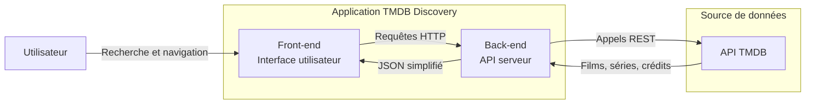
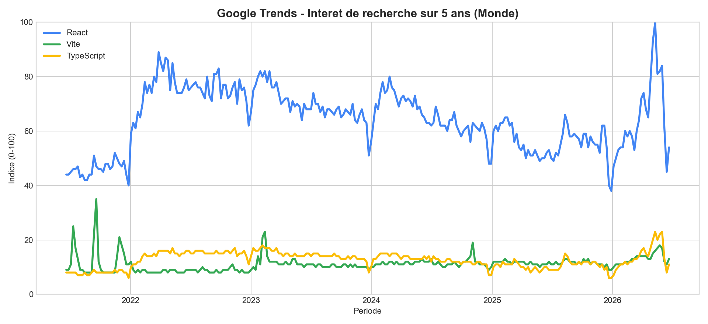

# Architecture logicielle

## TMDB Discovery App

---

# Objectifs

- Construire une application web de découverte TMDB : films, séries, acteurs, réalisateurs et statistiques.
- Livrer rapidement une première version fonctionnelle.
- Mettre en place une architecture évolutive pour accueillir les fonctionnalités à venir.
- Avancer en mode **agile** : itérations courtes, valeur livrée en continu, adaptation au changement.

---

# Architecture logicielle

## Architecture logicielle d'une application web

- Une application web s'organise généralement en 3 couches : **front-end**, **back-end**, **données**.
    - Le **front-end** est l'interface utilisateur, ce que l'utilisateur voit et avec quoi il interagit.
    - Le **back-end** est le moteur de l'application, il traite les données et fournit les informations au front-end.
    - La couche **données** est le stockage des informations, souvent une base de données.

---

## Architecture logicielle de TMDB Discovery App

- Pour TMDB Discovery, nous retenons un duo **front-end + back-end**.
- Le **back-end** interroge l'API TMDB et expose les données utiles au **front-end**.
- Pas de base locale dans cette version : l'API TMDB fait office de source de données.
- Pour plus de simplicité le **front-end** et le **back-end** seront développés dans le même projet, mais ils pourraient être séparés dans des projets distincts.
    - Nous pourrions par exemple avoir un projet **tmdb-discovery-backend** et un projet **tmdb-discovery-frontend**.
    - Pour plus de simplicité, allons aussi utiliser la même technologie pour le **front-end** et le **back-end** : **JavaScript** via **Node.js**.

---

# Architecture logicielle - back-end

Le **back-end** est le moteur de l'application, il interroge l'API TMDB et expose les données utiles au **front-end**.

C'est le **back-end** qui gère la logique métier de l'application, c'est-à-dire les règles et les traitements qui permettent de répondre aux besoins des utilisateurs.

Dans le cas de TMDB Discovery, le **back-end** interroge l'API TMDB pour récupérer les films, séries, acteurs et réalisateurs, et expose ces données au **front-end** sous forme de JSON simplifié (on ne renvoie pas toutes les données de l'API TMDB, mais seulement celles qui sont utiles pour l'application). On n'expose pas toutes les api, mais seulement les endpoints nécessaires pour l'application.

Le **back-end** masque la complexité de l'API TMDB au **front-end**, qui n'a pas besoin de connaître les détails de l'API TMDB pour fonctionner. Le **front-end** se contente d'appeler le **back-end** pour obtenir les données dont il a besoin.

Le **back-end** peut également effectuer des traitements sur les données avant de les renvoyer au **front-end**, par exemple pour filtrer, trier ou transformer les données.

Le **back-end** pourrait également utiliser une base de données locale pour stocker les données de l'API TMDB, mais dans cette version de l'application, nous n'avons pas besoin de stocker les données localement, car l'API TMDB est suffisamment rapide et fiable pour fournir les données en temps réel.

---

# Architecture logicielle - back-end (suite)

Pour TMDB Discovery, le **back-end** sera développé en **Node.js** avec le framework **Express.js**. Framework très populaire pour développer des applications web en **JavaScript** côté serveur.

Le **back-end** sera organisé en **routes** et **contrôleurs**. Les **routes** définissent les endpoints de l'API, et les **contrôleurs** contiennent la logique métier pour traiter les requêtes et renvoyer les réponses.

Le **back-end** interrogera l'API TMDB via des requêtes HTTP, et exposera les données utiles au **front-end** sous forme de JSON simplifié. 

Les **endpoints** (ce que le **back-end** expose) seront documentés en utilisant **Swagger**, un outil qui permet de générer automatiquement une documentation interactive de l'API, pour que le **front-end** sache comment les utiliser.

---

# Architecture logicielle - front-end

Afin de ne pas réinventer la roue, nous utilisons des librairies et frameworks spécialisés pour le développement web. En effet, le développement web est un domaine très vaste et complexe, et il est difficile de tout maîtriser. Les librairies et frameworks permettent de se concentrer sur la logique métier de l'application plutôt que sur les détails techniques du développement web.

Les contraintes du développement web sont nombreuses : compatibilité avec les différents navigateurs, performance, accessibilité, sécurité, etc. Les librairies et frameworks permettent de gérer ces contraintes de manière efficace et de se concentrer sur la valeur ajoutée de l'application.

---

# Architecture logicielle - front-end (suite)

Actuellement, les librairies et frameworks les plus populaires pour le développement web sont:
* __React__ : une librairie JavaScript développée par Facebook pour construire des interfaces utilisateurs
* __Angular__ : un framework JavaScript développé par Google pour construire des applications web
* __Vue.js__ : un framework JavaScript progressif pour construire des interfaces utilisateurs

---

# Architecture logicielle - front-end (suite)

## Google Trends (5 ans)

---

# Architecture logicielle - front-end (suite)

## Différences entre librairie et framework

- Une **librairie** est un ensemble de fonctions et d'outils que l'on peut utiliser dans son code pour accomplir certaines tâches. On l'appelle quand on en a besoin.

- Un **framework** est un ensemble de règles et de structures que l'on doit suivre pour construire une application. Il impose une certaine architecture et un certain flux de travail.

---

# Architecture logicielle - front-end (suite)

## Pourquoi React ?

Sur le bassin Niortais, de nombreuses entreprises utilisent **React** pour leurs applications web. 

* **librairie** javascript développée par Facebook
* permet de construire des interfaces utilisateurs de manière déclarative et modulaire
* très populaire, utilisée par de nombreux sites web (Facebook, Instagram, Netflix, Airbnb...)
    * maintenue par une large communauté
    * nombreux tutoriels, exemples, articles
    * nombreux outils et librairies tierces

---

# Architecture logicielle - front-end (suite)

# React + Vite + TypeScript

La combinaison de **React**, **Vite** et **TypeScript** est très populaire pour le développement web moderne. 

**TypeScript** est un sur-ensemble de JavaScript qui ajoute le typage statique et la vérification de type à la compilation. Cela permet de détecter les erreurs de type avant l'exécution du code, ce qui améliore la qualité du code et la productivité des développeurs.

**Vite** est un outil de build et de développement rapide pour les applications web modernes. Il permet de démarrer un projet rapidement, de recharger le code en temps réel lors du développement, et d'optimiser le code pour la production.

---

# Architecture logicielle - stack technique

