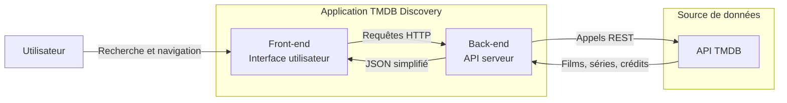
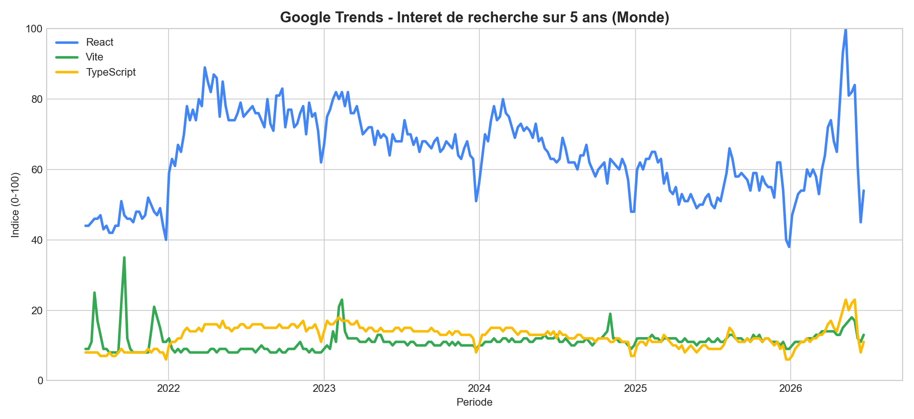

# Architecture logicielle - TMDB Discovery App

Front-end - Back-end - React - Express - TypeScript

---

# Objectifs

- Construire une application web de découverte TMDB : films, séries, acteurs, réalisateurs et statistiques
- Livrer rapidement une première version fonctionnelle
- Mettre en place une architecture évolutive pour accueillir les fonctionnalités à venir
- Avancer en mode **agile** : itérations courtes, valeur livrée en continu, adaptation au changement
---

# TMDB Discovery App

  
  

---

# Architecture logicielle

## Architecture logicielle d'une application web

- Une application web s'organise généralement en 3 couches : **front-end**, **back-end**, **données**
    - Le **front-end** est l'interface utilisateur, ce que l'utilisateur voit et avec quoi il interagit
    - Le **back-end** est le moteur de l'application, il traite les données et fournit les informations au front-end
    - La couche **données** est le stockage des informations, souvent une base de données
---

## Architecture logicielle de TMDB Discovery App

- Pour **TMDB Discovery**, nous retenons un duo **front-end + back-end**
- Le **back-end** interroge l'API TMDB et expose les données utiles au **front-end**
- Pas de base locale dans cette version : l'API TMDB fait office de source de données
- Pour plus de simplicité le **front-end** et le **back-end** seront développés dans le même projet, mais ils pourraient être séparés dans des projets distincts
    - Nous pourrions par exemple avoir un projet **tmdb-discovery-backend** et un projet **tmdb-discovery-frontend**
    - Pour plus de simplicité, allons aussi utiliser la même technologie pour le **front-end** et le **back-end** : **TypeScript** via **Node.js**

```mermaid
flowchart LR
    U[Utilisateur]

    subgraph APP[Application TMDB Discovery]
        F[Front-end
Interface utilisateur]
        B[Back-end
API serveur]
    end

    subgraph EXT[Source de données]
        T[API TMDB]
    end

    U -->|Recherche et navigation| F
    F -->|Requêtes HTTP| B
    B -->|Appels REST| T
    T -->|Films, séries, crédits| B
    B -->|JSON simplifié| F
```

---

# Architecture logicielle - back-end

Le **back-end** est le moteur de l'application :

- il interroge l'API TMDB
- il applique la logique métier (règles et traitements)
- il expose au **front-end** uniquement les données utiles, au format JSON simplifié
Dans TMDB Discovery, nous n'exposons pas toute l'API TMDB : seulement les **endpoints** nécessaires à l'application.

---

# Architecture logicielle - back-end (suite)

Le **back-end** joue aussi un rôle de simplification :

- le **front-end** n'appelle pas directement TMDB
- le **back-end** masque la complexité de l'API
- il peut filtrer, trier ou transformer les données avant de les renvoyer
Une base locale serait possible, mais pas nécessaire dans cette version : l'API TMDB suffit pour un accès en temps réel.

---

# Architecture logicielle - back-end (suite)

Pour TMDB Discovery, le **back-end** sera développé en **Node.js** avec **Express.js**.

- Structure : **routes** + **contrôleurs**
- Les routes définissent les **endpoints**
- Les contrôleurs appliquent la logique métier et renvoient la réponse
Le back-end interroge TMDB en HTTP et renvoie au **front-end** un JSON simplifié.
Les endpoints seront documentés avec **Swagger** pour faciliter l'intégration côté front-end.

---

# Architecture logicielle - front-end

Pour développer plus vite et plus proprement, nous nous appuyons sur des librairies et frameworks front-end.

- ils évitent de réimplémenter des briques techniques
- ils aident à gérer les contraintes web (compatibilité, performance, accessibilité, sécurité)
- ils permettent de se concentrer sur la logique métier et la valeur fonctionnelle
---

# Architecture logicielle - front-end (suite)

Les solutions les plus utilisées aujourd'hui sont :

- **React** : librairie JavaScript pour construire des interfaces utilisateur
- **Angular** : framework JavaScript pour construire des applications web
- **Vue.js** : framework JavaScript progressif pour construire des interfaces utilisateur
---

# Architecture logicielle - front-end (suite)

## Google Trends (5 ans)

---

# Architecture logicielle - front-end (suite)

## Différences entre librairie et framework

- Une **librairie** est un ensemble de fonctions et d'outils que l'on peut utiliser dans son code pour accomplir certaines tâches. On l'appelle quand on en a besoin
- Un **framework** est un ensemble de règles et de structures que l'on doit suivre pour construire une application. Il impose une certaine architecture et un certain flux de travail
---

# Architecture logicielle - front-end (suite)

## Pourquoi React ?

Sur le bassin niortais, de nombreuses entreprises utilisent **React** pour leurs applications web.

- Librairie JavaScript développée par Meta
- Approche déclarative et modulaire
- Écosystème très riche (communauté, tutoriels, outils)
---

# Architecture logicielle - front-end (suite)

# React + Vite + TypeScript

Cette combinaison est très populaire pour construire des applications web modernes.

- **React** : composant UI et structuration de l'interface
- **TypeScript** : typage statique pour fiabiliser le code
- **Vite** : démarrage rapide, rechargement instantané, build optimisé
---

# Méthodes de développement agiles

Pour livrer rapidement une première version fonctionnelle, nous adoptons une approche **agile**.

- itérations courtes
- priorisation des fonctionnalités
- collaboration continue
- adaptation selon les retours
**Note** : dans ce projet, les retours des parties prenantes seront simulés pour illustrer la démarche.

---

# SemVer - Semantic Versioning

Pour planifier les livraisons, chaque fonctionnalité est associée à une **version** selon **SemVer**.

Schéma : **MAJOR.MINOR.PATCH**

- **MAJOR** : changements majeurs, rupture de compatibilité
- **MINOR** : nouvelles fonctionnalités, compatibilité conservée
- **PATCH** : corrections de bugs, compatibilité conservée
Plus d'infos : [semver.org](https://semver.org/lang/fr/).

---

# SemVer - Semantic Versioning (suite)

Des suffixes peuvent préciser l'état d'avancement :

- `alpha` : version instable en cours de développement
- `beta` : version de test avant la version finale
- `rc` : release candidate, candidate à la version finale
- `latest` : version la plus récente
---

# SemVer - Semantic Versioning (suite)

Exemples de progression :

- `0.1.0` : première version en développement
- `0.2.0` : nouvelles fonctionnalités, toujours en développement
- `1.0.0-beta` : version de test
- `1.0.0-rc` : candidate finale
- `1.0.0` : première version stable
- `1.1.0` : nouvelles fonctionnalités compatibles
- `1.1.1` : correction de bugs compatible
---

# TMDB Discovery App - versions

| Version | Description |
|---------|-------------|
| **0.1.0** | Mise en oeuvre du back-end avec un premier endpoint **Hello World** |
| **0.2.0** | Exposition d'un vrai endpoint pour récupérer les films populaires depuis l'API TMDB |
| **0.3.0** | Amélioration du endpoint |
| **0.4.0** | Mise en oeuvre du front-end avec un premier composant React pour afficher les films populaires |
| ... | ... |
| **1.0.0** | Première version stable avec toutes les fonctionnalités prévues |
| **1.1.0** | Nouvelles fonctionnalités et améliorations |

---