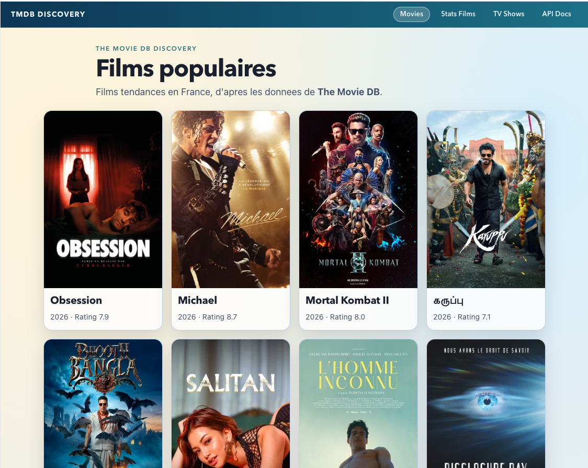
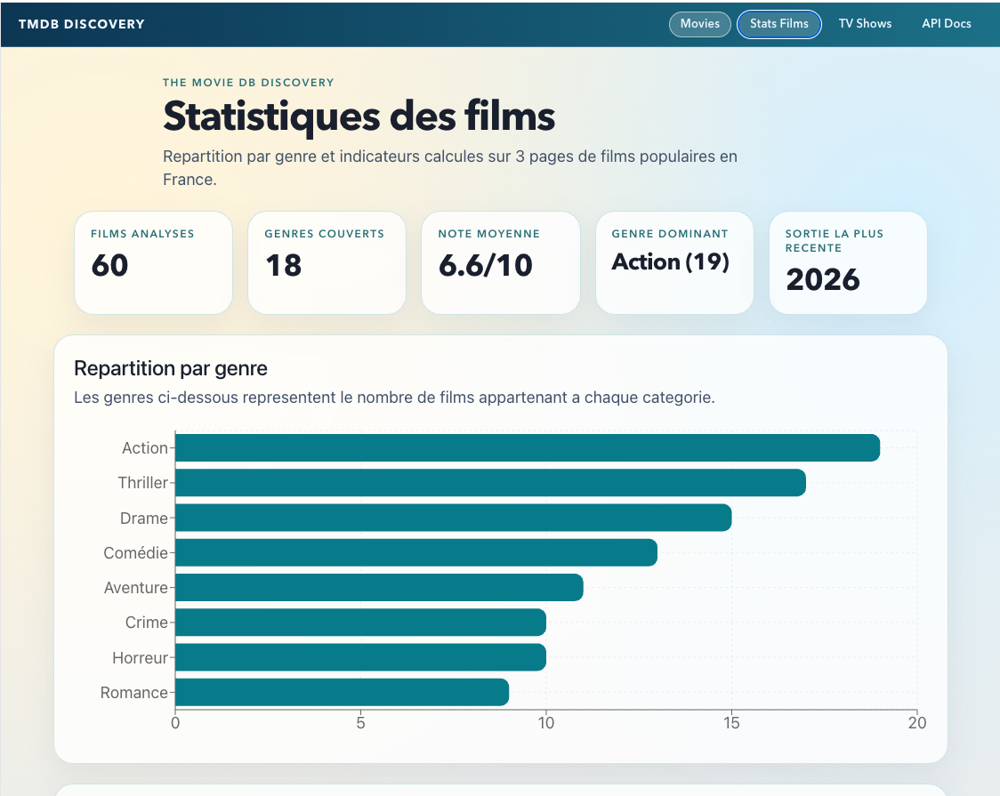
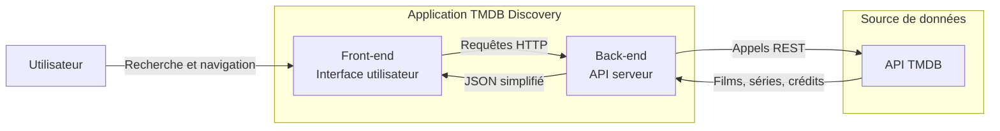

# Architecture logicielle

Front-end - Back-end - Agilité - Gestion de versions

---

# Objectifs

- **Objectif 1:** Construire une application web à partir des données **TMDB**
- **Objectif 2:** Préparer une architecture qui pourra évoluer
- **Objectif 3:** Travailler en mode **agile**
  - Livrer par petites itérations
  - Ajuster selon les retours
---

# **T**he **M**ovie **D**ata**b**ase (TMDB)

- **Définition:** **TMDB** est une base de données de films et de séries
- **Accès:** ses données sont disponibles via une **API**
- **Contenu:** films, séries, acteurs et réalisateurs
- **Usage:** source de données de **TMDB Discovery App**

Ressources:
- **Site officiel:** https://www.themoviedb.org
- **Documentation API:** https://developer.themoviedb.org/docs/getting-started

<!--

**A**pplication **P**rogramming **I**nterface: ensemble de règles et de conventions qui permet à des applications de communiquer entre elles. 

-->

---

# TMDB Discovery App

- **Objectif:** Construire une application web à partir de l'**API TMDB**
- **Fonctionnalité 1:** Rechercher des films et des séries
- **Fonctionnalité 2:** Explorer des statistiques et des tendances
- **Résultat attendu:** Afficher les données dans une interface claire

  
  

---

# Architecture logicielle d'une application web

- **Objectif:** Séparer les responsabilités de l'application
- **Couche 1:** **Front-end** - interface utilisée par l'utilisateur
- **Couche 2:** **Back-end** - traite les requêtes et applique les règles métier
- **Couche 3:** **Données** - stocke les informations de l'application
---

# Architecture logicielle de TMDB Discovery App

- **Objectif:** Relier l'interface aux données de **TMDB**
- **Organisation:** un **front-end** et un **back-end** dans le même projet
- **Rôle du back-end:** interroger l'**API TMDB** et préparer les données
- **Source de données:** pas de base locale dans cette version
- **Évolution possible:** séparer le front-end et le back-end en deux projets
- **Technologie:** **TypeScript** avec **Node.js**

```mermaid
flowchart LR
    U[Utilisateur]

    subgraph APP[Application TMDB Discovery]
        F[Front-end
Interface utilisateur]
        B[Back-end
API serveur]
    end

    subgraph EXT[Source de données]
        T[API TMDB]
    end

    U -->|Recherche et navigation| F
    F -->|Requêtes HTTP| B
    B -->|Appels REST| T
    T -->|Films, séries, crédits| B
    B -->|JSON simplifié| F
```

---

# Architecture logicielle - back-end

- **Objectif:** Servir d'intermédiaire entre le front-end et l'**API TMDB**
- **Rôle 1:** Interroger l'**API TMDB**
- **Rôle 2:** Appliquer les règles et traitements de l'application
- **Rôle 3:** Renvoyer au front-end des données JSON simplifiées
- **Rôle 4:** Exposer uniquement les **endpoints** nécessaires

---

# Architecture logicielle - back-end (suite)

- **Objectif:** Simplifier l'accès aux données **TMDB**
- **Règle:** Le front-end appelle uniquement le back-end
- **Traitement:** Filtrer, trier et transformer les réponses de l'API
- **Choix:** Ne pas utiliser de base locale dans cette version
- **Résultat attendu:** Utiliser les données TMDB en temps réel

---

# Architecture logicielle - back-end (suite)    

## Protéger la clé API TMDB

- **Objectif:** Empêcher l'exposition de la clé API TMDB
- **Règle:** Le front-end ne connaît jamais la clé API
- **Front-end:** Appeler uniquement les endpoints du back-end
- **Back-end:** Utiliser la clé pour appeler l'API TMDB
- **Stockage:** Conserver la clé dans une variable d'environnement
- **Anti-pattern à éviter:** Placer la clé dans le code front-end ou la publier dans Git

---

# Librairies et frameworks

- **Définition:** Une dépendance est un composant externe utilisé par l'application
- **Objectif:** Ajouter des fonctionnalités sans les développer entièrement
- **Pourquoi:** Gagner du temps et s'appuyer sur des solutions maintenues
- **Sources:** **npm**, **PyPI**, Maven Central

---

# Librairie ou framework ?

- **Librairie:** Ensemble d'outils appelés lorsque le code en a besoin
- **Framework:** Structure et règles qui organisent l'application
- **Différence clé:** La librairie s'adapte au code ; le framework impose un cadre

---

# Librairies et frameworks (suite)

- **Back-end:** 
    - Créer un serveur, exposer des API et accéder aux données
    - Interroger des services externes et gérer les sessions
- **Front-end:** 
    - Construire l'interface utilisateur
    - Gérer l'état, les routes et les formulaires

---

# Librairies - Gestion des dépendances

- **Définition:** Un gestionnaire de paquets installe et suit les dépendances
- **Actions:** Installer, mettre à jour, supprimer et lister les paquets
- **JavaScript:** **npm** ou Yarn
- **Python:** **pip**, Poetry ou uv
- **Java:** Maven

---

# Librairies et frameworks - Gestion des dépendances (suite)

- **Règle 1:** Maintenir les dépendances à jour (obsolescence, sécurité, compatibilité)
- **Règle 2:** Choisir des librairies actives et maintenues (GitHub, issues, commits)
- **Règle 3:** Lire la documentation et identifier les limites (exemples, bugs connus, compatibilité) 
- **Règle 4:** Vérifier la licence et les conditions d'utilisation (MIT, Apache, GPL, etc.)
- **Règle 5:** Utiliser le versionnement sémantique pour évaluer la compatibilité (SemVer)

---

# Architecture logicielle - back-end (suite)

- **Technologie:** **Node.js** avec **Express.js**
- **Structure:** Organiser le code avec des **routes** et des **contrôleurs**
- **Routes:** Définir les **endpoints** de l'API
- **Contrôleurs:** Appliquer la logique métier et construire les réponses
- **Flux:** Appeler TMDB en HTTP et renvoyer un JSON simplifié
- **Documentation:** Décrire les endpoints avec **Swagger**

---

# Architecture logicielle - front-end

- **Objectif:** Construire l'interface plus vite et de façon cohérente
- **Apport 1:** Éviter de réimplémenter des briques techniques
- **Apport 2:** Gérer la compatibilité, la performance et l'accessibilité
- **Résultat attendu:** Se concentrer sur la logique métier et la valeur utilisateur

---

# Architecture logicielle - front-end (suite)

- **Objectif:** Choisir un outil pour construire l'interface
- **React:** Librairie JavaScript pour créer des interfaces
- **Angular:** Framework JavaScript pour créer des applications web
- **Vue.js:** Framework progressif pour créer des interfaces

---

# Popularité des solutions front-end

- **Outil:** Google Trends, en France, sur les cinq dernières années

  <iframe src="https://trends.google.co.in:443/trends/embed/explore/TIMESERIES?req=%7B%22comparisonItem%22%3A%5B%7B%22keyword%22%3A%22%2Fm%2F012l1vxv%22%2C%22geo%22%3A%22FR%22%2C%22time%22%3A%22today%205-y%22%7D%2C%7B%22keyword%22%3A%22%2Fg%2F11c0vmgx5d%22%2C%22geo%22%3A%22FR%22%2C%22time%22%3A%22today%205-y%22%7D%2C%7B%22keyword%22%3A%22%2Fm%2F0j45p7w%22%2C%22geo%22%3A%22FR%22%2C%22time%22%3A%22today%205-y%22%7D%5D%2C%22category%22%3A0%2C%22property%22%3A%22%22%7D&tz=0" width="100%" height="100%" frameborder="0" scrolling="no" loading="lazy" referrerpolicy="no-referrer-when-downgrade" style="border:0; width:100%; height:100%; display:block;"></iframe>

---

# Choisir un outil front-end

- **Objectif:** Choisir un outil adapté au projet
- **Critère 1:** Les besoins fonctionnels et la complexité de l'interface
- **Critère 2:** Les compétences de l'équipe et le marché local
- **Critère 3:** La qualité de l'écosystème, de la documentation et de la maintenance
- **Critère 4:** Les contraintes de performance, d'accessibilité et de sécurité
- **Résultat attendu:** Justifier le choix technique selon le contexte, pas uniquement selon la popularité

---

# Pourquoi React ?

- **Contexte:** De nombreuses entreprises du bassin niortais utilisent **React**
- **Nature:** Librairie JavaScript développée par **Meta**
- **Approche:** Déclarative et modulaire
- **Atout:** Écosystème riche, avec une large communauté et de nombreux outils

---

# React + Vite + TypeScript

- **Objectif:** Construire une application web moderne et maintenable
- **React:** Composer et structurer l'interface utilisateur
- **TypeScript:** Fiabiliser le code grâce au typage statique
- **Vite:** Démarrer vite, recharger instantanément et optimiser le build

---

# Méthodes de développement agiles

- **Objectif:** Livrer rapidement une première version fonctionnelle
- **Principe 1:** Travailler par itérations courtes
- **Principe 2:** Prioriser les fonctionnalités utiles
- **Principe 3:** Collaborer en continu
- **Principe 4:** Adapter le produit selon les retours
- **Contexte:** Simuler les retours des parties prenantes dans ce projet

---

# Rôles d'une équipe agile

- **Principe:** Ajuster le développement grâce aux retours fréquents
- **Product Owner:** Porter la vision produit et prioriser les fonctionnalités
- **Scrum Master:** Faciliter l'équipe et les pratiques agiles
- **Équipe de développement:** Concevoir, développer et tester le produit
- **Parties prenantes:** Exprimer les besoins et partager leurs retours
- **Contexte:** Simuler ces rôles dans ce projet

---

# Artefacts agiles

- **Backlog produit:** Liste priorisée des fonctionnalités et améliorations
- **Backlog sprint:** Éléments sélectionnés pour une itération
- **Incrément:** Version fonctionnelle livrée en fin de sprint
- **Sprint:** Période fixe, généralement comprise entre une et quatre semaines
- **Contexte:** Simuler les itérations avant d'enrichir progressivement le produit

---

# SemVer - Semantic Versioning

- **Objectif:** Communiquer l'impact d'une livraison
- **Format:** **MAJOR.MINOR.PATCH**
- **MAJOR:** Changement incompatible avec les versions précédentes
- **MINOR:** Nouvelle fonctionnalité compatible
- **PATCH:** Correction de bug compatible
- **Référence:** [semver.org](https://semver.org/lang/fr/)

---

# SemVer - Suffixes de version

- **Objectif:** Indiquer l'état d'avancement d'une version
- **`alpha`:** Version instable, en cours de développement
- **`beta`:** Version de test avant la publication finale
- **`rc`:** Release candidate, candidate à la version finale
- **`latest`:** Tag de distribution, souvent utilisé par les gestionnaires de paquets

---

# SemVer - Exemples de progression

- **`0.1.0`:** Première version en développement
- **`0.2.0`:** Ajout de fonctionnalités, toujours en développement
- **`1.0.0-beta` puis `1.0.0-rc`:** Versions de test avant publication
- **`1.0.0`:** Première version stable
- **`1.1.0`:** Nouvelles fonctionnalités compatibles
- **`1.1.1`:** Correction de bug compatible

---

# TMDB Discovery App - feuille de route

| Version | Contenu |
| --- | --- |
| **0.1.0** | Back-end et endpoint **Hello World** |
| **0.2.0** | Endpoint des films populaires TMDB |
| **0.3.0** | Amélioration de l'endpoint |
| **0.4.0** | Front-end React: affichage des films populaires |
| ... | ... |
| **1.0.0** | Première version stable |
| **1.1.0** | Nouvelles fonctionnalités et améliorations |

---

# TMDB Discovery App - suite du parcours

- **Objectif:** Livrer rapidement une première version fonctionnelle
- **Constat:** Les besoins évolueront au fil du projet
- **Réponse:** Adapter le produit grâce à l'architecture choisie et à la démarche agile
- **Prochaine étape:** Implémenter progressivement les fonctionnalités
