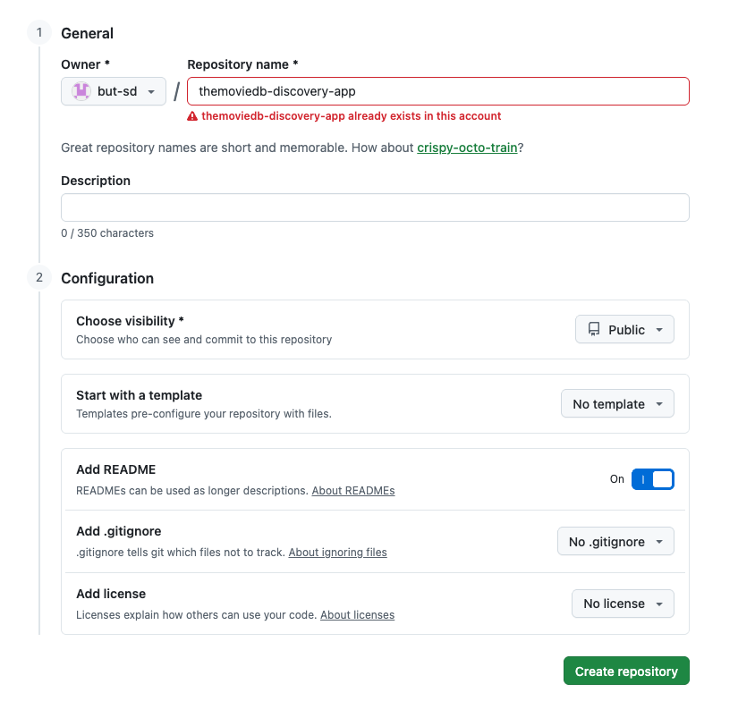
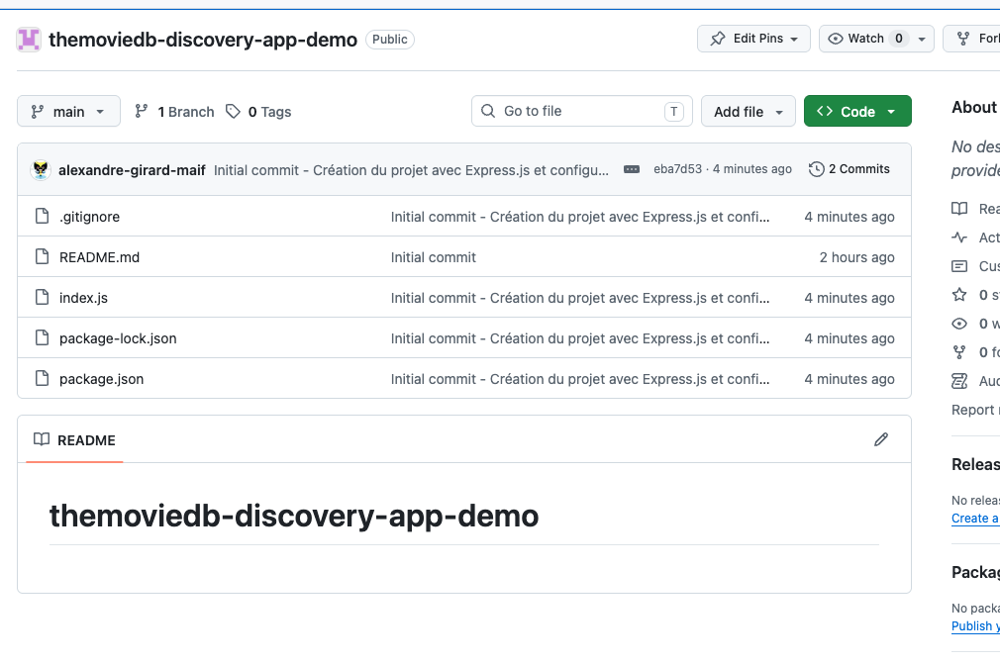

# TMDB Discovery App

## Back-end

---

<style>
.backend-showcase {
  margin-top: 1.5rem;
  display: grid;
  grid-template-columns: 1fr 1fr;
  gap: 2rem;
  align-items: start;
}

.backend-media {
  display: flex;
  align-items: flex-start;
  justify-content: center;
}

.backend-media img {
  display: block;
  width: auto;
  max-width: 100%;
  max-height: 50vh;
  object-fit: contain;
  border-radius: 1rem;
}

.backend-copy {
  display: flex;
  flex-direction: column;
  justify-content: center;
  gap: 1rem;
  font-size: 1.05rem;
  line-height: 1.7;
}

.backend-copy h2 {
  margin: 0;
  font-size: 2rem;
}

.backend-copy p {
  margin: 0;
}

@media (max-width: 900px) {
  .backend-showcase {
    grid-template-columns: 1fr;
    min-height: auto;
  }
}
</style>

# Création du projet back-end

<div class="backend-showcase">
  <div class="backend-media">
    
  </div>

  <div class="backend-copy">
    <h2>Options de création du projet</h2>
    <p>Le projet back-end est créé avec les options suivantes :</p>
    <ul>
      <li>Nom du repository : themoviedb-discovery-app</li>
      <li>Visibility : Public</li>
      <li>Add a README file</li>
    </ul>
  </div>
</div>

---

# Installation du projet

TODO expliquer l'utilisation de CodeSpaces permettant de travailler dans un environnement de développement pré-configuré.

```shell

# Initialisation du projet Node.js avec les options par défaut
npm init -y

# Positionnement du projet en mode module pour utiliser les imports ES6
npm pkg set type=module
```

---

# Express.js

**Express.js** est un framework web pour Node.js qui facilite la création d'applications web et d'API. Il fournit des fonctionnalités robustes pour gérer les requêtes HTTP, les routes, les middlewares et bien plus encore. Nous allons l'utiliser pour exposer notre back-end sous forme d'API REST.

Pour plus d'informations sur Express.js, vous pouvez consulter la documentation officielle : [https://expressjs.com/fr/](https://expressjs.com/fr/)

```shell
# Installation d'express pour créer le serveur web
npm install express
```

Nous allons mettre en place un serveur web simple qui écoute sur le port 3000 et répond à une requête GET sur la route racine `/` avec un message "Hello World!".

---

# Express.js (suite)

Création du fichier `index.js` qui sera le point d'entrée de notre application back-end.

```javascript
import express from 'express';

const app = express();
const port = 3000;

app.get('/', (req, res) => {
  res.send('Hello World!');
});

app.listen(port, () => {
  console.log(`Example app listening on port ${port}`);
});

```

Pour valider que le serveur fonctionne correctement lancer le serveur avec la commande suivante :

```shell
node index.js
```

Vous pouvez accéder à l'adresse [http://localhost:3000](http://localhost:3000). Vous devriez voir le message "Hello World!" s'afficher.

---

# Sauvegarde du projet sur GitHub

Nous avons une première version du projet back-end fonctionnelle. Il est temps de sauvegarder notre travail dans le dépôt GitHub.

---

# GIT - status


La commande `git status` permet de vérifier l'état du projet et de voir quels fichiers ont été modifiés, ajoutés ou supprimés depuis la dernière validation (commit). 

Elle nous indique également si nous avons des fichiers non suivis par Git, c'est-à-dire des fichiers qui ne sont pas encore inclus dans le suivi de version.

```shell
# Vérification de l'état du projet
git status  

````

Résultat attendu :

```shell
@alexandre-girard-maif ➜ /workspaces/themoviedb-discovery-app-demo (main) $ git status
On branch main
Your branch is up to date with 'origin/main'.

Untracked files:
  (use "git add <file>..." to include in what will be committed)
        index.js
        node_modules/
        package-lock.json
        package.json
```

---


La commande `git status` nous indique que nous avons des fichiers non suivis par Git (index.js, node_modules/, package-lock.json, package.json). Nous allons les ajouter à l'index Git pour les inclure dans le prochain commit. Cependant, nous ne voulons pas inclure le dossier `node_modules/` dans notre dépôt Git, car il contient les dépendances installées et peut être recréé à partir du fichier `package.json`. Nous allons donc créer un fichier `.gitignore` pour exclure ce dossier.

```shell
# Création du fichier .gitignore pour exclure le dossier node_modules/
echo "node_modules/" > .gitignore
```

Résultat attendu :

```shell
@alexandre-girard-maif ➜ /workspaces/themoviedb-discovery-app-demo (main) $ git status
On branch main
Your branch is up to date with 'origin/main'.

Untracked files:
  (use "git add <file>..." to include in what will be committed)
        .gitignore
        index.js
        package-lock.json
        package.json

```

---

# GIT - add

La commande `git add` permet d'ajouter des fichiers à l'index Git, c'est-à-dire de les préparer pour le prochain commit. Nous allons ajouter tous les fichiers non suivis par Git, sauf le dossier `node_modules/` qui est exclu par le fichier `.gitignore`.

```shell
# Ajout de tous les fichiers non suivis par Git, sauf le dossier node_modules/
git add .

# Vérification de l'état du projet après l'ajout des fichiers à l'index Git
git status
```

Résultat attendu :

```shell
@alexandre-girard-maif ➜ /workspaces/themoviedb-discovery-app-demo (main) $ git status
On branch main
Your branch is up to date with 'origin/main'.

Changes to be committed:
  (use "git restore --staged <file>..." to unstage)
        new file:   .gitignore
        new file:   index.js
        new file:   package-lock.json
        new file:   package.json
````

---

# GIT - commit

La commande `git commit` permet de valider les modifications ajoutées à l'index Git et de créer un nouveau commit dans l'historique du projet. Nous allons créer un commit avec un message décrivant les modifications apportées.

```shell
# Création d'un commit avec un message décrivant les modifications apportées
git commit -m "Initial commit - Création du projet avec Express.js et configuration de base"
```

Résultat attendu :

```shell
[main eba7d53] Initial commit - Création du projet avec Express.js et configuration de base
 4 files changed, 895 insertions(+)
 create mode 100644 .gitignore
 create mode 100644 index.js
 create mode 100644 package-lock.json
 create mode 100644 package.json

````

---

# GIT - commit (suite)

Une vérification de l'état du projet avec la commande `git status` nous indique que nous n'avons plus de modifications en attente et que notre branche locale est à jour avec la branche distante `origin/main`.

```shell
# Vérification de l'état du projet après le commit
git status
```

Résultat attendu :

```shell
@alexandre-girard-maif ➜ /workspaces/themoviedb-discovery-app-demo (main) $ git status
On branch main
Your branch is ahead of 'origin/main' by 1 commit.
  (use "git push" to publish your local commits)

nothing to commit, working tree clean
```

---

# GIT - push

La commande `git push` permet d'envoyer les commits locaux vers le dépôt distant sur GitHub. Nous allons pousser notre commit initial vers la branche principale `main` du dépôt distant.

```shell
# Envoi des commits locaux vers le dépôt distant sur GitHub
git push origin main
```

Résultat attendu :

```shell
@alexandre-girard-maif ➜ /workspaces/themoviedb-discovery-app-demo (main) $ git push origin main
Enumerating objects: 7, done.
Counting objects: 100% (7/7), done.
Delta compression using up to 2 threads
Compressing objects: 100% (5/5), done.
Writing objects: 100% (6/6), 8.15 KiB | 8.15 MiB/s, done.
Total 6 (delta 0), reused 0 (delta 0), pack-reused 0 (from 0)
To https://github.com/but-sd/themoviedb-discovery-app-demo
   ea1932b..eba7d53  main -> main
```

---

# GIT - push (suite)

Une vérification de l'état du projet avec la commande `git status` nous indique que notre branche locale est maintenant à jour avec la branche distante `origin/main`.

```shell
# Vérification de l'état du projet après le push
git status
```

Résultat attendu :

```shell
@alexandre-girard-maif ➜ /workspaces/themoviedb-discovery-app-demo (main) $ git status
On branch main
Your branch is up to date with 'origin/main'.

nothing to commit, working tree clean
```

---

# GIT - push (suite)

Le commit initial a été poussé avec succès vers le dépôt distant sur GitHub. Vous pouvez vérifier que les fichiers ont été correctement ajoutés et que le commit est présent dans l'historique du dépôt en visitant la page du dépôt sur GitHub.



---