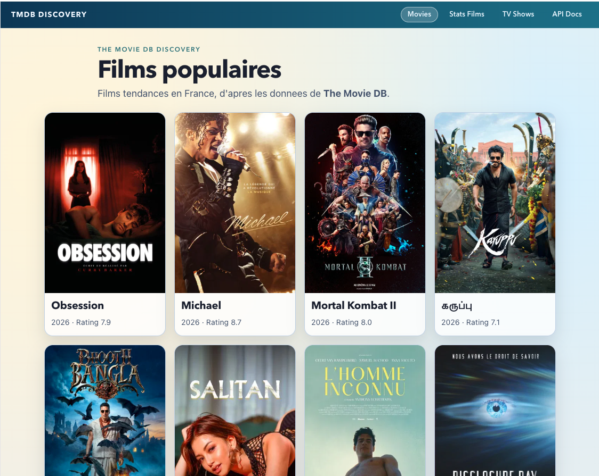
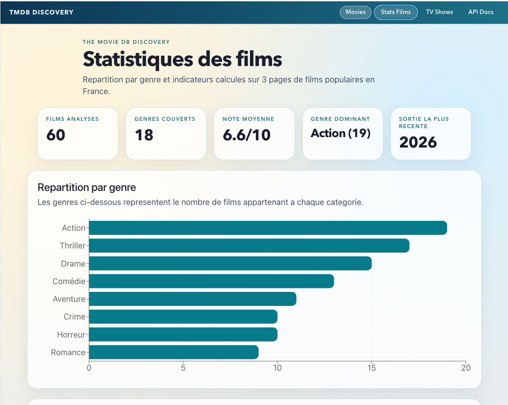

# Alexandre GIRARD

## Conseiller en Nouvelles Technologies

### alexandre.girard@maif.fr

<style>
.intro-slide {
  position: relative;
}

/* Assombrit legerement le fond via un voile noir (25%) */
.intro-slide::before {
  content: '';
  position: absolute;
  inset: 0;
  background: rgba(0, 0, 0, 0.25);
  pointer-events: none;
}

.intro-slide > * {
  position: relative;
  z-index: 1;
}

:global(.qr-slide) {
  min-height: 100%;
  display: flex;
  flex-direction: column;
  justify-content: center;
  align-items: center;
  text-align: center;
  gap: 0.6rem;
  background: radial-gradient(circle at 20% 20%, #dbeafe 0%, #f8fafc 38%, #e2e8f0 100%);
  color: #0f172a;
}

:global(.qr-slide h1) {
  margin: 0;
  font-size: 2.2rem;
  color: #0b3b66;
}

:global(.qr-subtitle) {
  margin: 0 0 0.4rem;
  font-size: 1.05rem;
  color: #334155;
}

:global(.intro-access) {
  margin-top: 0.2rem;
  display: inline-flex;
  flex-direction: column;
  align-items: center;
  gap: 0.9rem;
  padding: 1rem;
  border-radius: 16px;
  background: rgba(255, 255, 255, 0.92);
  box-shadow: 0 14px 32px rgba(15, 23, 42, 0.16);
  color: #111827;
}

:global(.intro-access a) {
  color: #0f766e;
  text-decoration: underline;
  word-break: break-all;
  font-size: 0.92rem;
  max-width: 28rem;
}

:global(.intro-access img) {
  width: 220px;
  height: 220px;
  border-radius: 10px;
  border: 1px solid rgba(15, 23, 42, 0.15);
  background: white;
}

/* Slide 2: diagramme centre et agrandi sans deformation */
.forge-slide {
  display: flex;
  flex-direction: column;
}

.forge-mermaid {
  flex: 1 1 auto;
  min-height: 0;
  display: grid;
  place-items: center;
}

.forge-mermaid pre {
  width: 100%;
  height: 100%;
  margin: 0 !important;
  padding: 0 !important;
  border: 0 !important;
  background: transparent !important;
  display: grid;
  place-items: center;
  overflow: hidden;
}

.forge-mermaid .mermaid {
  width: min(100%, 1400px);
  margin: 0 auto;
}

.forge-mermaid .mermaid svg {
  display: block;
  margin: 0 auto;
  width: 100% !important;
  height: auto !important;
  max-height: 100%;
}
</style>

---
class: forge-slide
---

# Gestion de la forge logicielle

Ensemble des outils pour le développement logiciel mis à la disposition des équipes de développement 

* __GitHub__ : gestion des dépôts de code source (versionning, pull request, issues)
* __Jenkins__ : intégration continue (exécution des tests, compilation, déploiement)
* __SonarQube__ : qualité du code (analyse statique, couverture de tests, détection de vulnérabilités)
* __Nexus__ : gestion des artefacts (dépendances, librairies, packages) 

<div class="forge-mermaid">

```mermaid
%%{init: {"flowchart": {"useMaxWidth": true}}}%%
flowchart LR
    GH@{ img: "./logos/github.svg", label: "GitHub", pos: "t", h: 48, constraint: "on" }
    JENKINS@{ img: "./logos/jenkins.svg", label: "Jenkins", pos: "t", h: 48, constraint: "on" }
    SONAR@{ img: "./logos/sonarqube.svg", label: "SonarQube", pos: "t", h: 48, constraint: "on" }
    NEXUS@{ img: "./logos/nexus.svg", label: "Nexus", pos: "t", h: 48, constraint: "on" }

    GH -->|Push / Pull Request| JENKINS
    JENKINS -->|Analyse qualite| SONAR
    SONAR -->|Quality Gate| JENKINS
    JENKINS -->|Publie artefacts| NEXUS
    NEXUS -->|Dependances / artefacts| JENKINS
```

</div>

---

# Organisation du cours (Regroupement de 2 modules)

## __Développement logiciel__
Présenter les approches et les outils qui permettent de mener à bien un projet informatique

## __Développement web__
Programmation web pour la visualisation de données


## 24 séances de 2H
Mélangeant de la théorie et surtout beaucoup de pratique pour mettre en application les concepts abordés

---

# Objectifs

## Mettre en place une application web en suivant les bonnes pratiques de développement

Les technologies utilisées sont celles actuellement utilisées dans le monde professionnel.

 L'objectif est de vous:
 * __préparer__ au mieux pour votre future insertion professionnelle.
 * __donner__ les bases pour que vous puissiez continuer à apprendre par vous-même par la suite. Les technologies évoluent très vite, il est important de __savoir s'adapter__.
 * __vous faire découvrir__ les outils et les pratiques qui sont utilisés dans le monde professionnel.
 * __être sensibilisé__ sur l'usage de l'**I**ntelligence **A**rtificielle dans le développement logiciel, ce quelle apporte comme opportunités et les risques associés.

---

# Application développée

Exploration de l'**API** de **T**he **M**ovie **D**atabase (TMDB) pour découvrir les films et séries populaires, les détails des films, les acteurs et les réalisateurs.

<div class="grid grid-cols-2 gap-4 mt-4">
  
  
</div>

---

# Concepts manipulés (1/2)

* __agilité__ : méthode de développement, permettant de livrer rapidement des fonctionnalités et de s'adapter aux changements
* __développement web__ : librairies et frameworks spécialisés pour le web.
* __aide au développement__: outils de débogage, outils de test, aide à la génération de code
* __travail collaboratif__: organisation du code, revue de code, gestion des versions, gestion des branches, pull request, issues
* __tests unitaires, tests d'intégration__: différentes stratégies de tests, couverture de tests
* __intégration continue__: automatisation des tests, compilation, qualité du code
* __déploiement continu__: automatisation du déploiement sur un serveur de test ou de production
* __documentation__: outils de génération de documentation, documentation des API
* __qualimétrie__: analyse statique de code, couverture de tests, détection de vulnérabilités, qualité du code

---

# Concepts manipulés (2/2)

Afin de mettre en pratique les concepts abordés, nous utiliserons des outils couramment employés dans le monde professionnel pour le développement logiciel et web.

L'essentiel n'est pas l'outil, mais la compréhension des concepts et des bonnes pratiques, qui restent valables d'un outil à l'autre.

Le développement logiciel évolue très vite : il faut savoir s'adapter et continuer à apprendre par soi-même. Les technologies changent, mais les concepts et les bonnes pratiques restent.

---
class: qr-slide
---

# Accès au support

<p class="qr-subtitle">Scannez le QR code ou utilisez le lien ci-dessous</p>

<div class="intro-access">
  
  <a href="https://but-sd.github.io/support-cours-2026-2027" target="_blank" rel="noopener noreferrer">
    https://but-sd.github.io/support-cours-2026-2027
  </a>
</div>
