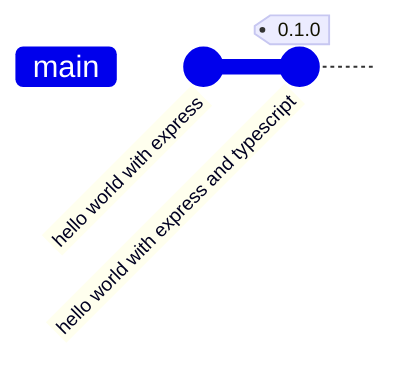
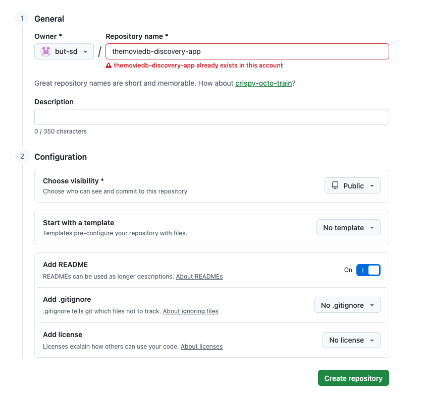
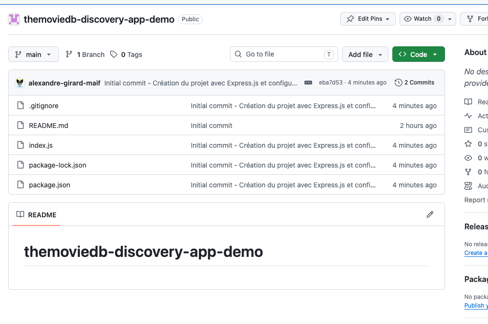
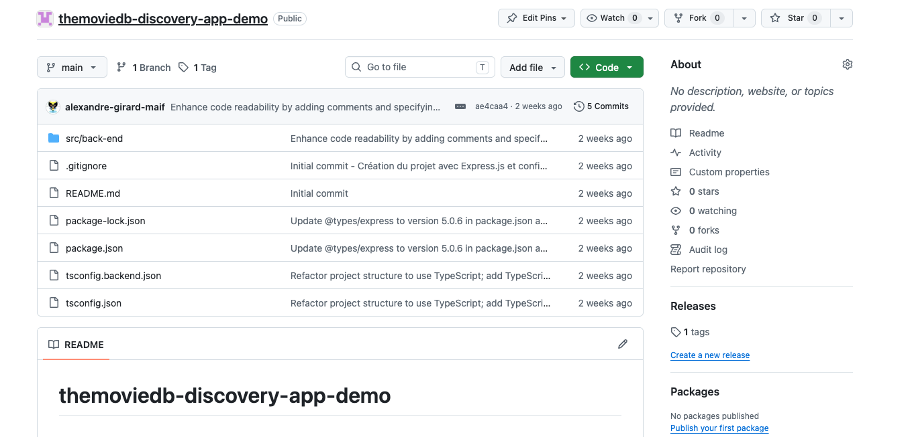
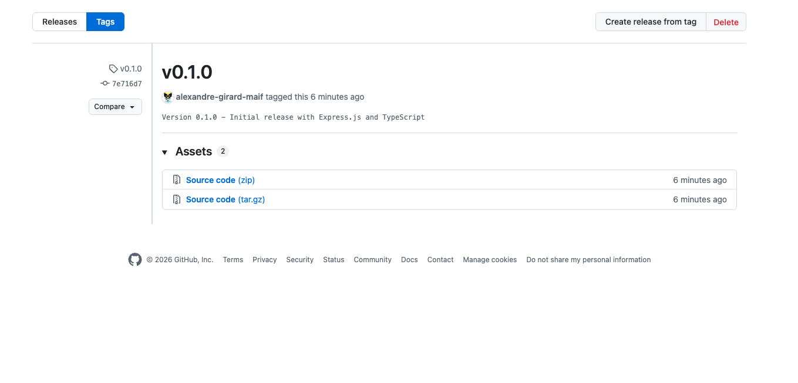

# TMDB Discovery App - 0.1.0

<p class="hero-kicker">Back-end Foundation - Express - TypeScript - Git</p>

---

# Objectifs

## Application
- Mise en place de l'architecture logicielle **back-end**
  - Utilisation de **Node.js** et **Express**
  - Exposition d'un premier endpoint __Hello World__ 

## Ingénierie logicielle
- Utilisation de **git**
    - **commit**, **push**
    - **tags** pour versionner le projet

<!--
- **back-end**: partie serveur de l'application
- **front-end**: partie client de l'application

- **endpoint**: point d'accès à une ressource via une URL
- **U**niform **R**esource **L**ocator: adresse permettant d'accéder à une ressource sur le web

-->
---

# Source Control Management (SCM)

Système qui permet de suivre les modifications apportées aux fichiers d’un projet.

- Suivre les modifications apportées à un projet (quand, qui)
- Inclure un message descriptif pour chaque modification pour expliquer le pourquoi
- Permettre de revenir à une version antérieure du projet ou d'un fichier
- Travailler en parallèle sur différentes branches de développement (feature, bugfix...) par des personnes différentes sans affecter la branche principale (main, develop...)
- Marquer des versions stables du projet (release)

---

# Distributed Version Control System

Système de gestion de version distribué

- Chaque utilisateur possède une copie complète de l'historique du projet
- Il est possible de travailler en local, sans connexion permanente à un serveur, contrairement aux anciens systèmes centralisés

**git**  - https://git-scm.com/

- Créé par Linus Torvalds (créateur de Linux) en 2005,
- Rapide, simple, léger, performant, open source
- Utilisé par de nombreux projets open source et entreprises
- Services en ligne (GitHub, GitLab, Bitbucket, Azure DevOps) viennent ajouter des fonctionnalités (gestion de projet, CI/CD, wiki, issues, pull requests...)
- Intégration dans les IDE (VSCode, IntelliJ, Eclipse...)

---

# git - terminologie

- **repository**: dépôt it, contient l'historique des modifications du projet
- **commit**: enregistrement d'un ensemble de modifications dans le dépôt Git
- **branch**: branche de développement indépendante dans le dépôt Git
- **merge**: fusion de deux branches dans le dépôt Git
- **tag**: marqueur pour une version spécifique du projet dans le dépôt Git

Nous manipulerons ces concepts tout au long du développement de l'application TMDB Discovery App.

---



- 2 **commits** vont être réalisés dans cette version 0.1.0 du projet.
- un premier **commit** pour la mise en place d'un serveur web avec **Express.js** et un endpoint REST __Hello World__
- un second **commit** pour la transformation du projet pour utiliser **TypeScript**

- 1 **tag** sera créé pour marquer la version 0.1.0 du projet.

---


<style>
.backend-showcase {
  margin-top: 1.5rem;
  display: grid;
  grid-template-columns: 1fr 1fr;
  gap: 2rem;
  align-items: start;
}

.backend-media {
  display: flex;
  align-items: flex-start;
  justify-content: center;
}

.backend-media img {
  display: block;
  width: auto;
  max-width: 100%;
  max-height: 50vh;
  object-fit: contain;
  border-radius: 1rem;
}

.backend-copy {
  display: flex;
  flex-direction: column;
  justify-content: center;
  gap: 1rem;
  font-size: 1.05rem;
  line-height: 1.7;
}

.backend-copy h2 {
  margin: 0;
  font-size: 2rem;
}

.backend-copy p {
  margin: 0;
}

@media (max-width: 900px) {
  .backend-showcase {
    grid-template-columns: 1fr;
    min-height: auto;
  }
}
</style>

# Création du projet dans GitHub

<div class="backend-showcase">
  <div class="backend-media">
    
  </div>

  <div class="backend-copy">
    <h2>Options de création du projet</h2>
    <p>Le projet est créé avec les options suivantes :</p>
    <ul>
      <li><b>Repository name:</b> themoviedb-discovery-app</li>
      <li><b>Visibility:</b> Public</li>
      <li><b>Add a README file</b></li>
    </ul>
  </div>
</div>

<!--

**github** est un service en ligne qui permet de gérer des projets utilisant le système de gestion de version **git**. Il existe d'autres services similaires comme **GitLab**, **Bitbucket** ou **Azure DevOps**.

**github** est le service en ligne le plus populaire pour héberger des projets open source et collaborer avec d'autres développeurs. Il offre des fonctionnalités supplémentaires comme la gestion de projet, l'intégration continue, la documentation et la communication entre les membres de l'équipe.

**open source** signifie que le code source du projet est accessible à tous et peut être modifié et redistribué librement. Cela favorise la collaboration, l'innovation et la transparence dans le développement logiciel.

**Public** signifie que le projet est visible par tous et peut être consulté, cloné et forké par n'importe qui. Cela permet à la communauté de contribuer au projet et d'en bénéficier. Pour notre cas cela permet de bénéficier de fonctionnalités supplémentaires qui ne sont proposées gratuitement que pour les projets publics.

-->

---

# GitHub - Codespaces

**Codespaces** est un service proposé par **GitHub** qui permet de créer un environnement de développement complet dans le cloud, directement à partir d'un dépôt **GitHub**.

Il offre une expérience de développement similaire à celle d'un **IDE** local, mais avec l'avantage de ne pas avoir à configurer l'environnement sur votre machine.

**Codespaces** est un **VS Code** complet dans le navigateur, avec un terminal intégré, un débogueur, un gestionnaire de versions et d'autres fonctionnalités utiles pour le développement. Il permet de travailler sur le projet depuis n'importe quel appareil avec un navigateur web, sans avoir à installer de logiciels supplémentaires.

Il est aussi possible d’utiliser **Codespaces** avec l’application **VS Code** installée sur votre machine, tout en conservant un environnement déjà configuré.

<!--

**Integrated Development Environment**, c'est un logiciel qui regroupe plusieurs outils pour faciliter le développement d'applications. Il inclut généralement un éditeur de code, un débogueur, un compilateur ou interpréteur, un gestionnaire de versions et d'autres fonctionnalités utiles pour le développement.

**VS Code** est un éditeur de code source développé par Microsoft, qui est gratuit, open source et multiplateforme. Il est très populaire parmi les développeurs pour sa légèreté, sa rapidité et sa richesse en fonctionnalités. Il supporte de nombreux langages de programmation et dispose d'une vaste bibliothèque d'extensions pour ajouter des fonctionnalités supplémentaires.
-->

---

# Initialisation du projet

Dans un terminal intégré à **Codespaces**, nous allons initialiser notre projet Node.js avec les options par défaut et le configurer pour utiliser les modules ES.

```shell

# Initialisation du projet Node.js avec les options par défaut
npm init -y

# Positionnement du projet en mode module pour utiliser les imports ES
npm pkg set type=module

# Création du fichier .nvmrc pour définir la version de Node.js à utiliser
echo "24" > .nvmrc
```

<!--

Un fichier `package.json` est créé à la racine du projet avec les informations de configuration du projet Node.js. Il contient notamment le nom du projet, la version, les dépendances (aucune pour l'instant) et les scripts (comme `start`, `test`, etc.) qui peuvent être utilisés pour exécuter des commandes spécifiques.

-->
---

# Express.js

**Express.js** est un **framework** web pour **Node.js** qui facilite la création d'applications web et d'**API**. Il fournit des fonctionnalités robustes pour gérer les requêtes **HTTP**, les routes, les middlewares et bien plus encore. Nous allons l'utiliser pour exposer notre back-end sous forme d'**API REST**.

Pour plus d'informations sur **Express.js**, vous pouvez consulter la documentation officielle : [https://expressjs.com/fr/](https://expressjs.com/fr/)

```shell
# Installation d'express pour créer le serveur web
npm install express
```

<!--

**framework**: ensemble d'outils et de bibliothèques qui facilite le développement d'applications en fournissant une structure et des fonctionnalités préconçues.

**Node.js**: environnement d'exécution JavaScript côté serveur qui permet d'exécuter du code JavaScript en dehors d'un navigateur web.

**routes**: chemins d'accès aux différentes ressources de l'application, définis par des URL et associés à des fonctions qui traitent les requêtes et renvoient des réponses.

**middlewares**: fonctions qui s'exécutent entre la réception d'une requête et l'envoi d'une réponse, permettant de modifier la requête ou la réponse, de gérer les erreurs, d'authentifier les utilisateurs, etc.

-->
---

# Express.js (suite)

Exposition d'un premier endpoint de notre **API REST** __Hello World__ avec Express.js.

Nous allons mettre en place un serveur web simple qui écoute sur le port **3000** et répond à une requête **GET** sur la route racine `/` avec un message "Hello World!".

Création du fichier `index.js` qui sera le point d'entrée de notre application back-end.

```javascript
import express from "express";

const app = express();
const port = 3000;

app.get("/", (req, res) => {
  res.send("Hello World!");
});

app.listen(port, () => {
  console.log(`Example app listening on port ${port}`);
});
```

<!--

**A**pplication **P**rogramming **I**nterface: ensemble de règles et de conventions qui permet à des applications de communiquer entre elles. Une API REST (Representational State Transfer) est un type d'API qui utilise le protocole HTTP pour échanger des données entre un client et un serveur, en suivant les principes de l'architecture REST.

**HTTP**: protocole de communication utilisé pour échanger des données sur le web. Il définit les méthodes (GET, POST, PUT, DELETE, etc.) et les codes de statut (200, 404, 500, etc.) pour indiquer le résultat d'une requête.

**REST**: style d'architecture pour concevoir des services web qui utilisent le protocole HTTP et les principes de l'architecture REST. Il repose sur l'utilisation de ressources identifiées par des URL, la manipulation de ces ressources via des méthodes HTTP et la représentation de l'état des ressources sous forme de données (souvent au format JSON).

**JSON**: format de données léger et facile à lire pour représenter des objets et des tableaux, utilisé pour échanger des données entre un client et un serveur. Il est basé sur la syntaxe des objets JavaScript, mais peut être utilisé avec n'importe quel langage de programmation.

-->

---

# Express.js (suite)

Pour vérifier que le serveur fonctionne correctement, lancez le serveur avec la commande suivante :

```shell
node index.js
```

Vous pouvez accéder à l'adresse [http://localhost:3000](http://localhost:3000). Vous devriez voir le message "Hello World!" s'afficher.


---

# Sauvegarde du projet sur GitHub

Nous avons une première version du projet back-end fonctionnelle. Il est temps de sauvegarder notre travail dans le dépôt **GitHub**.

Cette sauvegarde se fait en trois étapes : **status**, **add** et **commit**. Nous allons ensuite pousser notre commit vers le dépôt distant sur **GitHub** avec la commande **push**.

Tout au long de ces étapes, nous allons utiliser la ligne de commande **git** dans le terminal intégré à **Codespaces**.

Il est également possible d'utiliser l'interface graphique de **VS Code** pour effectuer ces opérations, mais nous allons privilégier (dans un premier temps) la ligne de commande pour mieux comprendre le fonctionnement de **git**.

---

# GIT - status

La commande `git status` permet de vérifier l'état du projet et de voir quels fichiers ont été modifiés, ajoutés ou supprimés depuis la dernière validation (**commit**).

Elle nous indique également si nous avons des fichiers non suivis par **Git**, c'est-à-dire des fichiers qui ne sont pas encore inclus dans le suivi de version.

```shell
# Vérification de l'état du projet
git status

```

Résultat attendu :

```shell
@alexandre-girard-maif ➜ /workspaces/themoviedb-discovery-app-demo (main) $ git status
On branch main
Your branch is up to date with 'origin/main'.

Untracked files:
  (use "git add <file>..." to include in what will be committed)
        index.js
        node_modules/
        package-lock.json
        package.json
```

---

La commande `git status` nous indique que nous avons des fichiers non suivis par **Git** (index.js, node_modules/, package-lock.json, package.json). Nous allons les ajouter à l'index **Git** pour les inclure dans le prochain commit. 

Cependant, nous ne voulons pas inclure le dossier **node_modules/** dans notre dépôt **Git**, car il contient les dépendances installées et peut être recréé à partir du fichier **package.json**. Nous allons donc créer un fichier **.gitignore** pour exclure ce dossier.

```shell
# Création du fichier .gitignore pour exclure le dossier node_modules/
echo "node_modules/" > .gitignore
```

Résultat attendu :

```shell
@alexandre-girard-maif ➜ /workspaces/themoviedb-discovery-app-demo (main) $ git status
On branch main
Your branch is up to date with 'origin/main'.

Untracked files:
  (use "git add <file>..." to include in what will be committed)
        .gitignore
        index.js
        package-lock.json
        package.json

```

<!--

avec **node.js**, les dépendances sont déclarées dans le fichier **package.json** et installées dans le dossier **node_modules**. Le fichier **package-lock.json** est généré automatiquement lors de l'installation des dépendances et permet de verrouiller les versions des dépendances pour garantir que le projet fonctionne de manière cohérente sur différentes machines.

Si les fichiers **package.json** et **package-lock.json** sont suivis par Git, il est inutile de suivre le dossier **node_modules**, car il peut être recréé à partir de ces fichiers. C'est pourquoi nous l'excluons avec le fichier **.gitignore**.

**.gitignore** est un fichier texte qui contient une liste de fichiers et de dossiers à ignorer par Git. Il permet d'éviter d'ajouter des fichiers temporaires, des fichiers de configuration locaux ou des dépendances dans le dépôt Git.

-->

---

# Git - add

La commande `git add` permet d'ajouter des fichiers à l'index **Git**, c'est-à-dire de les préparer pour le prochain commit. 

Nous allons ajouter tous les fichiers non suivis par **Git**, sauf le dossier **node_modules/** qui est exclu grâce à la configuration du fichier **.gitignore**.

```shell
# Ajout de tous les fichiers non suivis par Git, sauf le dossier node_modules/ car il est exclu par le fichier .gitignore
git add .

# Vérification de l'état du projet après l'ajout des fichiers à l'index Git
git status
```

Résultat attendu :

```shell
@alexandre-girard-maif ➜ /workspaces/themoviedb-discovery-app-demo (main) $ git status
On branch main
Your branch is up to date with 'origin/main'.

Changes to be committed:
  (use "git restore --staged <file>..." to unstage)
        new file:   .gitignore
        new file:   index.js
        new file:   package-lock.json
        new file:   package.json
```

---

# Git - commit

La commande `git commit` permet de valider les modifications ajoutées à l'index **Git** et de créer un nouveau commit dans l'historique du projet.

Nous allons créer un commit avec un message décrivant les modifications apportées.

```shell
# Création d'un commit avec un message décrivant les modifications apportées
git commit -m "Initial commit - Création du projet avec Express.js et configuration de base"
```

Résultat attendu :

```shell
[main eba7d53] Initial commit - Création du projet avec Express.js et configuration de base
 4 files changed, 895 insertions(+)
 create mode 100644 .gitignore
 create mode 100644 index.js
 create mode 100644 package-lock.json
 create mode 100644 package.json

```

---

# Git - commit (suite)

Une vérification de l'état du projet avec la commande `git status` nous indique que nous n'avons plus de modifications en attente et que notre branche locale est en avance sur la branche distante `origin/main` d'un commit.

```shell
# Vérification de l'état du projet après le commit
git status
```

Résultat attendu :

```shell
@alexandre-girard-maif ➜ /workspaces/themoviedb-discovery-app-demo (main) $ git status
On branch main
Your branch is ahead of 'origin/main' by 1 commit.
  (use "git push" to publish your local commits)

nothing to commit, working tree clean
```

---

# Git - push

La commande `git push` permet d'envoyer les **commits** locaux vers le dépôt distant sur GitHub. 

Nous allons pousser notre commit initial vers la branche principale `main` du dépôt distant.

```shell
# Envoi des commits locaux vers le dépôt distant sur GitHub
git push origin main
```

Résultat attendu :

```shell
@alexandre-girard-maif ➜ /workspaces/themoviedb-discovery-app-demo (main) $ git push origin main
Enumerating objects: 7, done.
Counting objects: 100% (7/7), done.
Delta compression using up to 2 threads
Compressing objects: 100% (5/5), done.
Writing objects: 100% (6/6), 8.15 KiB | 8.15 MiB/s, done.
Total 6 (delta 0), reused 0 (delta 0), pack-reused 0 (from 0)
To https://github.com/but-sd/themoviedb-discovery-app-demo
   ea1932b..eba7d53  main -> main
```

---

# Git - push (suite)

Une vérification de l'état du projet avec la commande `git status` nous indique que notre branche locale est maintenant à jour avec la branche distante `origin/main`.

```shell
# Vérification de l'état du projet après le push
git status
```

Résultat attendu :

```shell
@alexandre-girard-maif ➜ /workspaces/themoviedb-discovery-app-demo (main) $ git status
On branch main
Your branch is up to date with 'origin/main'.

nothing to commit, working tree clean
```

---

# Git - push (suite)

Le **commit** initial a été poussé avec succès vers le dépôt distant sur **GitHub**. Vous pouvez vérifier que les fichiers ont été correctement ajoutés et que le commit est présent dans l'historique du dépôt en visitant la page du dépôt sur GitHub.



---

# TypeScript

Le *JavaScript* était à l'origine le langage de programmation utilisé pour le développement web côté client. Cependant, il est devenu de plus en plus populaire pour le développement côté serveur grâce à **Node.js**. 

Le **JavaScript** est un langage interprété, ce qui signifie qu'il n'est pas compilé avant d'être exécuté. Cela peut entraîner des erreurs à l'exécution si le code n'est pas correctement écrit ou si les types de données ne sont pas correctement gérés.

Afin de résoudre ces problèmes, **TypeScript** a été créé. **TypeScript** est un sur-ensemble de **JavaScript** qui ajoute des fonctionnalités de typage statique et de vérification de type à la compilation. Cela permet aux développeurs de détecter les erreurs avant l'exécution et d'écrire du code plus sûr et plus maintenable.

---

<style>
.ts-showcase {
  margin-top: 0.8rem;
  display: grid;
  grid-template-columns: 1.1fr 0.9fr;
  gap: 1rem;
  align-items: stretch;
}

.ts-card {
  border: 1px solid #d7dee6;
  border-radius: 0.9rem;
  padding: 0.9rem 1rem;
  background: #f8fbff;
}

.ts-card-title {
  margin: 0 0 0.45rem 0;
  font-size: 1.05rem;
  font-weight: 700;
  color: #0f172a;
}

.ts-lead {
  margin: 0;
  line-height: 1.5;
}

.ts-points {
  margin: 0.4rem 0 0 1rem;
  line-height: 1.5;
}

.ts-steps {
  margin: 0.35rem 0 0 1.1rem;
  line-height: 1.55;
}

.ts-code :deep(pre) {
  margin: 0;
  font-size: 0.78rem;
}

.ts-hint {
  margin-top: 0.8rem;
  font-size: 0.98rem;
  font-weight: 600;
  color: #0b4f8a;
}

@media (max-width: 900px) {
  .ts-showcase {
    grid-template-columns: 1fr;
  }
}
</style>

# TypeScript - Pourquoi ?

<div class="ts-showcase">
  <div class="ts-card">
    <p class="ts-card-title">Le problème avec JavaScript dynamique</p>
    <p class="ts-lead">Le typage dynamique de JavaScript est pratique, mais il peut laisser passer des erreurs jusqu'à ce que le code soit exécuté, ce qui peut entraîner des comportements inattendus.</p>

```javascript {all|5}
function addTax(price) {
  return price + 2;
}

addTax("10"); // "102" (concaténation), pas 12
```

  </div>

  <div class="ts-card">
    <p class="ts-card-title">Ce que TypeScript change</p>
    <ul class="ts-points">
      <li>Types explicites des paramètres et retours</li>
      <li>Erreurs détectées avant exécution</li>
      <li>Moins de bugs à l'exécution</li>
    </ul>
  </div>
</div>

---

# TypeScript - Ce que l'on gagne

<div class="ts-showcase">
  <div class="ts-card">
    <p class="ts-card-title">Bénéfices immédiats pour l'équipe</p>
    <ul class="ts-points">
      <li>Vérification statique des types à la compilation</li>
      <li>Auto-complétion plus fiable dans l'éditeur</li>
      <li>Refactoring plus sûr sur les fonctions et objets</li>
      <li>Code plus lisible et plus maintenable en équipe</li>
    </ul>
  </div>

  <div class="ts-card ts-code">
    <p class="ts-card-title">Exemple TypeScript</p>

```typescript
function addTax(price: number): number {
  return price + 2;
}

addTax("10"); // Erreur TypeScript
```

  </div>
</div>

---

# TypeScript - Installation

Nous allons donc convertir notre projet back-end en **TypeScript** pour bénéficier de ces avantages. Cela implique d'installer **TypeScript**, de configurer le projet pour utiliser **TypeScript** et de renommer nos fichiers **JavaScript** en fichiers **TypeScript**.

```shell
# Installation de TypeScript et des types pour Node.js et Express
npm install typescript @types/node @types/express tsx --save-dev

```

Les types sont des définitions qui permettent à **TypeScript** de comprendre les types de données utilisés par **Node.js** et **Express**, ce qui améliore la vérification des types et l'auto-complétion dans l'éditeur.

---

# TypeScript - Configuration

La configuration de TypeScript se fait via un fichier `tsconfig.json` à la racine du projet. Ce fichier contient les options de compilation et les paramètres pour le projet TypeScript.

Pour créer ce fichier, nous pourrions utiliser la commande `tsc --init`, qui génère un fichier de configuration par défaut que nous pourrons ensuite modifier selon nos besoins.

Pour simplifier, nous allons créer directement un fichier `tsconfig.json` principal.
Il contient les options suivantes :

```json
{
  "files": [],
  "references": [{ "path": "./tsconfig.backend.json" }]
}
```

Nous aurons ainsi un fichier principal qui référence la configuration du back-end (`tsconfig.backend.json`).

---

# TypeScript - Configuration (suite)

Afin de commencer à organiser notre projet, nous allons créer un dossier `src/back-end` pour y placer nos fichiers source TypeScript de la partie back-end. Le fichier `index.ts` sera déplacé dans ce dossier.

```shell
# Création du dossier src/back-end pour les fichiers source TypeScript du back-end
mkdir -p src/back-end

# Déplacement du fichier index.js vers src/back-end/index.ts
mv index.js src/back-end/index.ts
```

Sur le slide suivant, nous allons créer le fichier `tsconfig.backend.json` qui contiendra la configuration propre au back-end.

---

```json
{
  "compilerOptions": {
    "tsBuildInfoFile": "./node_modules/.tmp/tsconfig.backend.tsbuildinfo",
    "target": "ES2023",
    "lib": ["ES2023"],
    "module": "ESNext",
    "outDir": "./dist/back-end",
    "rootDir": "./src/back-end",
    "types": ["node"],
    "skipLibCheck": true,

    /* Node ESM mode */
    "moduleResolution": "bundler",
    "verbatimModuleSyntax": true,
    "moduleDetection": "force",
    "noEmit": false,

    /* Linting */
    "strict": true,
    "noUnusedLocals": true,
    "noUnusedParameters": true,
    "erasableSyntaxOnly": true,
    "noFallthroughCasesInSwitch": true,
    "noUncheckedSideEffectImports": true
  },
  "include": ["src/back-end/**/*.ts"]
}
```

---

# TypeScript - Configuration (suite)

Nous allons ajouter un script dans `package.json` pour lancer le back-end en mode développement.
Nous utiliserons `tsx`, qui exécute directement les fichiers **TypeScript**.

```json
{
  ...
  "scripts": {
    "dev:server": "tsx watch src/back-end/index.ts"
  },
  ...
}
```

---

# TypeScript - Transformation du projet

Nous allons maintenant transformer notre projet back-end pour utiliser **TypeScript**. Cela implique de renommer le fichier `index.js` en `index.ts` et de modifier le code pour utiliser les types **TypeScript**.

```typescript
import express from 'express';

// Create a new express application instance
const app = express();

// Define the port number for the server to listen on
const port: number = 3000;

// Define a route handler for the root URL ('/')
app.get('/', (_req: express.Request, res: express.Response) => {
  res.send('Hello World from TypeScript!');
});

// Start the server and listen on the specified port
app.listen(port, () => {
  console.log(`Example app in TypeScript listening on port ${port}`);
});
```

---

# TypeScript - Lancement du projet

Pour lancer le projet back-end en mode développement, utilisez le script ajouté dans `package.json`.
Il démarre le serveur et recharge automatiquement les changements.

```shell
# Lancement du projet back-end en mode développement avec TypeScript
npm run dev:server
```

Une fois le serveur démarré, vous pouvez accéder à l'adresse [http://localhost:3000](http://localhost:3000) dans votre navigateur. Vous devriez voir le message "Hello World from TypeScript!" s'afficher.

Si vous apportez des modifications au fichier `index.ts`, le serveur se rechargera automatiquement pour refléter les changements. Il faut cependant recharger la page dans le navigateur pour voir les modifications.

Nous pouvons maintenant commiter ces modifications et les pousser vers le dépôt distant sur **GitHub** pour sauvegarder notre travail.

---

# GIT - commit et push

```shell
# Commit des modifications
git add .
git commit -m "Transform project to TypeScript and add dev:server script"

# Push vers le dépôt distant
git push origin main
```

--- 

# GIT - tag

Le **tag** est un marqueur dans l'historique **Git** qui permet de marquer un point spécifique dans le temps, généralement utilisé pour indiquer une version stable ou une release du projet. Nous allons créer un **tag** pour cette version 0.1.0 du projet.

```shell
# Création d'un tag pour la version 0.1.0
git tag -a v0.1.0 -m "Version 0.1.0 - Initial release with Express.js and TypeScript"

# Push du tag vers le dépôt distant
git push origin v0.1.0
```

---

# GIT - tag (suite)

Le **tag** a été créé avec succès et poussé vers le dépôt distant sur GitHub. Vous pouvez vérifier que le **tag** est présent dans l'historique du dépôt en visitant la page des tags sur GitHub.



---

# GIT - tag (suite)

Vous pouvez retrouver le **tag** v0.1.0 dans l'onglet "Tags" de votre dépôt GitHub, ce qui vous permet de revenir facilement à cette version du projet si nécessaire.



---

# Récapitulatif de la version 0.1.0

- Initialisation du projet Node.js avec Express.js
- Création d'un endpoint REST __Hello World__
- Transformation du projet pour utiliser TypeScript
- Ajout d'un script pour lancer le serveur en mode développement avec rechargement automatique
- Sauvegarde du projet sur GitHub avec un commit initial
- Création d'un **tag** pour marquer la version 0.1.0

