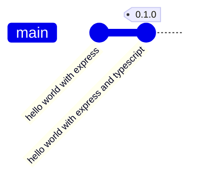

# TMDB Discovery App - 0.1.0

<p class="hero-kicker">Back-end Foundation - Express - TypeScript - Git</p>

---

# Objectifs

## Application
- Mise en place de l'architecture logicielle back-end
    - Utilisation de Node.js et Express
- Exposition d'un premier endpoint REST Hello World

## Ingénierie logicielle
- Utilisation de git
    - commit, push
    - tags pour versionner le projet
    
---



- 2 commits vont être réalisés dans cette version 0.1.0 du projet.
  - un premier commit pour la mise en place d'un serveur web avec **Express.js** et un endpoint REST Hello World
  - un second commit pour la mise en place d'un serveur web avec **Express.js** et un endpoint REST Hello World en **TypeScript**

- 1 tag sera créé pour marquer la version 0.1.0 du projet.

---

<style>
.backend-showcase {
  margin-top: 1.5rem;
  display: grid;
  grid-template-columns: 1fr 1fr;
  gap: 2rem;
  align-items: start;
}

.backend-media {
  display: flex;
  align-items: flex-start;
  justify-content: center;
}

.backend-media img {
  display: block;
  width: auto;
  max-width: 100%;
  max-height: 50vh;
  object-fit: contain;
  border-radius: 1rem;
}

.backend-copy {
  display: flex;
  flex-direction: column;
  justify-content: center;
  gap: 1rem;
  font-size: 1.05rem;
  line-height: 1.7;
}

.backend-copy h2 {
  margin: 0;
  font-size: 2rem;
}

.backend-copy p {
  margin: 0;
}

@media (max-width: 900px) {
  .backend-showcase {
    grid-template-columns: 1fr;
    min-height: auto;
  }
}
</style>

# Création du projet dans GitHub

<div class="backend-showcase">
  <div class="backend-media">
    
  </div>

  <div class="backend-copy">
    <h2>Options de création du projet</h2>
    <p>Le projet est créé avec les options suivantes :</p>
    <ul>
      <li>Nom du repository : themoviedb-discovery-app</li>
      <li>Visibility : Public</li>
      <li>Add a README file</li>
    </ul>
  </div>
</div>

---

# Initialisation du projet

TODO expliquer l'utilisation de CodeSpaces permettant de travailler dans un environnement de développement pré-configuré.

```shell

# Initialisation du projet Node.js avec les options par défaut
npm init -y

# Positionnement du projet en mode module pour utiliser les imports ES6
npm pkg set type=module
```
---

# Express.js

**Express.js** est un framework web pour Node.js qui facilite la création d'applications web et d'API. Il fournit des fonctionnalités robustes pour gérer les requêtes HTTP, les routes, les middlewares et bien plus encore. Nous allons l'utiliser pour exposer notre back-end sous forme d'API REST.

Pour plus d'informations sur Express.js, vous pouvez consulter la documentation officielle : [https://expressjs.com/fr/](https://expressjs.com/fr/)

```shell
# Installation d'express pour créer le serveur web
npm install express
```

Nous allons mettre en place un serveur web simple qui écoute sur le port 3000 et répond à une requête GET sur la route racine `/` avec un message "Hello World!".

---

# Express.js (suite)

Création du fichier `index.js` qui sera le point d'entrée de notre application back-end.

```javascript
import express from "express";

const app = express();
const port = 3000;

app.get("/", (req, res) => {
  res.send("Hello World!");
});

app.listen(port, () => {
  console.log(`Example app listening on port ${port}`);
});
```

Pour valider que le serveur fonctionne correctement lancer le serveur avec la commande suivante :

```shell
node index.js
```

Vous pouvez accéder à l'adresse [http://localhost:3000](http://localhost:3000). Vous devriez voir le message "Hello World!" s'afficher.

---

# Sauvegarde du projet sur GitHub

Nous avons une première version du projet back-end fonctionnelle. Il est temps de sauvegarder notre travail dans le dépôt GitHub.

---

# GIT - status

La commande `git status` permet de vérifier l'état du projet et de voir quels fichiers ont été modifiés, ajoutés ou supprimés depuis la dernière validation (commit).

Elle nous indique également si nous avons des fichiers non suivis par Git, c'est-à-dire des fichiers qui ne sont pas encore inclus dans le suivi de version.

```shell
# Vérification de l'état du projet
git status

```

Résultat attendu :

```shell
@alexandre-girard-maif ➜ /workspaces/themoviedb-discovery-app-demo (main) $ git status
On branch main
Your branch is up to date with 'origin/main'.

Untracked files:
  (use "git add <file>..." to include in what will be committed)
        index.js
        node_modules/
        package-lock.json
        package.json
```

---

La commande `git status` nous indique que nous avons des fichiers non suivis par Git (index.js, node_modules/, package-lock.json, package.json). Nous allons les ajouter à l'index Git pour les inclure dans le prochain commit. Cependant, nous ne voulons pas inclure le dossier `node_modules/` dans notre dépôt Git, car il contient les dépendances installées et peut être recréé à partir du fichier `package.json`. Nous allons donc créer un fichier `.gitignore` pour exclure ce dossier.

```shell
# Création du fichier .gitignore pour exclure le dossier node_modules/
echo "node_modules/" > .gitignore
```

Résultat attendu :

```shell
@alexandre-girard-maif ➜ /workspaces/themoviedb-discovery-app-demo (main) $ git status
On branch main
Your branch is up to date with 'origin/main'.

Untracked files:
  (use "git add <file>..." to include in what will be committed)
        .gitignore
        index.js
        package-lock.json
        package.json

```

---

# GIT - add

La commande `git add` permet d'ajouter des fichiers à l'index Git, c'est-à-dire de les préparer pour le prochain commit. Nous allons ajouter tous les fichiers non suivis par Git, sauf le dossier `node_modules/` qui est exclu par le fichier `.gitignore`.

```shell
# Ajout de tous les fichiers non suivis par Git, sauf le dossier node_modules/
git add .

# Vérification de l'état du projet après l'ajout des fichiers à l'index Git
git status
```

Résultat attendu :

```shell
@alexandre-girard-maif ➜ /workspaces/themoviedb-discovery-app-demo (main) $ git status
On branch main
Your branch is up to date with 'origin/main'.

Changes to be committed:
  (use "git restore --staged <file>..." to unstage)
        new file:   .gitignore
        new file:   index.js
        new file:   package-lock.json
        new file:   package.json
```

---

# GIT - commit

La commande `git commit` permet de valider les modifications ajoutées à l'index Git et de créer un nouveau commit dans l'historique du projet. Nous allons créer un commit avec un message décrivant les modifications apportées.

```shell
# Création d'un commit avec un message décrivant les modifications apportées
git commit -m "Initial commit - Création du projet avec Express.js et configuration de base"
```

Résultat attendu :

```shell
[main eba7d53] Initial commit - Création du projet avec Express.js et configuration de base
 4 files changed, 895 insertions(+)
 create mode 100644 .gitignore
 create mode 100644 index.js
 create mode 100644 package-lock.json
 create mode 100644 package.json

```

---

# GIT - commit (suite)

Une vérification de l'état du projet avec la commande `git status` nous indique que nous n'avons plus de modifications en attente et que notre branche locale est à jour avec la branche distante `origin/main`.

```shell
# Vérification de l'état du projet après le commit
git status
```

Résultat attendu :

```shell
@alexandre-girard-maif ➜ /workspaces/themoviedb-discovery-app-demo (main) $ git status
On branch main
Your branch is ahead of 'origin/main' by 1 commit.
  (use "git push" to publish your local commits)

nothing to commit, working tree clean
```

---

# GIT - push

La commande `git push` permet d'envoyer les commits locaux vers le dépôt distant sur GitHub. Nous allons pousser notre commit initial vers la branche principale `main` du dépôt distant.

```shell
# Envoi des commits locaux vers le dépôt distant sur GitHub
git push origin main
```

Résultat attendu :

```shell
@alexandre-girard-maif ➜ /workspaces/themoviedb-discovery-app-demo (main) $ git push origin main
Enumerating objects: 7, done.
Counting objects: 100% (7/7), done.
Delta compression using up to 2 threads
Compressing objects: 100% (5/5), done.
Writing objects: 100% (6/6), 8.15 KiB | 8.15 MiB/s, done.
Total 6 (delta 0), reused 0 (delta 0), pack-reused 0 (from 0)
To https://github.com/but-sd/themoviedb-discovery-app-demo
   ea1932b..eba7d53  main -> main
```

---

# GIT - push (suite)

Une vérification de l'état du projet avec la commande `git status` nous indique que notre branche locale est maintenant à jour avec la branche distante `origin/main`.

```shell
# Vérification de l'état du projet après le push
git status
```

Résultat attendu :

```shell
@alexandre-girard-maif ➜ /workspaces/themoviedb-discovery-app-demo (main) $ git status
On branch main
Your branch is up to date with 'origin/main'.

nothing to commit, working tree clean
```

---

# GIT - push (suite)

Le commit initial a été poussé avec succès vers le dépôt distant sur GitHub. Vous pouvez vérifier que les fichiers ont été correctement ajoutés et que le commit est présent dans l'historique du dépôt en visitant la page du dépôt sur GitHub.


---

# TypeScript

Le javascript était à l'origine le langage de programmation utilisé pour le développement web côté client. Cependant, il est devenu de plus en plus populaire pour le développement côté serveur grâce à Node.js. Le javascript est un langage interprété, ce qui signifie qu'il n'est pas compilé avant d'être exécuté. Cela peut entraîner des erreurs à l'exécution si le code n'est pas correctement écrit ou si les types de données ne sont pas correctement gérés.

Afin de résoudre ces problèmes, TypeScript a été créé. TypeScript est un sur-ensemble de JavaScript qui ajoute des fonctionnalités de typage statique et de vérification de type à la compilation. Cela permet aux développeurs de détecter les erreurs avant l'exécution et d'écrire du code plus sûr et plus maintenable.

---

<style>
.ts-showcase {
  margin-top: 0.8rem;
  display: grid;
  grid-template-columns: 1.1fr 0.9fr;
  gap: 1rem;
  align-items: stretch;
}

.ts-card {
  border: 1px solid #d7dee6;
  border-radius: 0.9rem;
  padding: 0.9rem 1rem;
  background: #f8fbff;
}

.ts-card-title {
  margin: 0 0 0.45rem 0;
  font-size: 1.05rem;
  font-weight: 700;
  color: #0f172a;
}

.ts-lead {
  margin: 0;
  line-height: 1.5;
}

.ts-points {
  margin: 0.4rem 0 0 1rem;
  line-height: 1.5;
}

.ts-steps {
  margin: 0.35rem 0 0 1.1rem;
  line-height: 1.55;
}

.ts-code :deep(pre) {
  margin: 0;
  font-size: 0.78rem;
}

.ts-hint {
  margin-top: 0.8rem;
  font-size: 0.98rem;
  font-weight: 600;
  color: #0b4f8a;
}

@media (max-width: 900px) {
  .ts-showcase {
    grid-template-columns: 1fr;
  }
}
</style>

# TypeScript - Pourquoi ?

<div class="ts-showcase">
  <div class="ts-card">
    <p class="ts-card-title">Le problème avec JavaScript dynamique</p>
    <p class="ts-lead">Le typage dynamique de JavaScript est pratique, mais il peut laisser passer des erreurs jusqu'à ce que le code soit exécuté, ce qui peut entraîner des comportements inattendus.</p>

```javascript {all|5}
function addTax(price) {
  return price + 2;
}

addTax("10"); // "102" (concaténation), pas 12
```

  </div>

  <div class="ts-card">
    <p class="ts-card-title">Ce que TypeScript change</p>
    <ul class="ts-points">
      <li>Types explicites des paramètres et retours</li>
      <li>Erreurs détectées avant exécution</li>
      <li>Moins de bugs à l'exécution</li>
    </ul>
  </div>
</div>

---

# TypeScript - Ce que l'on gagne

<div class="ts-showcase">
  <div class="ts-card">
    <p class="ts-card-title">Bénéfices immédiats pour l'équipe</p>
    <ul class="ts-points">
      <li>Vérification statique des types à la compilation</li>
      <li>Auto-complétion plus fiable dans l'éditeur</li>
      <li>Refactoring plus sûr sur les fonctions et objets</li>
      <li>Code plus lisible et plus maintenable en équipe</li>
    </ul>
  </div>

  <div class="ts-card ts-code">
    <p class="ts-card-title">Exemple TypeScript</p>

```typescript
function addTax(price: number): number {
  return price + 2;
}

addTax("10"); // Erreur TypeScript
```

  </div>
</div>

---

# TypeScript - Installation

Nous allons donc convertir notre projet back-end en TypeScript pour bénéficier de ces avantages. Cela implique d'installer TypeScript, de configurer le projet pour utiliser TypeScript et de renommer nos fichiers JavaScript en fichiers TypeScript.

```shell
# Installation de TypeScript et des types pour Node.js et Express
npm install typescript @types/node @types/express tsx --save-dev

```

Les types sont des définitions qui permettent à TypeScript de comprendre les types de données utilisés par Node.js et Express, ce qui améliore la vérification des types et l'auto-complétion dans l'éditeur.

---

# TypeScript - Configuration

La configuration de TypeScript se fait via un fichier `tsconfig.json` à la racine du projet. Ce fichier contient les options de compilation et les paramètres pour le projet TypeScript.

Pour créer ce fichier, nous pourrions utiliser la commande `tsc --init`, qui génère un fichier de configuration par défaut que nous pourrons ensuite modifier selon nos besoins.

Mais pour simplifier et préparer le projet pour une architecture multi-projets (back-end et front-end), nous allons créer directement un fichier `tsconfig.json` avec les options suivantes :

```json
{
  "files": [],
  "references": [{ "path": "./tsconfig.backend.json" }]
}
```

Nous aurons ainsi un fichier de configuration principal qui référence un fichier de configuration spécifique pour le back-end (`tsconfig.backend.json`). Cela nous permettra de gérer plus facilement les configurations pour différents projets dans le même dépôt.

---

# TypeScript - Configuration (suite)

Sur le slide suivant, nous allons créer le fichier `tsconfig.backend.json` qui contiendra les options de compilation spécifiques pour le projet back-end.

---

```json
{
  "compilerOptions": {
    "tsBuildInfoFile": "./node_modules/.tmp/tsconfig.backend.tsbuildinfo",
    "target": "ES2023",
    "lib": ["ES2023"],
    "module": "ESNext",
    "outDir": "./dist/back-end",
    "rootDir": "./src/back-end",
    "types": ["node"],
    "skipLibCheck": true,

    /* Node ESM mode */
    "moduleResolution": "bundler",
    "verbatimModuleSyntax": true,
    "moduleDetection": "force",
    "noEmit": false,

    /* Linting */
    "strict": true,
    "noUnusedLocals": true,
    "noUnusedParameters": true,
    "erasableSyntaxOnly": true,
    "noFallthroughCasesInSwitch": true,
    "noUncheckedSideEffectImports": true
  },
  "include": ["src/back-end/**/*.ts"]
}
```

---

# TypeScript - Configuration (suite)

Nous allons maintenant ajouter un script dans le fichier `package.json` pour lancer le projet back-end en mode développement avec TypeScript. Nous allons utiliser `tsx`, un outil qui permet d'exécuter des fichiers TypeScript directement sans avoir besoin de les compiler au préalable.

```json
{
  ...
  "scripts": {
    "dev:server": "tsx watch src/back-end/index.ts"
  },
  ...
}
```

---

# TypeScript - Transformation du projet

Nous allons maintenant transformer notre projet back-end pour utiliser TypeScript. Cela implique de renommer le fichier `index.js` en `index.ts` et de modifier le code pour utiliser les types TypeScript.

```javascript
import express from 'express';

// Create a new express application instance
const app = express();

// Define the port number for the server to listen on
const port: number = 3000;

// Define a route handler for the root URL ('/')
app.get('/', (_req: express.Request, res: express.Response) => {
  res.send('Hello World from TypeScript!');
});

// Start the server and listen on the specified port
app.listen(port as number, () => {
  console.log(`Example app in TypeScript listening on port ${port}`);
});
```

---

# TypeScript - Lancement du projet

Pour lancer le projet back-end en mode développement avec TypeScript, nous allons utiliser le script que nous avons ajouté dans le fichier `package.json`. Cela permettra de démarrer le serveur et de surveiller les modifications apportées aux fichiers TypeScript.

```shell
# Lancement du projet back-end en mode développement avec TypeScript
npm run dev:server
```

Une fois le serveur démarré, vous pouvez accéder à l'adresse [http://localhost:3000](http://localhost:3000) dans votre navigateur. Vous devriez voir le message "Hello World from TypeScript!" s'afficher.

Si vous apportez des modifications au fichier `index.ts`, le serveur se rechargera automatiquement pour refléter les changements.

Nous pouvons maintenant commiter ces modifications et les pousser vers le dépôt distant sur GitHub pour sauvegarder notre travail.

---

# GIT - commit et push

```shell
# Commit des modifications
git add .
git commit -m "Transform project to TypeScript and add dev:server script"

# Push vers le dépôt distant
git push origin main
```

--- 

# GIT - tag

Le tag est un marqueur dans l'historique Git qui permet de marquer un point spécifique dans le temps, généralement utilisé pour indiquer une version stable ou une release du projet. Nous allons créer un tag pour cette version 0.1.0 du projet.

```shell
# Création d'un tag pour la version 0.1.0
git tag -a v0.1.0 -m "Version 0.1.0 - Initial release with Express.js and TypeScript"

# Push du tag vers le dépôt distant
git push origin v0.1.0
```

---

# GIT - tag (suite)

Le tag a été créé avec succès et poussé vers le dépôt distant sur GitHub. Vous pouvez vérifier que le tag est présent dans l'historique du dépôt en visitant la page des tags sur GitHub. 


---

# GIT - tag (suite)

Vous pouvez retrouver le tag v0.1.0 dans l'onglet "Tags" de votre dépôt GitHub, ce qui vous permet de revenir facilement à cette version du projet si nécessaire.


