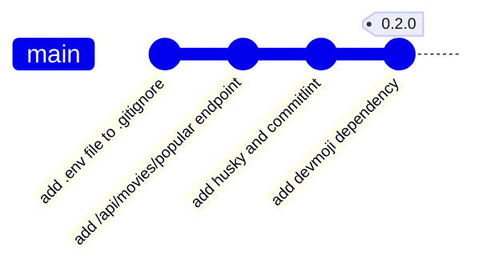

# TMDB Discovery App - 0.2.0

<p class="hero-kicker">TMDB API - Commits atomiques - Commitlint - Husky</p>

---

# Objectifs
    
## Application

- exposition du premier end point REST pour récupérer les films populaires via l'**API TMDB**

## Ingénierie logicielle
- Bonnes pratiques de développement avec **Git**: commits atomiques, messages de commit clairs et précis
- Validation du message de commit via un linter pour les messages de commit avec **commitlint**
- Amélioration du message de commit via l'ajout d'une dépendance **devmoji** pour ajouter des emojis aux messages de commit
- Contrôle du message de commit via un hook Git avec **Husky**

---



Pour cette version 0.2.0, nous allons faire de nombreux changements dans notre projet.

Afin de mieux comprendre les changements, nous allons créer un nouveau commit atomique pour chaque changement (ensemble cohérent de modifications) que nous allons effectuer. Cela nous permettra de mieux suivre l'évolution de notre projet et de revenir en arrière si nécessaire.

---

# **T**he **M**ovie **D**ata**B**ase (TMDB) - Découverte de l'API

[TMDB](https://www.themoviedb.org/?language=fr) est une base de données en ligne qui fournit des informations sur les films, les séries télévisées et les acteurs. Elle propose également une **API** (**A**pplication **P**rogramming **I**nterface) qui permet aux développeurs d'accéder à ces données et de les intégrer dans leurs applications.

<div style="display:flex;justify-content:center;align-items:center;max-height:52vh;overflow:hidden;">
  
</div>

---

# Exploitation de l'API TMDB (suite)

Pour plus d'informations sur l'API TMDB et comment l'utiliser, vous pouvez consulter la documentation officielle à l'adresse suivante :

https://developer.themoviedb.org/docs/getting-started

Les endpoints de l'API TMDB sont organisés en différentes catégories, telles que les films, les séries télévisées, les acteurs, etc. Chaque endpoint fournit des informations spécifiques et peut être utilisé pour effectuer des recherches, récupérer des détails sur un film ou une série, obtenir des recommandations, etc.

https://developer.themoviedb.org/reference/getting-started

### Wrappers pour l'API TMDB

Un wrapper est une bibliothèque qui simplifie l'utilisation d'une API en fournissant des fonctions et des méthodes prêtes à l'emploi pour effectuer des requêtes et traiter les réponses.

Il existe des Wrappers pour l'API TMDB, mais nous allons utiliser directement l'API REST pour mieux comprendre son fonctionnement et apprendre à interagir avec elle.

---

# Authentification avec l'API TMDB

Créer un compte sur le site [TMDB](https://www.themoviedb.org/?language=fr) pour obtenir une clé d'API et un token d'accès

Vous pouvez gérer vos clés d'API à l'adresse suivante : [https://www.themoviedb.org/settings/api?language=fr](https://www.themoviedb.org/settings/api?language=fr)

Une fois que vous avez créé un compte et obtenu une clé d'API et un token d'accès, vous pouvez les utiliser pour authentifier vos requêtes à l'API TMDB. L'authentification est nécessaire pour accéder aux données et effectuer des actions telles que la recherche de films, la récupération de détails sur un film ou une série, etc.

Il est préférable d'utiliser un token d'accès pour l'authentification, car il offre un niveau de sécurité plus élevé que la clé d'API. Le token d'accès est généralement utilisé dans l'en-tête de la requête HTTP pour authentifier l'utilisateur et autoriser l'accès aux ressources de l'API.

---

# Authentification avec l'API TMDB (suite)

Nous allons utiliser le token d'accès pour authentifier nos requêtes à l'API TMDB. Pour ce faire, nous allons créer un fichier `.env` à la racine du projet back-end pour stocker notre token d'accès en toute sécurité.

```shell
# Création du fichier .env pour stocker le token d'accès à l'API TMDB
echo "TMDB_ACCESS_TOKEN=your_access_token_here" > .env
```

Remplacez `your_access_token_here` par votre token d'accès réel obtenu depuis votre compte TMDB (Jeton d'accès en lecture à l'API).

__Attention__: Ne partagez jamais votre token d'accès publiquement, car il permettrait à des personnes malveillantes d'accéder à votre compte et de modifier vos données.

--- 

# Github et sécurité des informations sensibles

Il ne faut jamais inclure des fichiers contenant des informations sensibles (mot de passe, token d'accès, clé d'API, etc.) dans votre dépôt GitHub, car cela pourrait exposer vos informations d'identification à des personnes malveillantes.

Si jamais vous avez accidentellement ajouté un fichier contenant des informations sensibles à votre dépôt GitHub, vous devez le supprimer immédiatement, mais cela ne suffit pas. Il est également nécessaire de révoquer le token d'accès ou la clé d'API compromise et d'en générer un nouveau pour garantir la sécurité de votre compte.

En effet, même si vous supprimez le fichier contenant les informations sensibles de votre dépôt GitHub, git conserve l'historique des commits, ce qui signifie que les informations sensibles peuvent toujours être accessibles dans les anciens commits. Il est donc crucial de révoquer le token d'accès ou la clé d'API compromise et d'en générer un nouveau pour garantir la sécurité de votre compte.

---

# Authentification avec l'API TMDB (suite)

Pour éviter de commiter par erreur le fichier `.env`, nous allons l'ajouter à notre fichier `.gitignore`.

```shell
# Ajout du fichier .env au fichier .gitignore pour éviter de le partager publiquement
echo ".env" >> .gitignore
```

Faire un commit pour ce changement afin de sécuriser notre projet et éviter de partager notre token d'accès publiquement.

```shell
# Commit atomique pour l'ajout du fichier .env au fichier .gitignore
git add .gitignore .env
git commit -m "🔒 Add .env file to .gitignore to secure TMDB access token"
```

---

# Authentification avec l'API TMDB (suite)

Nous allons maintenant installer la bibliothèque `dotenv` pour charger les variables d'environnement depuis le fichier `.env`. Cela nous permettra d'accéder à notre token d'accès dans notre code sans l'exposer directement.

```shell
# Installation de la bibliothèque dotenv pour charger les variables d'environnement depuis le fichier .env
npm install dotenv
```
---

# Authentification avec l'API TMDB (suite)

Et créer un fichier `config.ts` dans le dossier `src/back-end` pour gérer la configuration de notre application, y compris le token d'accès à l'API TMDB.

```typescript
import dotenv from "dotenv";

// Charger les variables d'environnement depuis le fichier .env
dotenv.config();

// Récupérer le token d'accès à l'API TMDB depuis les variables d'environnement
const tmdbAccessToken: string | undefined = process.env.TMDB_ACCESS_TOKEN;

if (!tmdbAccessToken) {
  throw new Error(
    "TMDB_ACCESS_TOKEN is not defined in the environment variables.",
  );
}

export { tmdbAccessToken };
```

---

# Films populaires (/api/movies/popular)

Nous allons maintenant créer un endpoint pour récupérer les films populaires depuis l'API TMDB. Nous allons définir une route `/api/movies/popular` qui fera une requête à l'API TMDB et renverra les résultats au client en ajoutant le code suivant dans le fichier `index.ts` :

```typescript
// Define a route handler for fetching popular movies from TMDB API
app.get('/api/movies/popular', async (_req: express.Request, res: express.Response) => {
  try {
    const response = await fetch('https://api.themoviedb.org/3/movie/popular', {
      headers: {
        'Authorization': `Bearer ${tmdbAccessToken}`,
        'Content-Type': 'application/json;charset=utf-8'
      }
    });

    if (!response.ok) {
      throw new Error(`TMDB API request failed with status ${response.status}`);
    }

    const data = await response.json();
    res.json(data);
  } catch (error) {
    res.status(500).json({ error: 'Failed to fetch popular movies' });
  }
});

```

---

## Films populaires (/api/movies/popular) (suite)

Nous pouvons maintenant tester notre endpoint `/api/movies/popular` en utilisant un outil comme Postman ou en faisant une requête HTTP depuis le navigateur ou un client HTTP.

```
npm run dev:server
```

et ouvrez votre navigateur à l'adresse suivante : [http://localhost:3000/api/movies/popular](http://localhost:3000/api/movies/popular)

Nous devrions voir une réponse JSON contenant les films populaires récupérés depuis l'API TMDB.

---

## Films populaires (/api/movies/popular) (suite)

Notre endpoint `/api/movies/popular` est maintenant opérationnel, nous allons continuer à l'améliorer, mais nous allons d'abord faire un commit atomique pour ce changement afin de garder un historique clair et précis de l'évolution de notre projet.

```shell
# Commit atomique pour l'ajout de l'endpoint /api/movies/popular
git status
````

Résultat attendu :

```shell
On branch main
Your branch is up to date with 'origin/main'.

Changes not staged for commit:
  (use "git add <file>..." to update what will be committed)
  (use "git restore <file>..." to discard changes in working directory)
        modified:   package-lock.json
        modified:   package.json
        modified:   src/back-end/index.ts

Untracked files:
  (use "git add <file>..." to include in what will be committed)
        src/back-end/config.ts
````

---

## Films populaires (/api/movies/popular) (suite)

Après avoir vérifié les fichiers modifiés et ajoutés, nous pouvons maintenant faire un commit.

```shell

git add .
git commit -m "✨ Add /api/movies/popular endpoint to fetch popular movies from TMDB API"
```

Nous allons avoir de plus en plus de commits dans notre projet, il est donc important de suivre les bonnes pratiques pour le commit afin de garder un historique clair et précis de l'évolution de notre projet.

---

# GIT - Bonnes pratiques pour le commit

- Faire des commits réguliers et atomiques
    - Un commit par fonctionnalité/changement
    - Eviter les commits trop gros (trop de fichiers modifiés, trop de lignes modifiées)

Si vous commitez trop de fichiers en même temps, il est difficile de savoir ce qui a été modifié et pourquoi. Il est préférable de faire plusieurs commits pour des modifications différentes.

- Les messages de commit doivent être courts et descriptifs
- Ils doivent expliquer les modifications apportées par le commit
    - Quoi : modifications apportées
    - Pourquoi : pourquoi ces modifications ont été apportées

Si vous avez des difficultés à écrire un message de commit, c'est peut-être que vous devriez faire plusieurs commits pour des modifications différentes.

---

# GIT - Bonnes pratiques pour le commit (suite)

Un bon message de commit doit permettre de comprendre les modifications apportées sans avoir à lire le code.

Les messages de commit permettent de comprendre l'historique du projet et de savoir qui a fait quoi et pourquoi.
On doit pouvoir comprendre l'historique du projet sans avoir à lire le code.

Des messages de commit clairs et concis permettent de faciliter la collaboration entre les membres d'une équipe et de faciliter la maintenance du code.

Des messages trop génériques ou trop vagues rendent l'historique du projet difficile à comprendre et n'apportent pas d'informations utiles.

- Commencer le message de commit par un verbe à l'impératif avec une majuscule
    - "Ajoute la fonctionnalité xxx"
    - "Modifie le style de la page d'accueil"
    - "Supprime le fichier xxx devenu inutile"
- Limiter la longueur du titre à environ 70 caractères
- Ajouter une ligne vide entre le titre et le corps du message si le corps est nécessaire
- Utiliser le corps du message pour expliquer les modifications plus en détail si nécessaire
    - Expliquer le pourquoi des modifications
    - Expliquer les conséquences des modifications

----

# GIT - Conventionnal Commits

Les **Conventional Commits** sont une convention de nommage pour les messages de commit qui permet de rendre l'historique des modifications plus lisible et structuré. Voici les types de commits les plus courants :

- **feat** : Une nouvelle fonctionnalité
- **fix** : Correction d'un bug
- **docs** : Modifications de la documentation
- **style** : Changements de style (formatage, espaces, etc.)
- **refactor** : Refactorisation du code (sans ajout de fonctionnalité ni correction de bug)
- **test** : Ajout ou modification de tests
- **chore** : Tâches diverses (mise à jour des dépendances, scripts, etc.)

Pour plus d'informations sur les Conventional Commits, vous pouvez consulter le site officiel : [https://www.conventionalcommits.org/fr/v1.0.0/#summary](https://www.conventionalcommits.org/fr/v1.0.0/#summary)

---

# GIT - Conventionnal Commits (suite)

En respectant cette convention, chaque membre de l'équipe peut rapidement identifier le type de changement apporté par un commit donné.

Les Conventional Commits permettent de faciliter la recherche de commits spécifiques dans l'historique du projet, en utilisant des filtres basés sur les types de commits.

Les Conventional Commits permettent également d'automatiser certaines tâches, comme la génération de changelogs ou la gestion des versions, en se basant sur les types de commits effectués, nous verrons cela dans les prochaines versions de notre projet.

Enfin, étant donné que les Conventional Commits suivent une convention standardisée, il est possible d'utiliser des outils pour valider les messages de commit et s'assurer qu'ils respectent la convention.

----

# GIT - Conventionnal Commits - commitlint

**commitlint** est un outil qui permet d'effectuer ce contrôle pour des projets **nodejs**

**Installation:**

```bash
npm install -D @commitlint/cli @commitlint/config-conventional
```

**Configuration:**

Créer un fichier `commitlint.config.ts` à la racine du projet avec le contenu suivant :

```bash
import type { UserConfig } from '@commitlint/types';

const config: UserConfig = {
extends: ['@commitlint/config-conventional'],
};

export default config;
```

---

# GIT - Conventionnal Commits - commitlint (suite)

Il est ensuite possible par exemple de vérifier le dernier message de commit

```bash
npx commitlint --from HEAD~1 --to HEAD --verbose
```

La commande permet de voir si le commit est valide et si ce n'est pas le cas, d'avoir des indications sur les erreurs.

Ce contrôle devrait être effectué avant chaque commit pour s'assurer que le message de commit est valide.

Afin d'automatiser ce contrôle, il est possible d'utiliser des **git hooks**.

---

# GIT - hooks

**git** met à disposition des hooks, qui sont des scripts exécutés à des moments clés du cycle de vie de **git**. 

Par exemple, on peut utiliser un hook `commit-msg` pour vérifier le message d'un commit avant qu'il ne soit enregistré.

Ou encore un hook `pre-commit` pour exécuter des tests ou des vérifications de code avant qu'un commit ne soit effectué.

Pour plus d'informations sur les hooks **git**, vous pouvez consulter la documentation officielle : https://git-scm.com/book/en/Customizing-Git-Git-Hooks

---

# GIT - hooks - husky

**husky** est un outil **Node.js** qui permet de gérer les hooks **git** de manière simple et efficace. Il s'intègre facilement dans les projets **JavaScript** et **TypeScript**. 

Pour installer **husky**, vous pouvez utiliser la commande suivante :

```bash
npm install --save-dev husky
```

Pour configurer **husky**, vous pouvez utiliser la commande suivante :

```bash
npx husky init
```

---

# GIT - hooks - husky (suite)

Par défaut cela va ajouter un hook `pre-commit` qui va exécuter les tests avant chaque commit. Nous n'avons pas encore vu la configuration des tests, nous verrons cela plus tard. Il est donc nécessaire de supprimer ce hook pour l'instant.

```bash
rm .husky/pre-commit
```

Pour ajouter un hook `commit-msg` qui va vérifier le message de commit avec **commitlint**, vous pouvez utiliser la commande suivante :

```bash
echo "npx --no -- commitlint --edit \$1" > .husky/commit-msg
```

---

# GIT - hooks - husky (suite)

Vérifions que le hook fonctionne correctement en essayant de faire un commit avec un message invalide.

```bash
git add .
git commit -m "foo: this will fail"
```

Le commit doit échouer avec un message d'erreur indiquant que le message de commit ne respecte pas la convention.

Commiter de nouveau avec un message valide.

```bash
git commit -m "chore: add husky and commitlint for improved commit message management"
```

---

# GIT - Conventionnal Commits - devmoji

Nous avons maintenant un contrôle automatique des messages de commit pour s'assurer qu'ils respectent bien la convention.

Nous allons améliorer l'expérience de l'utilisateur en utilisant des emojis pour représenter les types de commits. Cela permet de rendre les messages de commit plus visuels et plus faciles à comprendre.

Pour cela, nous allons utiliser **devmoji**. **devmoji** est une liste d'emojis spécialement conçue pour les développeurs. Chaque emoji représente un type de commit spécifique. 

Pour plus d'informations, vous pouvez consulter le site officiel : https://github.com/folke/devmoji

---

# GIT - Conventionnal Commits - devmoji (suite)
<!-- _footer: "" -->

**Installation:**

```bash
npm install --save-dev devmoji
```

**Configuration**

```bash
echo "npx devmoji -e --lint" > .husky/prepare-commit-msg
```

**Utilisation**
```bash
git add .
git commit -m "feat: add devmoji dependency for improved commit message management"
```

---

# GIT - push and tag

Pour finir, nous allons pousser nos commits sur le dépôt distant et créer un tag pour cette version 0.2.0.

```bash
git push origin main
git tag -a v0.2.0 -m "Release version 0.2.0"
git push origin v0.2.0
```

