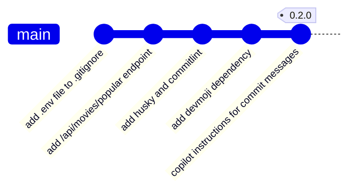

# TMDB Discovery App - 0.2.0

<p class="hero-kicker">TMDB API - Commits atomiques - Commitlint - Husky</p>

<!--
Notes de présentation:
- exploitation de l'API TMDB pour récupérer les films populaires
- aide à la création des messages de commit clairs et précis et validés automatiquement.

-->
---

# Objectifs
    
## Application

- Exposition d'un premier endpoint REST pour récupérer les films populaires
  - Appel de l'**API TMDB** depuis le back-end
  - Retour d'une réponse JSON exploitable par le client

## Ingénierie logicielle
- Bonnes pratiques de développement avec **Git**
  - Commits atomiques
  - Messages de commit clairs et précis
- Validation des messages de commit avec **commitlint**
- Contrôle automatique via un hook **Git** avec **Husky**
- Amélioration de la lisibilité des commits avec **devmoji**
- Instructions pour Copilot: génération des messages de commit clairs et précis et respectant les conventions définies.

<!--
Notes de présentation :
- commit atomique: un commit qui ne contient qu'un seul changement cohérent. Il est plus facile à comprendre et à maintenir.
- commitlint: outil pour valider les messages de commit selon des règles prédéfinies.
- husky: outil pour gérer les hooks Git, permettant d'exécuter des scripts avant ou après certaines actions Git.
- devmoji: outil pour améliorer la lisibilité des commits en ajoutant des emojis significatifs.
commit atomique: un commit qui ne contient qu'un seul changement cohérent. Il est plus facile à comprendre et à maintenir.

-->

---



- 5 **commits** atomiques vont être réalisés dans cette version 0.2.0.
  - 1 commit pour sécuriser la configuration (.env dans .gitignore).
  - 1 commit pour ajouter l'endpoint /api/movies/popular.
  - 1 commit pour mettre en place **Husky** et **commitlint**.
  - 1 commit pour ajouter **devmoji**.
  - 1 commit pour ajouter les instructions Copilot pour les messages de commit.

- 1 **tag** sera créé pour marquer la version 0.2.0.

<!--
Notes de présentation:

- 5 commits atomiques qui permettent de suivre clairement l'évolution de l'application et de maintenir un historique de modifications compréhensible.

-->
---

<style>
.backend-showcase {
  margin-top: 1.5rem;
  display: grid;
  grid-template-columns: 1fr 1fr;
  gap: 2rem;
  align-items: start;
}

.backend-media {
  display: flex;
  align-items: flex-start;
  justify-content: center;
}

.backend-media img {
  display: block;
  width: auto;
  max-width: 100%;
  max-height: 50vh;
  object-fit: contain;
  border-radius: 1rem;
}

.backend-copy {
  display: flex;
  flex-direction: column;
  justify-content: center;
  gap: 1rem;
  font-size: 1.05rem;
  line-height: 1.7;
}

.backend-copy h2 {
  margin: 0;
  font-size: 2rem;
}

.backend-copy p {
  margin: 0;
}

@media (max-width: 900px) {
  .backend-showcase {
    grid-template-columns: 1fr;
    min-height: auto;
  }
}
</style>

# **T**he **M**ovie **D**ata**B**ase (TMDB) - Découverte de l'API

<div class="backend-showcase">
  <div class="backend-media">
    
  </div>

  <div class="backend-copy">
    <ul>
      <li><a href="https://www.themoviedb.org/?language=fr">TMDB</a> est une base de données sur les films, séries et acteurs.</li>
      <li>TMDB fournit une <b>API</b> (<b>A</b>pplication <b>P</b>rogramming <b>I</b>nterface).</li>
      <li>Cette API permet à notre application :
        <ul>
          <li>de récupérer des informations sur les films, séries et acteurs</li>
          <li>de rechercher des films, séries et acteurs</li>
          <li>d'obtenir des recommandations de films et séries</li>
        </ul>
      </li>
    </ul>
  </div>
</div>

<!--
Notes de présentation:

- Exploitation de l'API TMDB pour récupérer les films populaires.
-->

---

# Exploitation de l'API TMDB

- Documentation officielle (prise en main) :
  - https://developer.themoviedb.org/docs/getting-started
- Référence des endpoints :
  - https://developer.themoviedb.org/reference/getting-started

- Les endpoints TMDB sont organisés par catégories (films, séries, acteurs, etc.).
- Chaque endpoint répond à un besoin précis :
  - recherche,
  - détails,
  - recommandations.

<!-- Notes de présentation:
 - Possibilité de tester les endpoints directement depuis la documentation.
-->

---

# Exploitation de l'API TMDB (suite)

## Wrappers pour l'API TMDB

- Un wrapper est une bibliothèque qui simplifie l'appel à une API.
- Il fournit des fonctions prêtes à l'emploi pour envoyer les requêtes.
- Il existe des wrappers pour TMDB.

Dans ce cours, nous utiliserons directement l'API REST pour bien comprendre :
- la construction des requêtes HTTP,
- la lecture des réponses,
- la gestion des erreurs.

<!-- Notes de présentation:
- Importance de comprendre la construction des requêtes HTTP pour interagir avec l'API TMDB.
-->

---

# Authentification avec l'API TMDB

- Créer un compte sur [TMDB](https://www.themoviedb.org/?language=fr).
- Générer des identifiants d'API depuis :
  - [https://www.themoviedb.org/settings/api?language=fr](https://www.themoviedb.org/settings/api?language=fr)

- Pour appeler l'API TMDB, il faut authentifier chaque requête.
- Deux options existent :
  - clé d'API,
  - token d'accès.
- Dans ce cours, nous privilégions le token d'accès (plus sécurisé).
- Le token est envoyé dans l'en-tête HTTP `Authorization`.

<!-- Notes de présentation:
- Clé d'API:
  - Moins sécurisée que le token d'accès.
  - Peut être utilisée directement dans les requêtes HTTP.
  - Doit également être protégée et ne jamais être committée dans le dépôt.
- Token d'accès:
  - Plus sécurisé que la clé d'API.
  - Doit être stocké dans un fichier `.env` et jamais committé dans le dépôt.
-->
---

# Authentification avec l'API TMDB (suite)


- Étape 1 : créer un fichier `.env` à la racine du projet back-end.
- Étape 2 : y stocker le token d'accès TMDB.

```shell
# Création du fichier .env pour stocker le token d'accès à l'API TMDB
echo "TMDB_ACCESS_TOKEN=your_access_token_here" > .env
```

- Étape 3 : remplacer `your_access_token_here` par votre vrai token TMDB.

<!-- Notes de présentation:
- Importance de sécuriser le token d'accès TMDB en utilisant un fichier `.env`.
- Ne jamais commiter le fichier `.env` contenant le token d'accès.
-->
---

# Github et sécurité des informations sensibles

- Ne jamais versionner des informations sensibles :
  - mot de passe,
  - token d'accès,
  - clé d'API.
- Ajouter ces fichiers dans **.gitignore** avant le premier commit.

- Si un secret a été commité par erreur :
  - supprimer le fichier du dépôt,
  - révoquer immédiatement le secret compromis,
  - générer un nouveau secret.

- Pourquoi révoquer ?
  - Git conserve l'historique,
  - un secret déjà poussé peut rester accessible dans les anciens commits.

<!-- Notes de présentation:
- Importance de ne jamais commiter des informations sensibles dans le dépôt.
- Utiliser `.gitignore` pour protéger les fichiers contenant des secrets.
- En cas de fuite, révoquer immédiatement le secret compromis.
-->
---

# Authentification avec l'API TMDB (suite)


- Étape 1 : ajouter `.env` dans `.gitignore` pour éviter tout commit accidentel.

```shell
# Ajout du fichier .env au fichier .gitignore
echo ".env" >> .gitignore
```

- Étape 2 : faire un commit atomique pour ce changement de sécurité.

```shell
# Commit atomique pour la protection du fichier .env
git add .gitignore .env
git commit -m "🔒 Add .env file to .gitignore to secure TMDB access token"
```

<!-- Notes de présentation:
- Importance d'ajouter le fichier `.env` dans `.gitignore` pour éviter tout commit accidentel.
- Faire un commit atomique pour ce changement de sécurité.
-->
---

# Authentification avec l'API TMDB (suite)


- Objectif : charger automatiquement les variables d'environnement du fichier `.env`.
- Solution : installer la bibliothèque `dotenv`.

```shell
# Installation de dotenv
npm install dotenv
```

<!-- Notes de présentation:
- Objectif : charger automatiquement les variables d'environnement depuis le fichier `.env`.
- Solution : utiliser la bibliothèque `dotenv`.
-->
---

# Authentification avec l'API TMDB (suite)


- Créer un fichier `config.ts` dans `src/back-end`.
```shell
# Création du fichier config.ts pour centraliser la configuration de l'application
touch src/back-end/config.ts
```
- Ce fichier centralise la configuration de l'application.
- Objectifs du code :
  - charger les variables d'environnement depuis `.env`,
  - récupérer le token TMDB,
  - arrêter l'application si le token est absent,
  - exporter le token pour le réutiliser ailleurs.

---

# Authentification avec l'API TMDB (suite)

```typescript
import dotenv from "dotenv";

// Charger les variables d'environnement depuis le fichier .env
dotenv.config();

// Récupérer le token d'accès à l'API TMDB depuis les variables d'environnement
const tmdbAccessToken: string | undefined = process.env.TMDB_ACCESS_TOKEN;

if (!tmdbAccessToken) {
  throw new Error(
    "TMDB_ACCESS_TOKEN is not defined in the environment variables.",
  );
}

export { tmdbAccessToken };
```

---

# Films populaires (/api/movies/popular)


- Objectif : exposer un endpoint REST qui renvoie les films populaires dans le fichier `index.ts` du back-end.
- Route à créer : `/api/movies/popular`.
- Comportement attendu :
  - appeler l'API TMDB,
  - transmettre le token dans l'en-tête `Authorization`,
  - renvoyer la réponse JSON au client,
  - retourner une erreur HTTP 500 en cas d'échec.

<!-- Notes de présentation:
- Objectif : exposer un endpoint REST pour les films populaires.
- Solution : créer une route `/api/movies/popular` dans `index.ts` du back-end.
-->
---

# Films populaires (/api/movies/popular) (suite)

```typescript
import express from 'express';
import { tmdbAccessToken } from './config';
...

// Define a route handler for fetching popular movies from TMDB API
app.get('/api/movies/popular', async (_req: express.Request, res: express.Response) => {
  try {
    const response = await fetch('https://api.themoviedb.org/3/movie/popular', {
      headers: {
        Authorization: `Bearer ${tmdbAccessToken}`,
        'Content-Type': 'application/json;charset=utf-8'
      }
    });

    if (!response.ok) {
      throw new Error(`TMDB API request failed with status ${response.status}`);
    }

    const data = await response.json();
    res.json(data);
  } catch (error) {
    res.status(500).json({ error: 'Failed to fetch popular movies' });
  }
});

...
```

<!-- Notes de présentation:
- **app.get** est utilisé pour définir un gestionnaire de route pour l'endpoint `/api/movies/popular` en HTTP GET (lecture des films populaires).
- **fetch** est utilisé pour effectuer une requête HTTP vers l'API TMDB.
- Le token d'accès est transmis dans l'en-tête `Authorization` pour authentifier la requête.
- En cas de succès, la réponse JSON est renvoyée au client.
- En cas d'échec, une erreur HTTP 500 est renvoyée.
-->
---

## Films populaires (/api/movies/popular) (suite)


- Étape 1 : démarrer le serveur back-end.

```
npm run dev:server
```

- Étape 2 : ouvrir l'endpoint dans le navigateur (ou Postman) :
  - [http://localhost:3000/api/movies/popular](http://localhost:3000/api/movies/popular)

- Étape 3 : vérifier que la réponse est un JSON avec les films populaires TMDB.

<!-- Notes de présentation:
- montrer le cas passant
- montrer le cas d'erreur (mauvaise configuration du token ou indisponibilité de l'API) et explique que l'erreur HTTP 500 est renvoyée au client, un console.log peut être utilisé pour inspecter l'erreur côté serveur.

-->
---

## Films populaires (/api/movies/popular) (suite)

L'endpoint /api/movies/popular fonctionne. Avant de continuer, nous faisons un commit atomique pour ce changement.

- Étape 1 : vérifier les fichiers modifiés.
```shell
# Commit atomique pour l'ajout de l'endpoint /api/movies/popular
git status
```

Résultat attendu :

```shell
On branch main
Your branch is up to date with 'origin/main'.

Changes not staged for commit:
  (use "git add <file>..." to update what will be committed)
  (use "git restore <file>..." to discard changes in working directory)
        modified:   package-lock.json
        modified:   package.json
        modified:   src/back-end/index.ts

Untracked files:
  (use "git add <file>..." to include in what will be committed)
        src/back-end/config.ts
```

---

## Films populaires (/api/movies/popular) (suite)

- Étape 2 : créer le commit une fois la vérification terminée.
```shell

git add .
git commit -m "✨ Add /api/movies/popular endpoint to fetch popular movies from TMDB API"
```


- Ce commit isole l'ajout de l'endpoint et garde un historique lisible.
---

# GIT - Bonnes pratiques pour le commit


- Faire des commits réguliers et atomiques.
  - 1 commit = 1 changement cohérent.
  - Éviter les commits trop volumineux.

- Écrire des messages de commit courts et descriptifs.
- Le message doit répondre à deux questions :
  - Quoi ?
  - Pourquoi ?

- Si le message devient difficile à rédiger, le commit est probablement trop large.

<!--Notes de présentation:
- incister sur le fait que chaque commit doit représenter un changement cohérent et compréhensible.
- rappeler que les messages de commit doivent être clairs et explicites pour faciliter la relecture et la collaboration.
-->

---

# GIT - Bonnes pratiques pour le commit (suite)

- Un bon message de commit doit être compréhensible sans lire le code.
- Un message clair aide à relire l'historique et à collaborer en équipe.
- Un message vague rend la maintenance plus difficile.

- Règles de rédaction :
  - commencer par un verbe à l'impératif avec une majuscule,
  - limiter le titre à environ 70 caractères,
  - ajouter une ligne vide avant le corps si nécessaire,
  - utiliser le corps pour expliquer le pourquoi et les conséquences.

- Exemples :
  - Ajoute la fonctionnalité xxx
  - Modifie le style de la page d'accueil
  - Supprime le fichier xxx devenu inutile
---

# GIT - Conventionnal Commits

- Les **Conventional Commits** standardisent les messages de commit.
- Format recommandé : `type: description`.
- Objectif : un historique plus lisible et plus facile à exploiter.

- Types les plus courants :
  - **feat** : nouvelle fonctionnalité
  - **fix** : correction de bug
  - **docs** : documentation
  - **style** : formatage / style
  - **refactor** : refactorisation sans changement fonctionnel
  - **test** : ajout ou modification de tests
  - **chore** : tâches techniques (dépendances, scripts, etc.)

- Référence : [https://www.conventionalcommits.org/fr/v1.0.0/#summary](https://www.conventionalcommits.org/fr/v1.0.0/#summary)

<!--Notes de présentation:
- expliquer l'intérêt des Conventional Commits pour la lisibilité de l'historique et l'automatisation des processus.
-->
---

# GIT - Conventionnal Commits (suite)

- Avec cette convention, le type de changement est visible immédiatement.
- L'historique est plus simple à filtrer (feat, fix, docs, etc.).
- Certains processus peuvent être automatisés :
  - génération de changelog,
  - aide au versioning.
- Les messages peuvent être validés automatiquement avec des outils dédiés.

<!--Notes de présentation:
- par exemple si l'on veut générer automatiquement un changelog à partir des commits qui retracent l'historique des changements.
- versioning automatique basé sur les types de commits (feat pour les nouvelles fonctionnalités, fix pour les corrections de bugs, etc.).
-->
---

# GIT - Conventionnal Commits - commitlint


- Objectif : vérifier que les messages de commit respectent la convention.
- Outil utilisé : **commitlint** (projet Node.js).

**Étape 1 - Installation**

```bash
npm install --save-dev @commitlint/cli @commitlint/config-conventional
```

**Étape 2 - Configuration**

Créer le fichier `commitlint.config.ts` à la racine du projet :

```shell
touch commitlint.config.ts
```

Ajouter le contenu suivant dans `commitlint.config.ts` :

```bash
import type { UserConfig } from '@commitlint/types';

const config: UserConfig = {
extends: ['@commitlint/config-conventional'],
};

export default config;
```

<!--Notes de présentation:
- commitlint permet de vérifier automatiquement que les messages de commit respectent la convention choisie.
- expliquer l'option `--save-dev` utilisée lors de l'installation des dépendances de développement et son raccourci `-D`.

-->
---

# GIT - Conventionnal Commits - commitlint (suite)


- Vérifier le dernier message de commit :

```bash
npx commitlint --from HEAD~1 --to HEAD --verbose
```
- La commande indique si le message est valide.
- En cas d'erreur, commitlint précise les règles non respectées.

```shell
@alexandre-girard-maif ➜ /workspaces/themoviedb-discovery-app-demo-2026-2027 (main) $ npx commitlint --from HEAD~1 --to HEAD --verbose
⧗   --- input ---
✨ Add /api/movies/popular endpoint to fetch popular movies from TMDB API
✖   subject may not be empty [subject-empty]
✖   type may not be empty [type-empty]

✖   found 2 problems, 0 warnings
ⓘ   Get help: https://github.com/conventional-changelog/commitlint/#what-is-commitlint
```

- Idéalement, ce contrôle doit être exécuté avant chaque commit.

- Étape suivante : automatiser cette vérification avec des **git hooks**.
---

# GIT - hooks


- Les hooks **git** sont des scripts déclenchés automatiquement à des moments précis.
- Ils permettent d'ajouter des contrôles avant ou après certaines actions Git.

- Exemples utiles :
  - `commit-msg` : valider le message de commit,
  - `pre-commit` : lancer des tests ou des vérifications de code.

- Référence : https://git-scm.com/book/en/Customizing-Git-Git-Hooks

<!--Notes de présentation:
- expliquer l'intérêt des hooks git pour automatiser les vérifications et les actions avant ou après certaines opérations Git.
- par exemple, utiliser un hook `commit-msg` pour s'assurer que tous les messages de commit respectent la convention choisie.
-->
---

# GIT - hooks - husky
  
- **husky** simplifie la gestion des hooks **git** dans un projet Node.js.

- Référence : https://typicode.github.io/husky/#/

- Étape 1 - Installer husky :

```bash
npm install --save-dev husky
```

- Étape 2 - Initialiser husky :

```bash
npx husky init
```

<!--Notes de présentation:
- montrer comment husky simplifie la gestion des hooks git dans un projet Node.js.
- expliquer l'intérêt d'automatiser les vérifications avec des hooks comme `commit-msg`.
-->
---

# GIT - hooks - husky (suite)

- Après `npx husky init`, un hook `pre-commit` est créé par défaut.
- Pour l'instant, nous le supprimons (les tests seront vus plus tard).

```bash
rm .husky/pre-commit
```

- Étape suivante : ajouter un hook `commit-msg` pour lancer **commitlint**.

```bash
echo "npx --no -- commitlint --edit \$1" > .husky/commit-msg
```

---

# GIT - hooks - husky (suite)


- Étape 1 : tester un commit avec un message invalide.

```bash
git add .
git commit -m "foo: this will fail"
```

- Résultat attendu : le commit échoue (message non conforme).

- Étape 2 : refaire le commit avec un message valide.

```bash
git commit -m "chore: add husky and commitlint to improve commit message management"
```

Nous avons maintenant un contrôle automatique avec **commitlint** + **husky**.

---

# GIT - Conventionnal Commits - devmoji


- Objectif maintenant : rendre les messages de commit plus visuels.

- Outil : **devmoji**.
- Principe : associer un emoji au type de commit.

- Résultat : des commits plus rapides à lire dans l'historique.
- Référence : https://github.com/folke/devmoji

<!--Notes de présentation:
- expliquer l'intérêt de devmoji pour rendre les messages de commit plus visuels et faciles à lire.
- montrer comment devmoji s'intègre avec husky pour automatiser l'ajout des emojis dans les messages de commit.
--->

---

# GIT - Conventionnal Commits - devmoji (suite)
<!-- _footer: "" -->


- Étape 1 - Installer devmoji.

```bash
npm install --save-dev devmoji
```

- Étape 2 - Configurer le hook `prepare-commit-msg`.

```bash
echo "npx devmoji -e --lint" > .husky/prepare-commit-msg
```

- Étape 3 - Utiliser un message de commit compatible.

```bash
git add .
git commit -m "feat: add devmoji dependency for improved commit message management"
```
---

# Copilot - instructions

- Objectif : montrer comment utiliser GitHub Copilot pour générer les messages de commit automatiquement.
- Référence : https://docs.github.com/en/copilot/how-tos/copilot-on-github/customize-copilot/add-custom-instructions/add-repository-instructions#creating-custom-instructions

---

# GitHub Copilot - instructions (suite)

Créer un fichier `.github/copilot-instructions.md` à la racine du dépôt pour définir les instructions personnalisées pour GitHub Copilot.

````markdown
## Commit Message Guidelines

Commit messages should use the conventional commit format. For example:

```
feat: add new feature
fix: fix a bug
docs: update documentation
style: update styles
refactor: refactor code
test: add tests
chore: update dependencies
build: update build process
ci: update continuous integration
perf: improve performance
revert: revert to previous commit
```

The commit message should be in the imperative mood, meaning it should describe what the commit does, not what it did.

The commit message should be concise and to the point, ideally no more than 72 characters in length. If the commit message is longer than 72 characters, it should be wrapped to the next line.

````

<!--Notes de présentation
- Montrer comment utiliser GitHub Copilot pour générer les messages de commit automatiquement.
-->

---

# Gestion de secrets dans Code Spaces

- Objectif : sécuriser les informations sensibles (comme le token d'accès TMDB) dans l'environnement de développement.
- Code Spaces permet de définir des secrets qui seront injectés dans l'environnement sans être exposés dans le dépôt.
- Exemple : ajouter le token d'accès TMDB comme secret dans Code Spaces.
- Référence : https://docs.github.com/en/codespaces/developing-in-codespaces/using-secrets-in-codespaces

---

# Gestion de secrets dans Code Spaces (suite)

- Étape 1 : aller dans les paramètres de votre Codespace.
- Étape 2 : naviguer vers "Secrets" puis "Codespaces".
- Étape 3 : ajouter un nouveau secret avec le nom `TMDB_ACCESS_TOKEN` et la valeur correspondante.
- Étape 4 : vérifier que le secret est correctement injecté en démarrant le serveur de développement.

---

# GIT - push and tag

- Étape 1 : pousser les commits sur `main`.

```bash
git push origin main
```

- Étape 2 : créer le tag de version `v0.2.0`.

```bash
git tag -a v0.2.0 -m "Release version 0.2.0"
```
- Étape 3 : pousser le tag sur le dépôt distant.

```bash
git push origin v0.2.0
```

---

# Récapitulatif de la version 0.2.0

- Ajout du fichier `.env` pour stocker le token d'accès à l'API TMDB.
- Ajout de l'endpoint `/api/movies/popular` pour récupérer les films populaires.
- Mise en place de **Husky** et **commitlint** pour valider les messages de commit.
- Ajout de **devmoji** pour améliorer la lisibilité des messages de commit.
- Copilot pour générer automatiquement les messages de commit.
- Ajout de la gestion des secrets dans Code Spaces pour sécuriser le token d'accès TMDB.
- Création du tag `v0.2.0` pour marquer cette version.