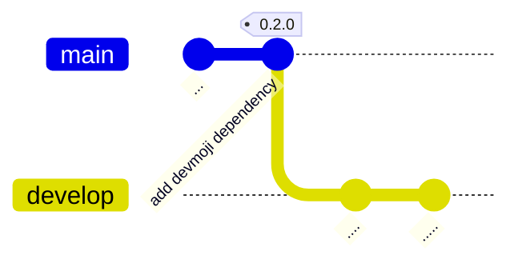
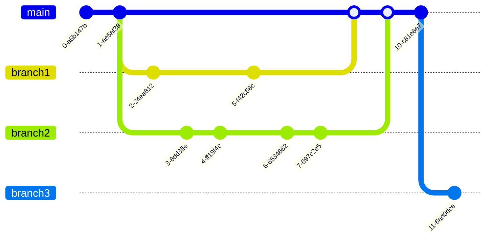
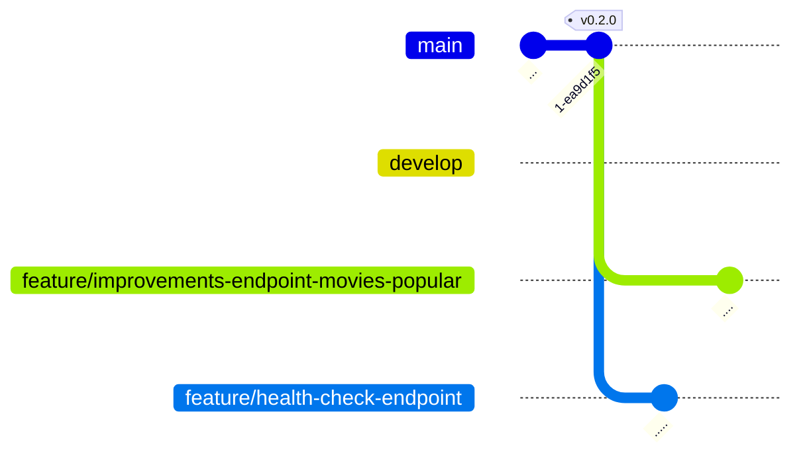
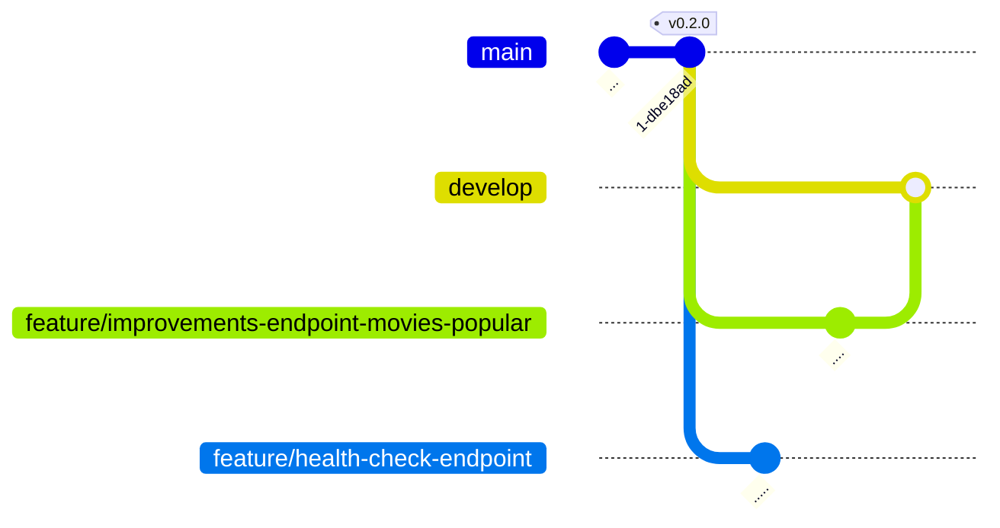
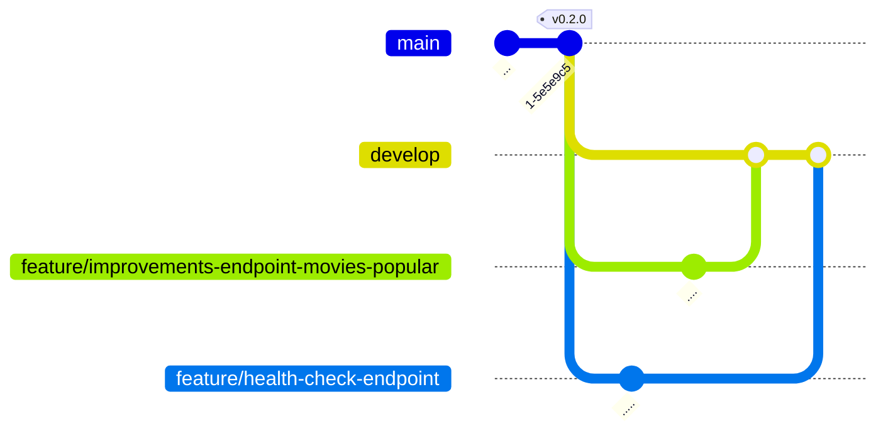

# TMDB Discovery App - 0.3.0

<p class="hero-kicker">TMDB API - Branches Git - Gitflow</p>

---

# Objectifs
    
## Application

- amélioration du end point REST pour récupérer les films populaires via l'**API TMDB**

## Ingénierie logicielle

- notion de branche Git

---



---

# git - Branches

* Les branches constituent un élément central de **Git**.
  - Elles permettent de créer des lignes de développement parallèles au sein d'un même dépôt Git.
* Permettent de travailler sur plusieurs aspects d'un projet en parallèle.
  - Chaque branche peut contenir un ensemble de modifications distinctes, ce qui permet de développer de nouvelles fonctionnalités, de corriger des bugs ou d'expérimenter sans affecter la branche principale (généralement appelée `main` ou `master`).

---

# git - Branches (suite)

Lors de la création d'une branche, celle-ci est dupliquée à partir de la branche courante. 

Les modifications apportées à cette branche n'impactent pas les autres branches. 

Une fois les modifications terminées, il est possible de fusionner la branche avec la branche courante.

---

# git - Branches (suite)

* Les branches sont des pointeurs vers un commit.
* Créer une nouvelle branche revient à créer un nouveau pointeur sur le commit courant.
* Les branches sont très légères et peu coûteuses en ressources.
* Les branches sont locales par défaut.
* Les branches peuvent être partagées avec d'autres développeurs en les poussant sur le dépôt distant.

---



---

# gitflow

* Méthode de gestion des branches en utilisant Git.
* Permet de structurer le développement logiciel en définissant des règles pour les branches.
* Utilise des branches spécifiques pour les fonctionnalités, les correctifs, les versions, les releases...
* Permet de travailler sur plusieurs fonctionnalités en même temps sans impacter le code de production.

---

# gitflow - branche **develop**

La branche **develop** est la branche de développement. Elle contient les fonctionnalités en cours de développement, ainsi la branche **main** reste stable et contient le code de production. 

On ne travaille jamais directement sur la branche **main**, afin de ne pas impacter involontairement le code de production (risque de bugs, de régressions...).

---

# gitflow - branches **feature**

Lorsque l'on souhaite ajouter une nouvelle fonctionnalité, on crée une branche spécifique **feature/nom-fonctionnalite** à partir de la branche **develop**. 

Une fois la fonctionnalité terminée, on fusionne la branche avec la branche **develop**.

Le fait de travailler sur des branches **feature** permet de travailler sur plusieurs fonctionnalités en même temps pour une même version en cours de développement.

Dans le cadre de notre projet, nous allons par exemple créer une branche **feature/improvements-endpoint-movies-popular** pour améliorer le end point REST qui récupère les films populaires, et en parallèle une branche **feature/health-check-endpoint** pour ajouter un end point REST qui permet de vérifier que le serveur est bien en fonctionnement.

Pour que les développements en parallèle ne se gênent pas, il est important de bien définir les responsabilités de chaque branche **feature** et de ne pas modifier le même code dans plusieurs branches **feature** en même temps. Il s'agit d'une bonne pratique, mais il est possible que deux branches **feature** modifient le même code en même temps. Dans ce cas, il faudra résoudre les conflits lors de la fusion des branches.

---

# gitflow - Mise en pratique

* Créer une nouvelle branche **develop** à partir de la branche principale
    * `git checkout -b develop`
* Créer une branche **feature/improvements-endpoint-movies-popular** pour améliorer le end point REST qui récupère les films populaires
    * `git checkout -b feature/improvements-endpoint-movies-popular`
* Créer une branche **feature/health-check-endpoint** pour ajouter un end point REST qui permet de vérifier que le serveur est bien en fonctionnement
    * `git checkout -b feature/health-check-endpoint`

---

# gitflow - Mise en pratique (suite)

Lister les branches avec la commande:

```bash
git branch -v
```

La commande `git branch -v` permet de lister les branches locales et d'afficher le dernier commit de chaque branche. 

Cela permet de vérifier que les branches ont bien été créées et de voir sur quelle branche on se trouve actuellement. On voit ici que toutes les branches sont au même niveau (même commit)

Remarque: la branche courante est indiquée par un astérisque `*` devant le nom de la branche.

Résultat attendu:

```bash
@alexandre-girard-maif ➜ /workspaces/themoviedb-discovery-app-demo (feature/health-check-endpoint) $ git branch -v
  backup-before-rewrite                        a22b904 feat: ✨ add devmoji dependency for improved commit message management
  develop                                      a22b904 feat: ✨ add devmoji dependency for improved commit message management
* feature/health-check-endpoint                a22b904 feat: ✨ add devmoji dependency for improved commit message management
  feature/improvements-endpoint-movies-popular a22b904 feat: ✨ add devmoji dependency for improved commit message management
  main                                         a22b904 feat: ✨ add devmoji dependency for improved commit message management
```
---

# gitflow - Mise en pratique (suite)

Le graphe ci-dessous illustre ce qu'il va se passer lorsque nous allons travailler sur les branches **feature** en parallèle puis fusionner les branches **feature** avec la branche **develop** puis fusionner la branche **develop** avec la branche **main** pour créer une nouvelle version de l'application.


---

## Health check endpoint

Le endpoint `/api/health` est un endpoint REST qui permet de vérifier que le serveur est bien en fonctionnement. Il est très utile pour les tests automatisés et pour les outils de monitoring. Il ne fait que renvoyer un code HTTP 200 et un message JSON indiquant que le serveur est en fonctionnement.

Travailler sur la branche **feature/health-check-endpoint** pour ajouter le endpoint `/api/health` dans le fichier `src/back-end/index.ts`.

```bash
git checkout feature/health-check-endpoint
```

Modifier le fichier `src/back-end/index.ts` pour ajouter le endpoint `/api/health`:

```typescript

...

// Define a route handler for health check endpoint
app.get('/api/health', (_req: express.Request, res: express.Response) => {
  const response: { status: string } = { status: 'ok' };
  res.json(response);
});

...
```

---

# Health check endpoint (suite)

Vérifier que le serveur fonctionne correctement et que le endpoint `/api/health` renvoie bien un code HTTP 200 et un message JSON indiquant que le serveur est en fonctionnement.

Démarrer le serveur avec la commande:
```bash
npm run dev:server
```

Vérifier que le endpoint `/api/health` fonctionne correctement avec la commande:
```bash
curl -i http://localhost:3000/api/health
```

Résultat attendu:

```bash
@alexandre-girard-maif ➜ /workspaces/themoviedb-discovery-app-demo (feature/health-check-endpoint) $ curl -i http://localhost:3000/api/health
HTTP/1.1 200 OK
X-Powered-By: Express
Content-Type: application/json; charset=utf-8
Content-Length: 15
ETag: W/"f-VaSQ4oDUiZblZNAEkkN+sX+q3Sg"
Date: Mon, 13 Jul 2026 14:06:10 GMT
Connection: keep-alive
Keep-Alive: timeout=5
```

---

# Health check endpoint (suite)

Une fois que le endpoint `/api/health` fonctionne correctement, nous pouvons maintenant commiter ces modifications et les pousser vers le dépôt distant sur GitHub pour sauvegarder notre travail.

**Remarque:** Notre travail est pour l'instant uniquement sur la branche **feature/health-check-endpoint**. Nous n'avons pas encore fusionné cette branche avec la branche **develop**. 

----

# Films populaires (/api/movies/popular)

Nous allons maintenant travailler sur la branche **feature/improvements-endpoint-movies-popular** pour améliorer le end point REST qui récupère les films populaires depuis l'API TMDB.

Pour cela nous devons basculer sur la branche **feature/improvements-endpoint-movies-popular** avec la commande:

```bash
git checkout feature/improvements-endpoint-movies-popular
```

On constate que le end pojnt 'api/health' ne fonctionne plus, c'est normal car nous avons basculé sur la branche **feature/improvements-endpoint-movies-popular** qui ne contient pas encore le endpoint `/api/health`.

Nous verrons plus tard comment fusionner les branches **feature** avec la branche **develop** pour que le endpoint `/api/health` soit disponible dans la branche **develop**.

----

# Films populaires (/api/movies/popular) (suite)

Ajout d'un type pour la réponse de l'API TMDB afin d'améliorer la sécurité et la lisibilité du code. 

Nous allons créer un fichier `MoviesTypes.ts` dans le dossier `src/back-end/schemas` pour définir les types utilisés pour consommer les films depuis l'API TMDB.

Nous allons modifier la réponse de l'API TMDB afin de supprimer les champs inutiles et ne garder que les informations pertinentes pour notre application. Cela permettra de réduire la quantité de données transférées et d'améliorer les performances de l'application.

----

```typescript
// TypeScript type for the raw response from the TMDB API for popular movies.
export type TmdbMoviesRawResponse = {
  page: number;
  results: Array<TmdbMovie & { video?: boolean }>;
  total_pages: number;
  total_results: number;
};

// TypeScript type for the raw response from the TMDB API for popular movies.
export type TmdbMovie = {
  adult: boolean;
  backdrop_path: string | null;
  genre_ids: number[];
  id: number;
  original_language: string;
  original_title: string;
  overview: string;
  popularity: number;
  poster_path: string | null;
  release_date: string;
  title: string;
  video: boolean;
  vote_average: number;
  vote_count: number
};
```

----

```typescript
// TypeScript type for the API response when fetching movies, containing an array of supported Movie objects.
export type MoviesApiResponse = {
  page: number;
  results: Movie[];
  total_pages: number;
  total_results: number;
};


// TypeScript type for the supported movie format used in our application, omitting 'adult' and 'video' properties from the TmdbMovie type.
export type Movie = Omit<TmdbMovie, 'adult' | 'video'>;


// TypeScript type for the API response when fetching popular movies, containing an array of supported Movie objects.
export type ApiErrorResponse = {
  error: string;
};

```

----

# Films populaires (/api/movies/popular) (suite)

Ajouter une fonction utilitaire dans un nouveau fichier `utils.ts` pour transformer les films bruts de l'API TMDB en films supportés par notre application. Cette fonction prend un film brut de l'API TMDB et retourne un objet Movie avec uniquement les propriétés pertinentes.

----

```typescript
import type { TmdbMoviesRawResponse, Movie } from './schemas/MoviesTypes';

/**
 * Transforms a TmdbMovie object into a supported Movie object by omitting the 'adult' and 'video' properties.
 * @param movie The raw TmdbMovie object.
 * @returns The supported Movie object.
 */
export const toSupportedMovie = (movie: TmdbMoviesRawResponse['results'][number]): Movie => {
  return {
    backdrop_path: movie.backdrop_path,
    genre_ids: movie.genre_ids,
    id: movie.id,
    original_language: movie.original_language,
    original_title: movie.original_title,
    overview: movie.overview,
    popularity: movie.popularity,
    poster_path: movie.poster_path,
    release_date: movie.release_date,
    title: movie.title,
    vote_average: movie.vote_average,
    vote_count: movie.vote_count
  };
};
```

----

# Films populaires (/api/movies/popular) (suite)

Nous allons maintenant modifier notre endpoint `/api/movies/popular` pour utiliser la fonction `toSupportedMovie` afin de transformer les films bruts de l'API TMDB en films supportés par notre application avant de les renvoyer au client.

```typescript
      ...

      // Parse the raw response from the TMDB API
      const rawData = (await response.json()) as TmdbMoviesRawResponse;

      // Transform the raw data into the supported format for our application
      const data: MoviesApiResponse = {
        page: rawData.page,
        results: rawData.results.map(toSupportedMovie),
        total_pages: rawData.total_pages,
        total_results: rawData.total_results
      };

      // Send the transformed data as a JSON response
      res.json(data);

      ...

```

----

# Films populaires (/api/movies/popular) (suite)

Après avoir validé que le serveur fonctionne correctement et que l'endpoint `/api/movies/popular` renvoie les films populaires depuis l'API TMDB en ayant transformé les données brutes en films supportés par notre application, nous pouvons maintenant commiter ces modifications et les pousser vers le dépôt distant sur GitHub pour sauvegarder notre travail.

---

# Fusion des branches **feature** avec la branche **develop**

Nous avons maintenant terminé le développement des deux branches **feature**. Les deux branches **feature** sont maintenant prêtes à être fusionnées avec la branche **develop** pour que les modifications soient disponibles dans la branche de développement.

Nous aurons ainsi une branche **develop** qui contient les deux nouvelles fonctionnalités: le endpoint `/api/health` et le endpoint `/api/movies/popular` amélioré.

----

# Fusion des branches **feature** avec la branche **develop** (suite)

Etat actuel des branches:



----

Fusionner la branche **feature/improvements-endpoint-movies-popular** avec la branche **develop** en se placant sur la branche **develop** et en utilisant la commande `git merge`:

```bash
git checkout develop
git merge feature/improvements-endpoint-movies-popular
```



----

Fusionner la branche **feature/health-check-endpoint** avec la branche **develop** en se plaçant sur la branche **develop** et en utilisant la commande `git merge`:

```bash
git checkout develop
git merge feature/health-check-endpoint
```



----

# Fusion des branches **feature** avec la branche **develop**

Nous avons maintenant terminé la fusion des deux branches **feature** avec la branche **develop**. La branche **develop** contient maintenant les deux nouvelles fonctionnalités: le endpoint `/api/health` et le endpoint `/api/movies/popular` amélioré.

Il est maintenant temps de fusionner la branche **develop** avec la branche **main** pour créer une nouvelle version de l'application.

----

# Fusion de la branche **develop** avec la branche **main** pour créer une nouvelle version de l'application.

Fusionner la branche **develop** avec la branche **main** en se plaçant sur la branche **main** et en utilisant la commande `git merge`:

```bash
git checkout main
git merge develop
git push origin main
```

Créer un tag pour la nouvelle version de l'application avec la commande `git tag`:

```bash
git tag v0.3.0
git push origin v0.3.0
```

---


Les branches **feature** ont été fusionnées avec la branche **develop** et la branche **develop** a été fusionnée avec la branche **main** pour créer une nouvelle version de l'application.

----

# Nettoyage des branches **feature** après fusion avec la branche **develop**

Les branches **feature** ont été fusionnées avec la branche **develop** et ne sont plus nécessaires. Il est donc recommandé de les supprimer pour éviter toute confusion et garder un dépôt Git propre.

Supprimer les branches **feature** locales avec la commande:

```bash
git branch -d feature/improvements-endpoint-movies-popular
git branch -d feature/health-check-endpoint
```

Supprimer les branches **feature** distantes avec la commande:

```bash
git push origin --delete feature/improvements-endpoint-movies-popular
git push origin --delete feature/health-check-endpoint
```
----

# Nettoyage des branches **feature** après fusion avec la branche **develop** (suite)

Nous devrions maintenant avoir un dépôt Git propre avec uniquement les branches **main** et **develop** aussi bien localement que sur le dépôt distant.

Liste des branches locales avec la commande:

```bash
git branch -v
```


