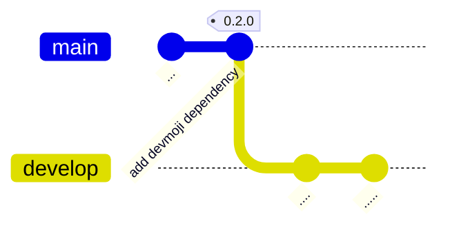
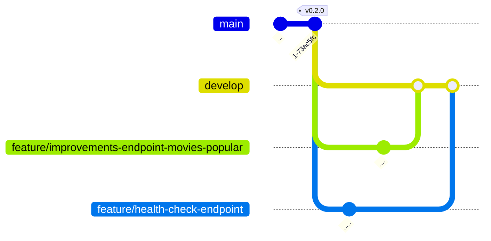
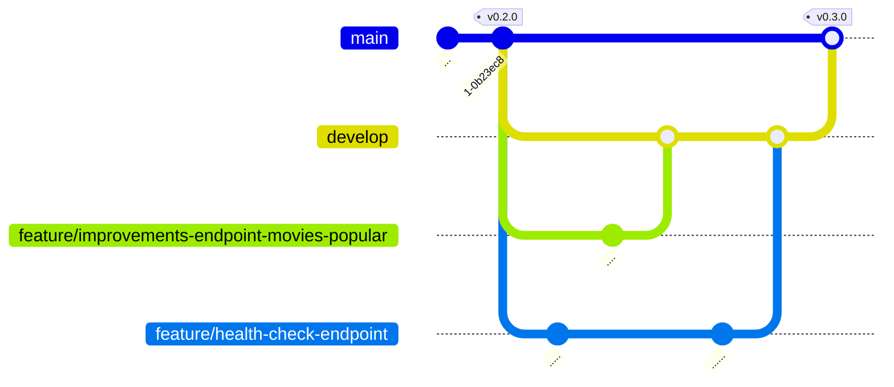

# TMDB Discovery App - 0.3.0

<p class="hero-kicker">TMDB API - Branches Git - Gitflow</p>

---

# Objectifs

- **Objectif application:** améliorer un endpoint REST qui récupère les films populaires via l'**API TMDB**.
- **Objectif ingénierie:** introduire la notion de **branche Git**.
- **Résultat attendu:** implémenter une évolution fonctionnelle sans impacter la branche principale.

---



---

# git - Branches

- **Objectif:** travailler sur plusieurs évolutions en parallèle sans casser la base du projet.
- **Définition:** une branche est une ligne de développement indépendante dans **Git**.
- **Pourquoi c'est utile:** isoler une fonctionnalité, un bugfix ou un essai technique.
- **Exemple rapide:** développer sur une branche dédiée puis fusionner vers `main` ou `develop` une fois validé.

---

# git - Branches (suite)

- **Étape 1:** créer une branche à partir de la branche courante.
- **Étape 2:** développer dessus sans impacter les autres branches.
- **Étape 3:** fusionner la branche quand les modifications sont validées.
- **Résultat attendu:** intégrer la fonctionnalité sans perturber le flux principal.

---

# git - Branches (suite)

- Les branches sont des pointeurs vers un commit.
- Créer une nouvelle branche revient à créer un nouveau pointeur sur le commit courant.
- Les branches sont très légères et peu coûteuses en ressources.
- Les branches sont locales par défaut.
- Les branches peuvent être partagées avec d'autres développeurs en les poussant sur le dépôt distant.

---


<!--

Dans ce diagramme, nous voyons que la branche `branch1` a été créée à partir du commit 2, puis un commit a été ajouté sur `branch1`. Ensuite, nous avons basculé sur la branche `main` et créé la branche `branch2`, puis ajouté deux commits sur `branch2`. Ensuite, nous avons basculé sur `branch1` et ajouté un commit, puis basculé sur `branch2` et ajouté deux commits. Enfin, nous avons fusionné les branches `branch1` et `branch2` dans la branche `main`, puis ajouté un commit sur la branche `main` et créé une nouvelle branche `branch3`.
-->
---

# VS Code extension - Git Graph

- **Objectif:** visualiser l'historique des commits et des branches de façon graphique dans VS Code.
- **Définition:** **Git Graph** est une extension VS Code pour explorer le graphe Git (commits, branches, merges).
- **Pourquoi c'est utile:** comprendre rapidement l'état du dépôt avant de créer, fusionner ou nettoyer des branches.
- **Exemple rapide:** installation via le marketplace en local, ou via `.devcontainer/devcontainer.json` en environnement conteneurisé **Code Spaces** (configuration au slide suivant).

---

# VS Code extension - Git Graph (suite)

- **Etape 1:** créer le fichier `.devcontainer/devcontainer.json` avec la commande:

```bash
touch .devcontainer/devcontainer.json
```

- **Etape 2:** ajouter le contenu suivant dans le fichier `.devcontainer/devcontainer.json` pour installer l'extension **Git Graph** dans le conteneur de développement:

```json
{
  "name": "themoviedb-discovery-app-demo-2026-2027",
  "customizations": {
    "vscode": {
      "extensions": [
        "mhutchie.git-graph"
      ]
    }
  }
}

```

---

# VS Code extension - Git Graph (suite)

- **Etape 3:** Commiter et pousser le fichier `.devcontainer/devcontainer.json` vers le dépôt distant sur GitHub pour que l'extension **Git Graph** soit installée automatiquement dans le conteneur de développement.

```bash
git add .devcontainer/devcontainer.json
git commit -m "chore: add devcontainer.json to install Git Graph extension in the development container"
git push origin main
```

- **Etape 4:** Recharger le conteneur de développement pour que l'extension **Git Graph** soit installée automatiquement dans le conteneur de développement.

---

# VS Code extension - Git Graph (suite)

class: p-0


---

# gitflow

- Méthode de gestion des branches en utilisant Git. Approche très populaire pour les projets logiciels.
- Permet de structurer le développement logiciel en définissant des règles pour les branches.
- Utilise des branches spécifiques pour les fonctionnalités, les correctifs, les versions, les releases...
- Permet de travailler sur plusieurs fonctionnalités en même temps sans impacter le code de production.

---


---

# gitflow - branches **main**

- La branche **main** contient le code de production.
- Elle doit rester stable.
- On ne travaille pas directement dessus.
- Les changements arrivent via une fusion depuis **develop**.

---

# gitflow - branches **develop**

- La branche **develop** regroupe les fonctionnalités validées.
- Elle sert de branche d'intégration avant la fusion vers **main**.
- On y teste les changements avant de créer une nouvelle version.
- Les fonctionnalités arrivent via les branches **feature**.

---

# gitflow - branches **feature**

- Une branche **feature** porte une seule évolution.
- Elle est créée depuis **develop**.
- Elle est fusionnée vers **develop** après validation.
- Elle permet d'avancer en parallèle sans casser la branche principale.
- Exemple : **feature/improvements-endpoint-movies-popular** et **feature/health-check-endpoint**.


---

# gitflow - Mise en pratique

- **Étape 1:** créer la branche **develop** depuis la branche principale.

```bash
git checkout -b develop
```

- **Étape 2:** créer la branche **feature/improvements-endpoint-movies-popular**.

```bash
git checkout -b feature/improvements-endpoint-movies-popular
```

- **Étape 3:** créer la branche **feature/health-check-endpoint**.

```bash
git checkout develop
git checkout -b feature/health-check-endpoint
```

- **Résultat attendu:** les trois branches locales sont prêtes pour développer en parallèle.

---

# gitflow - Mise en pratique (suite)

Lister les branches avec la commande:

```bash
git branch -v
```

La commande `git branch -v` permet de lister les branches locales et d'afficher le dernier commit de chaque branche. 

Cela permet de vérifier que les branches ont bien été créées et de voir sur quelle branche on se trouve actuellement. On voit ici que toutes les branches sont au même niveau (même commit)

Remarque: la branche courante est indiquée par un astérisque `*` devant le nom de la branche.

Résultat attendu:

```bash
@alexandre-girard-maif ➜ /workspaces/themoviedb-discovery-app-demo (feature/health-check-endpoint) $ git branch -v
  develop                                      a22b904 feat: ✨ add devmoji dependency for improved commit message management
* feature/health-check-endpoint                a22b904 feat: ✨ add devmoji dependency for improved commit message management
  feature/improvements-endpoint-movies-popular a22b904 feat: ✨ add devmoji dependency for improved commit message management
  main                                         a22b904 feat: ✨ add devmoji dependency for improved commit message management
```
---

# gitflow - Mise en pratique (suite)


<!--
Le graphe ci-dessous illustre ce qu'il va se passer lorsque nous allons travailler sur les branches **feature** en parallèle puis fusionner les branches **feature** avec la branche **develop** puis fusionner la branche **develop** avec la branche **main** pour créer une nouvelle version de l'application.
-->


---

## Health check endpoint

- **Objectif :** ajouter un endpoint de vérification de santé du serveur.
- **Route :** `/api/health`.
- **Réponse attendue :** code HTTP `200` avec un JSON `{ status: 'ok' }`.
- **Étape 1 :** se placer sur la branche `feature/health-check-endpoint`.

```bash
git checkout feature/health-check-endpoint
```

- **Étape 2 :** modifier `src/back-end/index.ts` pour ajouter la route :

```typescript

...

// Define a route handler for health check endpoint
app.get('/api/health', (_req: express.Request, res: express.Response) => {
  const response: { status: string } = { status: 'ok' };
  res.json(response);
});

...
```

---

# Health check endpoint (suite)

- **Objectif :** vérifier que l'endpoint `/api/health` répond correctement.
- **Étape 1 :** démarrer le serveur.
```bash
npm run dev:server
```
- **Étape 2 :** appeler l'endpoint de health check.
```bash
curl -i http://localhost:3000/api/health
```
- **Résultat attendu :**

```bash
@alexandre-girard-maif ➜ /workspaces/themoviedb-discovery-app-demo (feature/health-check-endpoint) $ curl -i http://localhost:3000/api/health
HTTP/1.1 200 OK
X-Powered-By: Express
Content-Type: application/json; charset=utf-8
Content-Length: 15
ETag: W/"f-VaSQ4oDUiZblZNAEkkN+sX+q3Sg"
Date: Mon, 13 Jul 2026 14:06:10 GMT
Connection: keep-alive
Keep-Alive: timeout=5
```

---

# Health check endpoint (suite)

- **Objectif :** sauvegarder la fonctionnalité sur la branche `feature/health-check-endpoint`.
- **Commande :**

```bash
git add src/back-end/index.ts
git commit -m "feat: add health check endpoint /api/health"
git push origin feature/health-check-endpoint
```

- **Vérification :** les changements sont poussés sur la branche `feature/health-check-endpoint`.
- **Remarque :** la fusion vers **develop** n'est pas encore faite. 

---

# Films populaires (/api/movies/popular)

- **Objectif :** améliorer l'endpoint `/api/movies/popular`.
- **Branche :** `feature/improvements-endpoint-movies-popular`.
- **Commande :**

```bash
git checkout feature/improvements-endpoint-movies-popular
```

- **Vérification :** l'endpoint `/api/health` n'est pas encore présent sur cette branche.
- **Remarque :** il réapparaîtra après fusion des branches **feature** dans **develop**.

---

# Films populaires (/api/movies/popular) (suite)

- **Objectif :** typer la réponse TMDB pour améliorer la lisibilité et la sécurité.
- **Étape 1 :** créer le fichier `MoviesTypes.ts`.

```bash
mkdir -p src/back-end/schemas
touch src/back-end/schemas/MoviesTypes.ts
```

- **Étape 2 :** conserver uniquement les champs utiles pour l'application.
- **Résultat attendu :** disposer de types clairs pour la réponse brute et la réponse exposée par l'API.

---

```typescript
// TypeScript type for the raw response from the TMDB API for popular movies.
export type TmdbMoviesRawResponse = {
  page: number;
  results: Array<TmdbMovie & { video?: boolean }>;
  total_pages: number;
  total_results: number;
};

// TypeScript type for the raw response from the TMDB API for popular movies.
export type TmdbMovie = {
  adult: boolean;
  backdrop_path: string | null;
  genre_ids: number[];
  id: number;
  original_language: string;
  original_title: string;
  overview: string;
  popularity: number;
  poster_path: string | null;
  release_date: string;
  title: string;
  video: boolean;
  vote_average: number;
  vote_count: number
};
```

---

```typescript
// TypeScript type for the API response when fetching movies, containing an array of supported Movie objects.
export type MoviesApiResponse = {
  page: number;
  results: Movie[];
  total_pages: number;
  total_results: number;
};


// TypeScript type for the supported movie format used in our application, omitting 'adult' and 'video' properties from the TmdbMovie type.
export type Movie = Omit<TmdbMovie, 'adult' | 'video'>;


// TypeScript type for the API response when fetching popular movies, containing an array of supported Movie objects.
export type ApiErrorResponse = {
  error: string;
};

```

<!--

Pour notre application, nous n'avons pas besoin des champs `adult` et `video` de la réponse brute de l'API TMDB. Nous allons donc créer un type `Movie` qui omet ces deux champs pour ne garder que les informations pertinentes pour notre application.

-->

---

# Films populaires (/api/movies/popular) (suite)

- **Objectif :** créer une fonction utilitaire pour transformer les films TMDB.
- **Étape 1 :** créer le fichier `utils.ts`.

```bash
touch src/back-end/utils.ts
```

- **Résultat attendu :** disposer d'une fonction qui convertit un film brut en type `Movie`.

---

```typescript
import type { TmdbMoviesRawResponse, Movie } from './schemas/MoviesTypes';

/**
 * Transforms a TmdbMovie object into a supported Movie object by omitting the 'adult' and 'video' properties.
 * @param movie The raw TmdbMovie object.
 * @returns The supported Movie object.
 */
export const toSupportedMovie = (movie: TmdbMoviesRawResponse['results'][number]): Movie => {
  return {
    backdrop_path: movie.backdrop_path,
    genre_ids: movie.genre_ids,
    id: movie.id,
    original_language: movie.original_language,
    original_title: movie.original_title,
    overview: movie.overview,
    popularity: movie.popularity,
    poster_path: movie.poster_path,
    release_date: movie.release_date,
    title: movie.title,
    vote_average: movie.vote_average,
    vote_count: movie.vote_count
  };
};
```

<!--

La fonction `toSupportedMovie` prend un objet `TmdbMovie` en entrée et retourne un objet `Movie` en omettant les propriétés `adult` et `video`. Cela permet de transformer les films bruts de l'API TMDB en films supportés par notre application avant de les renvoyer au client.

-->
---

# Films populaires (/api/movies/popular) (suite)

- **Objectif :** utiliser `toSupportedMovie` dans l'endpoint `/api/movies/popular`.
- **Étape 1 :** transformer la réponse brute TMDB avec `rawData.results.map(toSupportedMovie)`.
- **Résultat attendu :** renvoyer une réponse JSON au format `MoviesApiResponse`.

```typescript
      ...

      // Parse the raw response from the TMDB API
      const rawData = (await response.json()) as TmdbMoviesRawResponse;

      // Transform the raw data into the supported format for our application
      const data: MoviesApiResponse = {
        page: rawData.page,
        results: rawData.results.map(toSupportedMovie),
        total_pages: rawData.total_pages,
        total_results: rawData.total_results
      };

      // Send the transformed data as a JSON response
      res.json(data);

      ...

```

---

# Films populaires (/api/movies/popular) (suite)

- **Objectif :** sauvegarder l'amélioration de `/api/movies/popular` sur la branche feature.
- **Commande :**

```bash
git add src/back-end/index.ts src/back-end/schemas/MoviesTypes.ts src/back-end/utils.ts
git commit -m "feat: improve /api/movies/popular endpoint to return supported Movie objects"
git push origin feature/improvements-endpoint-movies-popular
```

- **Vérification :** les changements sont poussés sur `feature/improvements-endpoint-movies-popular`.

---

# Fusion des branches **feature** avec la branche **develop**

- **Objectif :** intégrer les deux branches **feature** dans **develop**.
- **Étape :** fusionner successivement chaque branche **feature**.
- **Résultat attendu :** la branche **develop** contient `/api/health` et la version améliorée de `/api/movies/popular`.

---

# Fusion des branches **feature** avec la branche **develop** (suite)

Etat actuel des branches:


---

- **Objectif :** intégrer `feature/improvements-endpoint-movies-popular` dans `develop`.
- **Commande :**

```bash
git checkout develop
git merge feature/improvements-endpoint-movies-popular
```


---

- **Objectif :** intégrer `feature/health-check-endpoint` dans `develop`.
- **Commande :**

```bash
git checkout develop
git merge feature/health-check-endpoint
```



---

# Fusion des branches **feature** avec la branche **develop**

- **Objectif :** valider la fusion des deux branches **feature** dans **develop**.
- **Résultat attendu :** **develop** contient `/api/health` et la version améliorée de `/api/movies/popular`.
- **Vérification :** tester les deux endpoints depuis la branche **develop**.
- **Remarque :** en cas de conflit, il faut le résoudre avant la fusion.
- **Suite :** fusionner ensuite **develop** dans **main**.

<!--

Remarque: Il y aurait pu y avoir des conflits lors de la fusion des branches **feature** avec la branche **develop**. Dans ce cas, il aurait fallu résoudre les conflits avant de pouvoir fusionner les branches. Nous n'avons pas eu de conflits dans notre cas car les deux branches **feature** ne modifiaient pas les mêmes fichiers. Nous verrons plus tard comment gérer les conflits lors de la fusion des branches.

-->

---

# Fusion de la branche **develop** avec la branche **main** pour créer une nouvelle version de l'application.

- **Objectif :** publier les changements de **develop** dans **main**.
- **Commande (fusion vers main) :**

```bash
git checkout main
git merge develop
git push origin main
```

- **Commande (tag de version) :**

```bash
git tag v0.3.0
git push origin v0.3.0
```

- **Résultat attendu :** la version `v0.3.0` est visible sur la branche `main` et sur le dépôt distant.

---


<!--
Les branches **feature** ont été fusionnées avec la branche **develop** et la branche **develop** a été fusionnée avec la branche **main** pour créer une nouvelle version de l'application.
-->

---

# Nettoyage des branches **feature** après fusion avec la branche **develop**

- **Objectif :** supprimer les branches **feature** devenues inutiles.
- **Commande (local) :**

```bash
git branch -d feature/improvements-endpoint-movies-popular
git branch -d feature/health-check-endpoint
```

- **Commande (distant) :**

```bash
git push origin --delete feature/improvements-endpoint-movies-popular
git push origin --delete feature/health-check-endpoint
```

- **Résultat attendu :** ne conserver que les branches actives du flux Gitflow.
---

# Nettoyage des branches **feature** après fusion avec la branche **develop** (suite)

- **Vérification :** contrôler les branches locales après nettoyage.

```bash
git branch -v
```

- **Résultat attendu :** seules **main** et **develop** restent présentes.

---

# Récapitulatif de la version 0.3.0

- Ajout de l'endpoint `/api/health` pour vérifier la santé du serveur.
- Amélioration de l'endpoint `/api/movies/popular` pour renvoyer des films au format `Movie` supporté par l'application.
- Introduction de la gestion des branches avec Gitflow pour isoler les évolutions et faciliter la collaboration.
- Fusion des branches **feature** dans **develop** puis fusion de **develop** dans **main** pour créer la version `v0.3.0` de l'application.