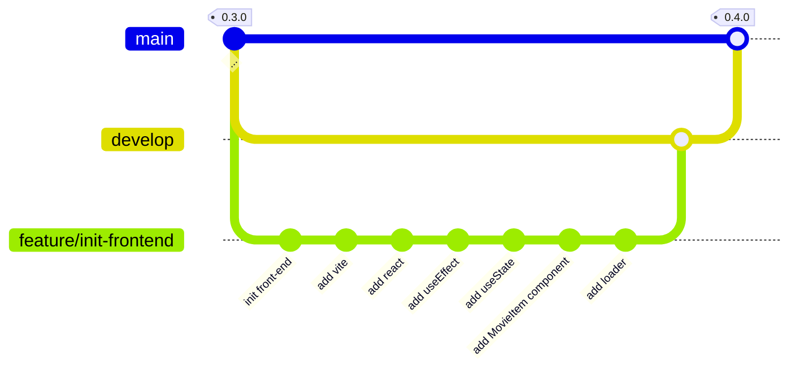

# TMDB Discovery App - 0.4.0

<p class="hero-kicker">Vite - React - DevTools</p>

---

# Objectifs
    
## Application

- Mise en oeuvre d'une première version minimaliste de l'application TMDB Discovery App.
    
## Ingénierie logicielle

- vite, outil de build front-end moderne
- react, librairie front-end pour créer des interfaces utilisateur
- chrome devtools, outil de débogage pour les applications web

---



---

Se positionner sur la branche develop pour démarrer une nouvelle feature `init-frontend`.

```bash
git switch develop
git switch -c feature/init-frontend
```

La commande `git switch` est équivalente à `git checkout` mais plus moderne, l'option `-c` permet de créer une nouvelle branche.

---

Installer vite

```bash
npm install -D vite
```

Créer un fichier index.html à la racine du projet avec le contenu suivant:

```html
<p>Hello Vite!</p>
```

Tester l'application avec la commande suivante:

```bash
npx vite
```

Vite est un outil de build front-end moderne: en développement, il démarre un serveur très rapide et recharge les modules à chaud (HMR) sans recharger toute la page. En production, il génère un bundle optimisé (assets minifiés et découpés) pour de meilleures performances.

----

# Configuration de l'application pour servir le front-end

Afin de faciliter le développement de l'application, nous avons choisi de servir à la fois le back-end et le front-end depuis le même serveur. Nous allons donc configurer notre application pour démarrer le serveur vite en parallèle du serveur express. **concurrenly** est un package npm qui permet de lancer plusieurs commandes en parallèle.

```bash
npm install -D concurrently
```

Puis créer les scripts `dev` et `dev:client` dans le fichier `package.json` pour lancer à la fois le serveur express et le serveur vite:

```json
"scripts": {
  ...
  "dev": "concurrently \"npm run dev:server\" \"npm run dev:client\"",
  "dev:client": "vite",
  "dev:server": "tsx watch src/back-end/index.ts",
  ...
}
```

----

# Configuration de l'application pour servir le front-end (suite)

Par défaut vite utilise la configuration présente dans le fichier `vite.config.js` ou `vite.config.ts` à la racine du projet. Nous pouvons donc créer un fichier `vite.config.ts` à la racine du projet pour configurer le serveur vite.

```ts
import { defineConfig } from 'vite';
export default defineConfig({
  server: {
    port: 5173,
    proxy: {
      '/api': 'http://localhost:3000',
    },
  },
});
```

Cette configuration permet de configurer le serveur vite pour qu'il écoute sur le port 5173 et qu'il redirige les requêtes vers `/api` vers le serveur express qui écoute sur le port 3000.

Cette configuration est utile pour éviter les problèmes de CORS (Cross-Origin Resource Sharing) lors du développement de l'application.

----

# Configuration de l'application pour servir le front-end en react  

Afin de pouvoir utiliser React dans notre application, nous devons installer les packages nécessaires:

```bash
npm install react react-dom
npm install -D @types/react @types/react-dom
npm install -D @vitejs/plugin-react
```

Configurer vite pour utiliser le plugin React en modifiant le fichier `vite.config.ts`:

```ts
import { defineConfig } from 'vite';
import react from '@vitejs/plugin-react';   

export default defineConfig({
  plugins: [react()],
  server: {
    port: 5173,
    proxy: {
      '/api': 'http://localhost:3000',
    },
  },
});
```

----

Créer un fichier `src/front-end/App.tsx` pour créer le composant principal de l'application React:

```javascript
export default function App() {
  return (
    <div>
      Hello Vite from React!
    </div>
  )
}
```

Créer un fichier `src/front-end/main.tsx` pour initialiser l'application React:

```javascript
import { StrictMode } from 'react'
import { createRoot } from 'react-dom/client'
import App from './App.tsx'

createRoot(document.getElementById('root')!).render(
  <StrictMode>
    <App />
  </StrictMode>,
)
```

----

Modifier le fichier `index.html` pour inclure le fichier `main.tsx`:

```html
<!doctype html>
<html lang="en">
  <head>
    <meta charset="UTF-8" />
    <link rel="icon" type="image/svg+xml" href="/favicon.svg" />
    <meta name="viewport" content="width=device-width, initial-scale=1.0" />
    <title>themoviedb-discovery-app</title>
  </head>
  <body>
    <div id="root"></div>
    <script type="module" src="/src/front-end/main.tsx"></script>
  </body>
</html>
```

----

#  useEffect Hook

useEffect est un Hook React qui vous permet de synchroniser un composant React avec un système extérieur.

Il peut être pour effectuer l'appel à une API, pour mettre à jour le DOM, pour configurer un abonnement, etc. Nous allons l'utiliser pour effectuer un appel à l'API TMDB pour récupérer les films populaires.


```javascript
import { useEffect } from 'react'

...

useEffect(() => {
    // fetch data from an API /api/movies/popular
    fetch('/api/movies/popular')
      .then((response) => response.json())
      .then((data) => {
        console.log(data)
      })
  }, [])

...
```

Nous pouvons voir dans la console du navigateur que nous avons bien récupéré les films populaires depuis l'API TMDB.

---

# useState Hook

useState est un Hook React qui ajoute une variable d’état dans votre composant.

```javascript
import { useEffect, useState } from "react"
import type { Movie } from "../back-end/schemas/MoviesTypes"

export default function App() {
  // State to hold the fetched movies data, initialized to null
  const [movies, setMovies] = useState<Movie[] | null>(null)

  // useEffect hook to fetch data from an API when the component mounts
  useEffect(() => {
    // fetch data from an API /api/movies/popular
    fetch('/api/movies/popular')
      .then((response) => response.json())
      .then((data) => {
        console.log('Fetched movies data:', data) // Log the fetched data for debugging
        setMovies(data.results) // Update the state with the fetched movies data
      })
  }, [])

...
```

----

# useState Hook (suite)

```javascript

...

return (
    <div>
      <h1>Popular Movies</h1>
      {movies ? (
        <ul>
          {movies.map((movie) => (
            <li key={movie.id}>
              <h2>{movie.title}</h2>
              <p>{movie.overview}</p>
              <p>Release Date: {movie.release_date}</p>
              <p>Rating: {movie.vote_average}</p>
            </li>
          ))}
        </ul>
      ) : null}
    </div>
  )
}
```

----

# refactoring du code pour créer un composant MovieItem

Créer un fichier `src/front-end/components/MovieItem.tsx` pour créer le composant MovieItem:    

```javascript
import type { Movie } from "../../back-end/schemas/MoviesTypes"

type MovieItemProps = {
  movie: Movie
}

export default function MovieItem({ movie }: MovieItemProps) {
  return (
    <li>
      <h2>{movie.title}</h2>
      <p>{movie.overview}</p>
      <p>Release Date: {movie.release_date}</p>
      <p>Rating: {movie.vote_average}</p>
    </li>
  )
}
```

----

# refactoring du code pour créer un composant MovieItem (suite)

Modifier le fichier `src/front-end/App.tsx` pour utiliser le composant MovieItem:


```javascript
...
    {movies ? (
        <ul>
          {movies.map((movie) => (
            <MovieItem key={movie.id} movie={movie} />
          ))}
        </ul>
      ) : null}
...
```

----

# Amélioration de l'expérience utilisateur avec un loader

```javascript
...
return (
    <div>
      <h1>Popular Movies</h1>
      {movies ? (
        <ul>
          {movies.map((movie) => (
            <MovieItem key={movie.id} movie={movie} />
          ))}
        </ul>
      ) : (
        <p>Loading...</p>
      )}
    </div>
  )
}
``` 
