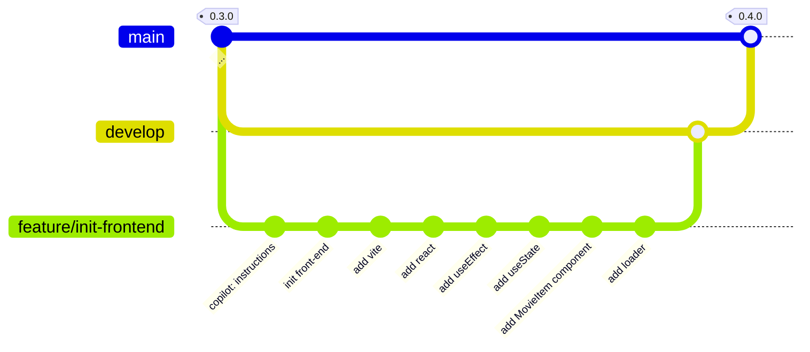

# TMDB Discovery App - 0.4.0

<p class="hero-kicker">Vite - React - DevTools - GitHub Copilot</p>

---

# Objectifs

## Application

- Mettre en place une première version minimaliste de TMDB Discovery App.

## Ingénierie logicielle

- Utiliser **Vite** pour le build front-end.
- Utiliser **React** pour construire l'interface.
- Utiliser **Chrome DevTools** pour le débogage web.
- Utiliser **GitHub Copilot** pour accélérer le développement.

<!--

Nous allons utiliser le fichier copilot-instructions.md pour configurer GitHub Copilot afin de nous aider dans notre développement. Notre premier cas d'usage sera de générer le message de commit en respectant la convention de commit "Conventional Commits".
-->

---



---

- **Objectif :** démarrer la feature `init-frontend` depuis `develop`.
- **Commande :**

```bash
git switch develop
git switch -c feature/init-frontend
```

- **Vérification :** la branche `feature/init-frontend` est créée et active.

<!--

La commande `git switch` est équivalente à `git checkout` mais plus moderne, l'option `-c` permet de créer une nouvelle branche.

-->

---

# Github Copilot - instructions

- **Objectif :** guider Copilot pour générer des commits au format Conventional Commits.
- **Commande :**

```bash
mkdir -p .github
touch .github/copilot-instructions.md
```

- **Règles à ajouter dans** `.github/copilot-instructions.md` :

```markdown
# Instructions pour GitHub Copilot

## Conventions de commit

- Utiliser la convention de commit "Conventional Commits".
- Types autorisés : feat, fix, docs, style, refactor, test, chore.
- Format : `<type>: <message en anglais>`.
- Exemple : "feat: add new feature to the application"
```

- **Résultat attendu :** Copilot propose des messages de commit cohérents et standardisés.

<!--

Ce fichier permet de donner des instructions à GitHub Copilot qui seront utilisées par défaut pour toutes les suggestions de code. Nous allons l'utiliser pour générer des messages de commit respectant la convention de commit "Conventional Commits".

Utiliser le bouton "Commit" de GitHub Copilot pour générer un message de commit basé sur les changements effectués dans le code. Le message sera automatiquement formaté selon les règles définies dans le fichier `copilot-instructions.md`.

Nos contrôles sur le message de commit restent utiles pour s'assurer que le message est pertinent et respecte les conventions de commit. Ici copilot vient nous aider à générer un message de commit cohérent et standardisé.

-->

---

# Mise en place de Vite pour le front-end

Installer Vite en tant que dépendance de développement:

```bash
npm install -D vite
```

Créer un fichier index.html à la racine du projet avec un simple message pour tester Vite:

```bash
echo "<p>Hello from Vite</p>" > index.html
```

Tester l'application avec la commande suivante:

```bash
npx vite
```

- **Pourquoi Vite :** démarrage très rapide en développement.
- **En développement :** rechargement à chaud (HMR) sans recharger toute la page.
- **En production :** bundle optimisé (minification + découpage des assets).

Commiter les changements dans le **Source Control** avec un message de commit généré par Copilot
----

# Configuration de l'application pour servir le front-end

- **Objectif :** lancer le back-end et le front-end en même temps.
- **Outil :** `concurrently` pour exécuter plusieurs commandes en parallèle.
- **Action :** ajouter des scripts pour démarrer Express et Vite ensemble.

```bash
npm install -D concurrently
```

Puis créer les scripts `dev` et `dev:client` dans le fichier `package.json` pour lancer à la fois le serveur express et le serveur vite:

```json
"scripts": {
  ...
  "dev": "concurrently \"npm run dev:server\" \"npm run dev:client\"",
  "dev:client": "vite",
  "dev:server": "tsx watch src/back-end/index.ts",
  ...
}
```

----

# Configuration de l'application pour servir le front-end (suite)

- **Objectif :** configurer Vite pour le développement local.
- **Étape 1 :** créer `vite.config.ts` à la racine du projet.
```bash
touch vite.config.ts
```
- **Étape 2 :** définir le port Vite et le proxy API vers Express dans le fichier `vite.config.ts`:

```ts
import { defineConfig } from 'vite';
export default defineConfig({
  server: {
    port: 5173,
    proxy: {
      '/api': 'http://localhost:3000',
    },
  },
});
```

---

# Configuration de l'application pour servir le front-end (suite)

- **Résultat attendu :** Vite tourne sur `5173` et `/api` est redirigé vers `http://localhost:3000`.
- **Bénéfice :** on évite les problèmes CORS en développement.

- **Test à exécuter :** démarrer les serveurs front-end et back-end.
- **Commande :**

```bash
npm run dev
```

- **Résultat attendu :** Express répond sur `http://localhost:3000` et Vite sur `http://localhost:5173`.
- **Vérification API :** `http://127.0.0.1:5173/api/movies/popular` retourne bien des données.

Committer les changements dans le **Source Control** avec un message de commit généré par Copilot

----

# Configuration de l'application pour servir le front-end en react  

- **Objectif :** activer React dans le front-end Vite.
- **Étape 1 :** installer React, les types TypeScript et le plugin Vite.

```bash
npm install react react-dom
npm install -D @types/react @types/react-dom
npm install -D @vitejs/plugin-react
```

- **Étape 2 :** activer le plugin React dans `vite.config.ts`.

```ts
import { defineConfig } from 'vite';
import react from '@vitejs/plugin-react';   

export default defineConfig({
  plugins: [react()],
  server: {
    port: 5173,
    proxy: {
      '/api': 'http://localhost:3000',
    },
  },
});
```

- **Résultat attendu :** les composants React se compilent et le HMR fonctionne.

----

- **Objectif:** créer le composant racine et le point d'entrée React.
- **Étape 1:** créer `src/front-end/App.tsx`.

```tsx
export default function App() {
  return (
    <div>
      Hello Vite from React!
    </div>
  )
}
```

- **Étape 2:** créer `src/front-end/main.tsx` pour monter l'application.

```tsx
import { StrictMode } from 'react'
import { createRoot } from 'react-dom/client'
import App from './App.tsx'

createRoot(document.getElementById('root')!).render(
  <StrictMode>
    <App />
  </StrictMode>,
)
```

----

- **Étape 3 :** modifier `index.html` pour charger `main.tsx`.

```html
<!doctype html>
<html lang="en">
  <head>
    <meta charset="UTF-8" />
    <link rel="icon" type="image/svg+xml" href="/favicon.svg" />
    <meta name="viewport" content="width=device-width, initial-scale=1.0" />
    <title>themoviedb-discovery-app</title>
  </head>
  <body>
    <div id="root"></div>
    <script type="module" src="/src/front-end/main.tsx"></script>
  </body>
</html>
```

- **Étape 4 :** démarrer Vite.

```bash
npm run dev
```

- **Résultat attendu :** l'application React s'affiche correctement dans le navigateur.
- **Ressources :** React https://fr.react.dev/ | Vite https://vitejs.dev/.

----

# Chrome DevTools

- **Objectif :** inspecter et déboguer l'application web dans le navigateur.
- **Utilité :** analyser le DOM, les styles CSS, le réseau et les performances.
- **Ouverture (Windows/Linux) :** `Ctrl + Shift + I`.
- **Ouverture (Mac) :** `Cmd + Option + I`.
- **Alternative :** clic droit sur la page puis **Inspecter**.

<!--

Faire une rapide démonstration de l'utilisation de Chrome DevTools pour inspecter le DOM, modifier les styles CSS et vérifier les requêtes réseau.

Expliquer que nous aurons un usage plus avancé de Chrome DevTools pour le débogage des composants React et l'inspection des requêtes réseau dans les prochaines étapes.

-->


----

#  React - useEffect Hook

- **Objectif :** déclencher une action après le rendu du composant.
- **Définition :** `useEffect` sert à gérer les effets secondaires en React.
- **Cas d'usage :** appel API, mise à jour du DOM, abonnement à un événement.
- Référence : https://fr.react.dev/reference/react/useEffect

---

# React - useEffect Hook (suite)

- **Objectif:** récupérer les films populaires depuis l'API TMDB.


```tsx
import { useEffect } from 'react'

export default function App() {
    useEffect(() => {
        // fetch data from an API /api/movies/popular
        fetch('/api/movies/popular')
            .then((response) => response.json())
            .then((data) => {
                console.log(data)
            })
    }, [])

    return (
        <div>
            Hello Vite from React!
        </div>
    )
}
```

<!--

Vérifier dans la console du navigateur que les données sont bien récupérées depuis l'API TMDB.
Remarque, en mode développement l'appel à l'API est visible 2 fois dans la console, c'est normal car React active le mode strict qui double l'exécution des effets pour détecter les problèmes potentiels ( voir fichier `src/front-end/main.tsx` ).

-->

---

# React - useState Hook


- **Objectif :** ajouter une variable d’état dans votre composant React.
- **Référence :** https://fr.react.dev/reference/react/useState

- **Définition :** l'état est une donnée qui peut changer dans le temps.
- **Effet :** quand l'état change, React relance le rendu du composant.
- **Cas d'usage :** réponse API, champs de formulaire, données interactives.

<!--
Nous verrons dans la suite avec la mise en place du composant `MovieItem` et du loader que le `useState` est très utile pour gérer l'état de l'application et améliorer l'expérience utilisateur.
-->

---

# React - useState Hook (suite)

**Objectif :** stocker les films récupérés depuis l'API dans l'état du composant.
```tsx
import { useEffect, useState } from "react"
import type { Movie } from "../back-end/schemas/MoviesTypes"

export default function App() {
  // State to hold the fetched movies data, initialized to null
  const [movies, setMovies] = useState<Movie[] | null>(null)

  // useEffect hook to fetch data from an API when the component mounts
  useEffect(() => {
    // fetch data from an API /api/movies/popular
    fetch('/api/movies/popular')
      .then((response) => response.json())
      .then((data) => {
        console.log('Fetched movies data:', data) // Log the fetched data for debugging
        setMovies(data.results) // Update the state with the fetched movies data
      })
  }, [])

...
```

----

# React - useState Hook (suite)

```tsx

...

return (
    <div>
      <h1>Popular Movies</h1>
      {movies ? (
        <ul>
          {movies.map((movie) => (
            <li key={movie.id}>
              <h2>{movie.title}</h2>
              <p>{movie.overview}</p>
              <p>Release Date: {movie.release_date}</p>
              <p>Rating: {movie.vote_average}</p>
            </li>
          ))}
        </ul>
      ) : null}
    </div>
  )
}
```

Committer les changements dans le **Source Control** avec un message de commit généré par Copilot

<!--
Le code ci-dessus affiche la liste des films populaires récupérés depuis l'API TMDB. Chaque film est affiché avec son titre, sa description, sa date de sortie et sa note. Si les films ne sont pas encore chargés, rien n'est affiché.

Faire une demo en limitant le réseau pour simuler un chargement lent et montrer que l'affichage est vide pendant le chargement des données. Cela met en évidence la nécessité d'améliorer l'expérience utilisateur avec un loader.
-->

----

# Refactoring du code pour créer un composant MovieItem

- **Objectif :** isoler l'affichage d'un film dans un composant dédié.
- **Bénéfice :** améliorer la lisibilité et la réutilisabilité du code.
- **Étape 1 :** créer `src/front-end/components/MovieItem.tsx`.    

```tsx
import type { Movie } from "../../back-end/schemas/MoviesTypes"

type MovieItemProps = {
  movie: Movie
}

export default function MovieItem({ movie }: MovieItemProps) {
  return (
    <li>
      <h2>{movie.title}</h2>
      <p>{movie.overview}</p>
      <p>Release Date: {movie.release_date}</p>
      <p>Rating: {movie.vote_average}</p>
    </li>
  )
}
```

----

# Refactoring du code pour créer un composant MovieItem (suite)

- **Objectif :** utiliser le composant `MovieItem` dans `App.tsx`.
- **Étape 2 :** remplacer le rendu inline par le composant dédié.


```javascript
...
    {movies ? (
        <ul>
          {movies.map((movie) => (
            <MovieItem key={movie.id} movie={movie} />
          ))}
        </ul>
      ) : null}
...
```

Committer les changements dans le **Source Control** avec un message de commit généré par Copilot

----

# Amélioration de l'expérience utilisateur avec un loader

- **Objectif :** afficher un indicateur pendant le chargement des données.
- **Bénéfice :** informer l'utilisateur que l'application travaille.
- **Exemple ici :** afficher `Loading...` tant que les films ne sont pas encore disponibles.

```javascript
...
return (
    <div>
      <h1>Popular Movies</h1>
      {movies ? (
        <ul>
          {movies.map((movie) => (
            <MovieItem key={movie.id} movie={movie} />
          ))}
        </ul>
      ) : (
        <p>Loading...</p>
      )}
    </div>
  )
}
``` 

---

# Fin du développement de la version 0.4.0

Faire le nécessaire pour que la branche **main** soit à jour avec la version `v0.4.0` de l'application.

Rappel des étapes à suivre pour créer une nouvelle version de l'application:
- Merger les branches **feature** dans **develop**.
- Merger la branche **develop** dans **main**.
- Créer un tag de version sur la branche **main**.

----

# Récapitulatif de la version 0.4.0

- Mise en place d'une application front-end avec Vite et React.
- Création du composant `MovieItem` pour afficher les détails d'un film.
- Amélioration de l'expérience utilisateur avec un loader pendant le chargement des films.
