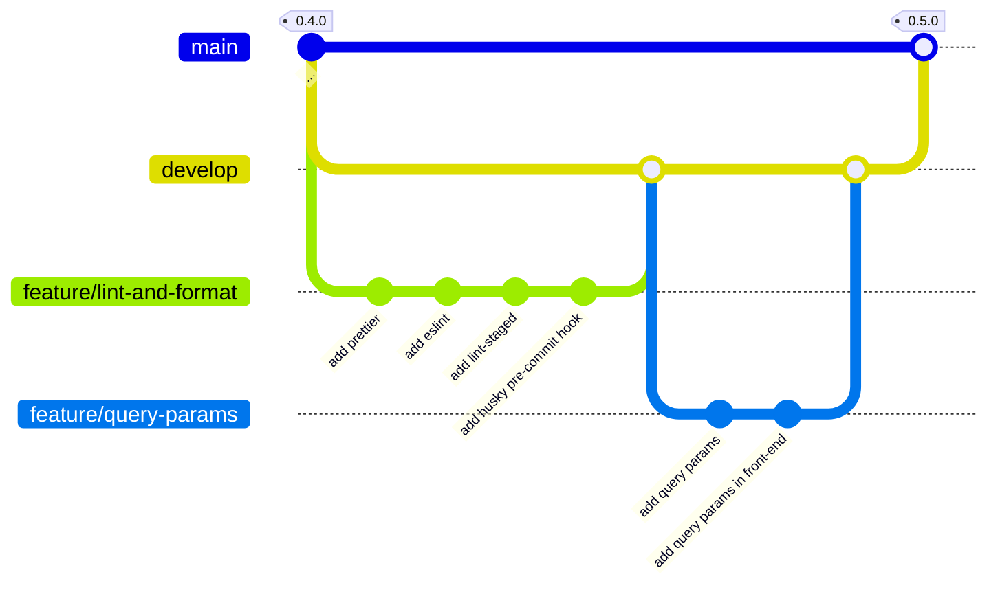

# TMDB Discovery App - 0.5.0

<p class="hero-kicker">Query Params - ESLint - Prettier - Pull Requests</p>

---

# Objectifs
    
## Application

- Exposition de paramètres lors de l'appel de l'API TMDB pour récupérer les films populaires (langue, page, ...)
- Utilisation de query params pour passer les paramètres de l'API TMDB via l'URL (query params) depuis le front-end.
    
## Ingénierie logicielle

- prettier, outil de formatage de code pour maintenir un style de code cohérent
- eslint, outil de linting pour le code JavaScript/TypeScript
- pull request, mécanisme de contribution sur GitHub pour proposer des modifications à un projet

<!--

Exemple de notes

-->
---



---

Se positionner sur la branche develop pour démarrer une nouvelle feature `lint-and-format`.

```bash
git switch develop
git switch -c feature/lint-and-format
```

---

# formatage du code avec prettier

**prettier** est un outil de formatage de code qui permet de maintenir un style de code cohérent dans le projet. Il peut être utilisé en complément d'eslint pour formater automatiquement le code selon les règles définies.

Installer prettier et les plugins nécessaires pour React et TypeScript:

```bash
npm install -D prettier eslint-config-prettier eslint-plugin-prettier
```

Créer un fichier de configuration `prettier.config.ts` à la racine du projet avec le contenu suivant:

```typescript
import { defineConfig } from 'prettier'

export default defineConfig({
  semi: true,
  singleQuote: true,
  trailingComma: 'all',
  printWidth: 80,
  tabWidth: 2,
})
```

----

# formatage du code avec prettier (suite)

Ajouter le script de formatage dans le fichier `package.json`:

```json
{
  "scripts": {
    ...
    "format": "prettier --write ."
    ...
  }
}
```

Committer les modifications avant de lancer le formatage du code qui va modifier plusieurs fichiers du projet puis commiter à nouveau les modifications apportées par prettier.

Pour lancer le formatage du code, exécuter la commande suivante:

```bash
npm run format
```

---

# linting avec eslint

Le **linting** est le processus d'analyse statique du code pour identifier les erreurs de style, les problèmes potentiels et les violations des bonnes pratiques. Il permet d'améliorer la qualité du code et de maintenir une cohérence dans le projet.

**eslint** est un outil de linting populaire pour JavaScript et TypeScript. Il permet de définir des règles de style et de détecter les problèmes dans le code.

Installer eslint et les plugins nécessaires pour React et TypeScript:

```bash
npm install -D eslint @eslint/js eslint-plugin-react-hooks eslint-plugin-react-refresh globals typescript-eslint
````

Ajouter le script de linting dans le fichier `package.json`:

```json
{
  "scripts": {
    ...
    "lint": "eslint ."
    ...
  }
}
```

----

# linting avec eslint (suite)

Ajouter le fichier de configuration `eslint.config.ts` à la racine du projet avec le contenu du slide suivant. Ce fichier configure eslint pour analyser les fichiers TypeScript et React, en utilisant les règles recommandées pour chaque technologie.

----

```typescript
import js from '@eslint/js';
import globals from 'globals';
import reactHooks from 'eslint-plugin-react-hooks';
import reactRefresh from 'eslint-plugin-react-refresh';
import tseslint from 'typescript-eslint';
import { defineConfig, globalIgnores } from 'eslint/config';
import eslintConfigPrettier from 'eslint-config-prettier/flat';

export default defineConfig([
  globalIgnores(['dist', 'coverage']),
  {
    files: ['**/*.{ts,tsx}'],
    extends: [
      js.configs.recommended,
      tseslint.configs.recommended,
      reactHooks.configs.flat.recommended,
      reactRefresh.configs.vite,
    ],
    languageOptions: {
      ecmaVersion: 2020,
      globals: globals.browser,
    },
  },
  eslintConfigPrettier,
]);

```
----

# Contrôle avec lint-staged

**lint-staged** est un outil qui permet d'exécuter des scripts de linting uniquement sur les fichiers modifiés dans un commit. Cela permet de s'assurer que le code ajouté ou modifié respecte les règles de linting définies dans le projet.

Ajouter le package `lint-staged` pour exécuter eslint sur les fichiers modifiés avant chaque commit:

```bash
npm install -D lint-staged
```

Configurer lint-staged dans le fichier `package.json` pour exécuter eslint et prettier sur les fichiers TypeScript et React modifiés:

```json
  ...
  "lint-staged": {
    "*.{js,jsx,ts,tsx}": [
      "eslint --fix",
      "prettier --write"
    ]
  },
  ...
```

----

# Contrôle avec lint-staged (suite)

Afin de s'assurer que lint-staged est exécuté avant chaque commit, nous allons ajouter un hook git `pre-commit` qui va exécuter lint-staged. 

Nous avons déjà installé `husky` dans le projet pour gérer les hooks git. Il suffit donc de créer le hook `pre-commit` dans le dossier `.husky` avec le contenu suivant:

```bash
echo "npx lint-staged" > .husky/pre-commit
```

Si des fichiers ne respectent pas les règles de linting, le commit sera annulé et il faudra corriger les erreurs avant de pouvoir commiter à nouveau. Lorsque cela est possible, les modifications seront automatiquement corrigées par prettier et eslint.

Avec cette configuration le code existant n'est pas modifié, seul le code ajouté ou modifié dans le commit est analysé et corrigé si nécessaire. Cette approche permet de maintenir un code propre et cohérent dans le projet sans avoir à reformater l'ensemble du code existant, qui pourrait introduire des modifications inutiles et rendre l'historique des commits plus difficile à suivre.

----

# pull request - lint and format

Pousser les modifications sur la branche `feature/lint-and-format` sur le dépôt distant et créer une pull request qui permettra de fusionner les modifications dans la branche `develop`. Ne valider pas la pull request pour le moment, nous allons d'abord ajouter la feature `query-params` avant de fusionner les deux features dans la branche `develop`.

----

# pull request

Une **pull request** est un mécanisme de contribution sur GitHub qui permet de proposer des modifications à un projet. Elle permet aux contributeurs de soumettre leurs changements pour examen et discussion avant qu'ils ne soient fusionnés dans une branche du projet. 

Les pull requests sont souvent utilisées pour collaborer sur des projets open source, mais elles peuvent également être utilisées dans des projets privés pour faciliter la collaboration entre les membres d'une équipe.

Elle présente même un intétrêt pour un projet personnel, car elle permet de relire son code avant de le fusionner dans la branche cible du projet. Cela permet de détecter des erreurs ou des problèmes potentiels avant qu'ils ne soient intégrés dans le code principal.

Nous verrons plus tard que l'on peut utiliser la pull request pour ajouter des contrôles (tests unitaires, tests d'intégration, linting, ...) avant de fusionner les modifications dans la branche cible du projet.

La **pull request** est une fonctionnalité de GitHub mais elle est également disponible sur d'autres plateformes de gestion de code source comme GitLab, Bitbucket, etc, sous des noms différents (merge request sur GitLab par exemple).

----

# feature - query params

Se positionner sur la branche develop pour démarrer une nouvelle feature `query-params`.

```bash
git switch develop
git switch -c feature/query-params
```

L'objectif de cette feature est de permettre à l'utilisateur de passer des paramètres à l'API TMDB pour récupérer les films populaires. Ces paramètres seront passés via l'URL (query params) depuis le front-end.

Les query params sont des paramètres qui sont ajoutés à l'URL d'une requête HTTP pour transmettre des informations supplémentaires au serveur. Ils sont généralement utilisés pour filtrer, trier ou paginer les résultats d'une requête.

Nous allons avoir une approche progressive pour implémenter cette feature. Nous allons d'abord ajouter les query params dans le back-end, vérifier que l'API TMDB fonctionne correctement avec ces paramètres, puis nous allons ajouter les query params dans le front-end pour permettre à l'utilisateur de les modifier.

----

# feature - query params - back-end

Les query params sont déjà gérés par l'API TMDB, il suffit donc de les transmettre depuis notre back-end vers l'API TMDB. Nous allons donc modifier la route `/api/movies/popular` pour accepter les query params `language` et `page`.

Nous allons dans un premier temps ajouter des constantes pour les query params dans le fichier `src/back-end/constants.ts`:

```typescript
// Langue par défaut pour les requêtes à l'API TMDB
export const DEFAULT_LANGUAGE = 'fr-FR';

// Page par défaut pour les requêtes à l'API TMDB
export const DEFAULT_PAGE = '1';

// Région par défaut pour les requêtes à l'API TMDB
export const DEFAULT_REGION = 'FR';
```

Nous aurons ainsi un comportement par défaut pour les requêtes à l'API TMDB si l'utilisateur ne fournit pas de query params.

----

# feature - query params - back-end (suite)

Extrait des modifications apportées à la route `/api/movies/popular` dans le fichier `src/back-end/index.ts` pour gérer les query params `language`, `page` et `region`:

```typescript
...
      // Create a URLSearchParams object to build the query string for the TMDB API request
      const queryParams = new URLSearchParams();

      // Extract query parameters from the request and append them to the query string
      const { language, page, region } = _req.query;

      queryParams.append('language', (language as string) || DEFAULT_LANGUAGE);
      queryParams.append('page', (page as string) || DEFAULT_PAGE);
      queryParams.append('region', (region as string) || DEFAULT_REGION);

      const response = await fetch(
        `https://api.themoviedb.org/3/movie/popular?${queryParams.toString()}`,
        {
          headers: {
            Authorization: `Bearer ${tmdbAccessToken}`,
            'Content-Type': 'application/json;charset=utf-8',
          },
        },
      );
...
```

----

# feature - query params - back-end (suite)

Tester la route `/api/movies/popular` avec les query params `language`, `page` et `region` pour vérifier que l'API TMDB fonctionne correctement avec ces paramètres.

Pour ajouter les query params à la requête, il suffit de les ajouter à l'URL de la requête. Par exemple, pour récupérer les films populaires en anglais (en-US) et à la page 2, il suffit d'ajouter `?language=en-US&page=2` à l'URL de la requête.

```bash
curl -X GET "http://localhost:3000/api/movies/popular?language=en-US&page=2" -H "accept: application/json"
```

Une fois que la route est testée et fonctionne correctement, commiter les modifications.

----

# feature - query params - front-end

Nous allons dans un premier temps uniquement gérer le fait de passer les query params `language`, `page` et `region` depuis le front-end vers le back-end en passant par l'URL de la requête. Nous verrons plus tard comment ajouter des contrôles pour permettre à l'utilisateur de modifier ces paramètres depuis l'interface utilisateur.

----

# feature - query params - front-end (suite)

Extrait des modifications apportées au fichier `src/front-end/App.tsx` pour gérer les query params `language`, `page` et `region`:

```typescript
export default function App() {
  ...

  // read parameters from the URL query string
  const queryParams = new URLSearchParams(window.location.search);
  const language = queryParams.get('language') || DEFAULT_LANGUAGE;
  const page = queryParams.get('page') || DEFAULT_PAGE;
  const region = queryParams.get('region') || DEFAULT_REGION;

  ...

  // useEffect hook to fetch data from an API when the component mounts
  useEffect(() => {
    // fetch data from an API /api/movies/popular
    fetch(
      `/api/movies/popular?language=${language}&page=${page}&region=${region}`,
    )

  ...
```

----

# feature - query params - front-end (suite)

Comme pour le back-end, nous allons tester que la page d'accueil du front-end fonctionne correctement avec les query params `language`, `page` et `region`. Pour cela, il suffit de modifier l'URL de la page d'accueil pour ajouter les query params.

Par exemple, pour récupérer les films populaires en anglais (en-US) et à la page 2, il suffit d'ajouter `?language=en-US&page=2` à l'URL de la page d'accueil.

Dans votre navigateur, vous pouvez tester l'URL suivante pour vérifier que les query params sont bien pris en compte par le front-end et le back-end:

```bash
http://127.0.0.1:5173/?language=en-US&page=2
```

Notre application est maintenant capable de gérer les query params `language`, `page` et `region` pour récupérer les films populaires depuis l'API TMDB.

----

# feature - query params - front-end (suite)


La langue par défaut étant le français (fr-FR), modifier le titre de la page d'accueil pour afficher "Films populaires" au lieu de "Popular Movies".

Nous verrons plus tard comment ajouter des contrôles pour permettre à l'utilisateur de modifier ces paramètres depuis l'interface utilisateur et éventuellement gérer une application multilingue si nous voulons aller plus loin dans le projet.

Pousser les modifications sur la branche `feature/query-params` sur le dépôt distant et créer une pull request qui permettra de fusionner les modifications dans la branche `develop`. Ne valider pas la pull request pour le moment.

----

# pull request

Nous avons maintenant deux pull requests ouvertes sur le dépôt distant, une pour la feature `lint-and-format` et une pour la feature `query-params`. Nous allons fusionner les deux pull requests dans la branche `develop` pour valider les modifications apportées par les deux features.

Une fois les deux pull requests fusionnées dans la branche `develop`, nous allons créer une nouvelle pull request pour fusionner la branche `develop` dans la branche `main` et ainsi valider les modifications apportées par les deux features dans la version 0.5.0 de l'application.