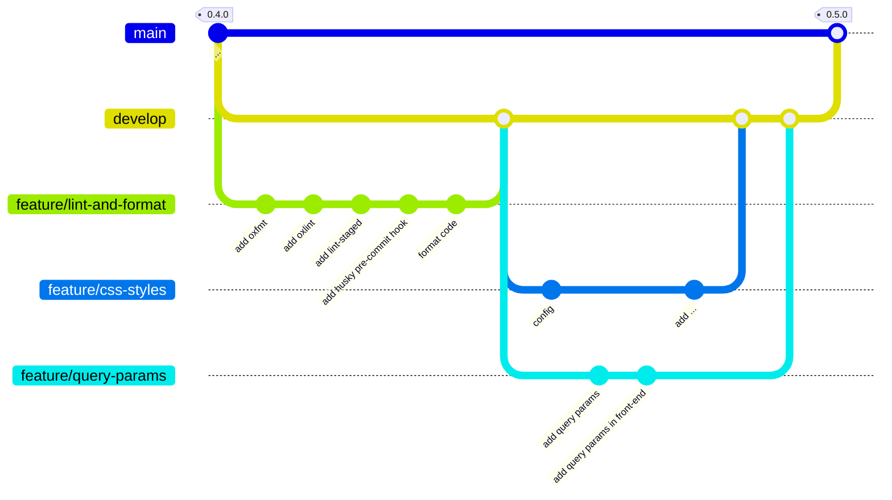

# TMDB Discovery App - 0.5.0

<p class="hero-kicker">lint - format - style - query params - pull requests</p>

---

# Objectifs

## Application

- Améliorer l'apparence de l'application avec des styles CSS.
- Utiliser des balises HTML5 pour structurer les contenus.
- Gérer les query params pour récupérer les films populaires depuis l'API TMDB.

## Ingénierie logicielle

- Utiliser **oxfmt** pour formater le code.
- Utiliser **oxlint** pour analyser le code JavaScript et TypeScript.
- Utiliser les **pull requests** pour proposer et relire les modifications.

<!--

**C**ascading **S**tyle **S**heets (feuilles de style en cascade), un langage standard utilisé pour mettre en forme et concevoir le design des pages web en **HTML**.

**HTML5** est la dernière version du langage de balisage HTML, qui est utilisé pour structurer et présenter le contenu sur le web. Il introduit de nouvelles balises sémantiques (comme `<header>`, `<footer>`, `<article>`, `<section>`, etc.) qui permettent de mieux organiser le contenu et d'améliorer l'accessibilité et le référencement des pages web.

**Query params** (paramètres de requête) sont des paramètres qui sont ajoutés à l'URL d'une requête HTTP pour transmettre des informations supplémentaires au serveur. Ils sont généralement utilisés pour filtrer, trier ou paginer les résultats d'une requête.

**oxfmt** et **oxlint** sont des outils de formatage et d'analyse de code pour JavaScript et TypeScript. Ils permettent de maintenir un style de code cohérent et de détecter les erreurs de style, les problèmes potentiels et les violations des bonnes pratiques.

**Pull requests** sont un mécanisme de contribution sur GitHub qui permet de proposer des modifications à un projet. Elles permettent aux contributeurs de soumettre leurs changements pour examen et discussion avant qu'ils ne soient fusionnés dans une branche du projet.

-->
---



<!--

Nous allons tout d'abord créer une branche `feature/lint-and-format` pour ajouter les outils de linting et de formatage de code. Nous allons ensuite créer une branche `feature/css-styles` pour ajouter les styles CSS et améliorer la sémantique du code HTML. Enfin, nous allons créer une branche `feature/query-params` pour gérer les query params dans le front-end et le back-end.

Nous ne fusionnerons pas directement les branches `feature/css-styles` et `feature/query-params` nous passerons par le concept de pull request pour relire le code avant de le fusionner dans la branche `develop`.
-->

---

# Linting et formatage du code

- **Objectif :** démarrer la feature `lint-and-format` depuis `develop`.
- **Commande :**

```bash
git switch develop
git switch -c feature/lint-and-format
```

- **Vérification :** la branche `feature/lint-and-format` est créée et active.

<!--

**Linting** est le processus d'analyse du code source pour détecter les erreurs de style, les problèmes potentiels et les violations des bonnes pratiques (variable non utilisée, ordre des imports, etc.). Il permet d'améliorer la qualité du code et de maintenir une cohérence dans le projet.

**Formatage** est le processus de mise en forme du code source pour qu'il respecte un style de code cohérent. Il permet d'améliorer la lisibilité du code et de faciliter la collaboration entre les développeurs.

-->
---

# Linting avec **oxlint**

- **Objectif :** détecter les erreurs et appliquer des règles de qualité au code JavaScript et TypeScript.
- **Étape 1 :** installer `oxlint`.

```bash
npm install -D oxlint
```

- **Étape 2 :** ajouter les scripts dans `package.json`.

```json
{
  "scripts": {
    ...
    "lint": "oxlint -c oxlint.config.ts .",
    "lint:fix": "oxlint -c oxlint.config.ts --fix .",
    ...
  }
}
```

- **Résultat attendu :** les commandes `npm run lint` et `npm run lint:fix` sont disponibles.

<!--

**npm run lint** : exécute oxlint pour analyser le code et détecter les erreurs de style et les problèmes potentiels.

**npm run lint:fix** : exécute oxlint pour analyser le code et corriger automatiquement les erreurs de style et les problèmes potentiels.
-->
---

# Configuration d'**oxlint**

- **Objectif :** définir les règles appliquées par `oxlint`.
- **Étape 1 :** créer le fichier `oxlint.config.ts` à la racine du projet.
- **Étape 2 :** ajouter la configuration suivante.

```typescript
import { defineConfig } from "oxlint";

export default defineConfig({
  plugins: ["typescript", "unicorn", "oxc", "react"],
  categories: {
    correctness: "error",
  },
  rules: {},
  env: {
    builtin: true,
  },
});
```

- **Résultat attendu :** `oxlint` analyse les fichiers **TypeScript** et **React** avec les règles de correction activées.

<!--
Cela configure oxlint pour analyser les fichiers TypeScript et React, en utilisant les règles recommandées pour chaque technologie. unicorn et oxc sont des plugins qui ajoutent des règles supplémentaires pour améliorer la qualité du code.

**categories: { correctness: "error" }** indique que toutes les erreurs de correction doivent être signalées comme des erreurs.

**rules: {}** permet de définir des règles supplémentaires ou de modifier les règles existantes. Dans cet exemple, nous n'avons pas défini de règles supplémentaires, mais nous pourrions le faire si nous le souhaitons.

**env: { builtin: true }** indique que l'environnement d'exécution est celui de Node.js, ce qui permet à oxlint de comprendre les fonctionnalités spécifiques à Node.js et d'éviter de signaler des erreurs pour les fonctionnalités qui sont disponibles dans cet environnement.

-->
---

# Vérifier avec **oxlint**

- **Objectif :** analyser le code avec la configuration `oxlint.config.ts`.
- **Commande :**

```bash
npm run lint
```

- **Résultat attendu :** `oxlint` détecte le paramètre `error` non utilisé dans le `catch`.

```bash
@alexandre-girard-maif ➜ /workspaces/themoviedb-discovery-app-demo-2026-2027 (feature/lint-and-format) $ npm run lint

> themoviedb-discovery-app-demo-2026-2027@1.0.0 lint
> oxlint -c oxlint.config.ts .


  × eslint(no-unused-vars): Catch parameter 'error' is caught but never used.
    ╭─[src/back-end/index.ts:44:12]
 43 │ 
 44 │   } catch (error) {
    ·            ──┬──
    ·              ╰── 'error' is declared here
 45 │     res.status(500).json({ error: 'Failed to fetch popular movies' });
    ╰────
  help: Consider handling this error.

Found 0 warnings and 1 error.
Finished in 49ms on 11 files with 115 rules using 2 threads.
```

---

# Corriger une erreur de linting

- **Option 1 :** supprimer le paramètre `error` lorsqu'il n'est pas utilisé.

```typescript
  } catch {
    res.status(500).json({ error: 'Failed to fetch popular movies' });
  }
```

- **Option 2 :** journaliser l'erreur lorsqu'elle aide au débogage.

```typescript
  } catch (error) {
    console.error('Error fetching popular movies:', error);
    res.status(500).json({ error: 'Failed to fetch popular movies' });
  }
```

- **Résultat attendu :** l'erreur de linting est corrigée et `oxlint` ne signale plus d'erreur. L'option 2 est préférable pour le débogage et la maintenance du code.

---

# Formatage avec **oxfmt**

- **Objectif :** appliquer un style de code cohérent avec `oxfmt`.
- **Étape 1 :** installer `oxfmt`.

```bash
npm install -D oxfmt
```

- **Étape 2 :** créer le fichier `oxfmt.config.ts` à la racine du projet.
- **Étape 3 :** ajouter la configuration TypeScript suivante.

```typescript
import { defineConfig } from 'oxfmt';

export default defineConfig({
  semi: true,
  singleQuote: true,
  trailingComma: 'all',
  printWidth: 80,
  tabWidth: 2,
});
```
---

# Utiliser **oxfmt**

- **Objectif :** vérifier et appliquer le formatage du code.
- **Étape 1 :** ajouter les scripts dans `package.json`.

```json
{
  "scripts": {
    ...
    "fmt": "oxfmt",
    "fmt:check": "oxfmt --check",
    ...
  }
}
```

- **Étape 2 :** vérifier le formatage avec la configuration `oxfmt.config.ts`.

```bash
npm run fmt:check
```

- **Étape 3 (optionnelle) :** corriger les écarts avec `npm run fmt`. Ne pas l'exécuter à cette étape pour éviter de reformater le code existant.

```bash
npm run fmt
```

- **Résultat attendu :** `npm run fmt:check` signale les écarts sans modifier les fichiers.

----

# Contrôle avec **lint-staged**

- **Objectif :** analyser uniquement les fichiers modifiés avant un commit.
- **Étape 1 :** installer `lint-staged`.

```bash
npm install -D lint-staged
```

- **Étape 2 :** configurer les commandes à exécuter dans `package.json`.

```json
  ...
  "lint-staged": {
    "*": [
      "npm run fmt",
      "npm run lint:fix"
    ]
  }
  ...
```

- **Résultat attendu :** seuls les fichiers du commit sont formatés et analysés.

<!--

**lint-staged** est un outil qui permet d'exécuter des scripts de linting uniquement sur les fichiers modifiés dans un commit. 

Cela permet de s'assurer que le code ajouté ou modifié respecte les règles de linting définies dans le projet et de ne pas reformater l'ensemble du code existant, ce qui pourrait introduire des modifications inutiles et rendre l'historique des commits plus difficile à suivre.

-->

----

# Hook `pre-commit` avec **lint-staged**

- **Objectif :** lancer `lint-staged` avant chaque commit.
- **Étape 1 :** utiliser `husky` pour gérer le hook Git.
- **Étape 2 :** créer le fichier `.husky/pre-commit`.

```bash
echo "npx lint-staged" > .husky/pre-commit
```

- **Résultat attendu :** le commit est annulé si les fichiers modifiés ne respectent pas les règles.
- **En cas d'échec :** corriger les erreurs signalées, puis relancer le commit.

<!--

Avec cette configuration le code existant n'est pas modifié, seul le code ajouté ou modifié dans le commit est analysé et corrigé si nécessaire. Cette approche permet de maintenir un code propre et cohérent dans le projet sans avoir à reformater l'ensemble du code existant, qui pourrait introduire des modifications inutiles et rendre l'historique des commits plus difficile à suivre.
-->
---

# Formatage initial du code

- **Objectif :** partir d'une base de code formatée et sans erreur de linting.
- **Étape 1 :** formater l'ensemble du code existant.
- **Étape 2 :** corriger automatiquement les erreurs détectées par le linter.

```bash
npm run fmt
npm run lint:fix
```

- **Résultat attendu :** de nombreux fichiers peuvent être modifiés lors de cette initialisation.
- **Attention :** isoler ce formatage dans un commit dédié pour garder un historique lisible.

---

# Merger `lint-and-format` dans `develop`

- **Objectif :** intégrer les outils de qualité dans la branche `develop`.
- **Commande :**

```bash
git checkout develop
git merge feature/lint-and-format
```

- **Vérification :** `develop` contient le linting et le formatage.
- **Suite :** conserver `main` inchangée jusqu'à l'ajout d'une fonctionnalité.

---

# Feature `css-styles`

- **Objectif :** améliorer l'apparence et la structure HTML de l'application.
- **Commande :**

```bash
git switch develop
git switch -c feature/css-styles
```

- **Vérification :** la branche `feature/css-styles` est créée et active.
- **Suite :** ajouter les styles CSS et les balises HTML5 sémantiques.

---

# Configurer TypeScript pour le front-end

- **Objectif :** séparer la configuration TypeScript du back-end et du front-end.
- **Étape 1 :** préparer le fichier `tsconfig.frontend.json` à la racine du projet.
- **Étape 2 :** référencer cette configuration dans `tsconfig.json`.

```json
{
  "files": [],
  "references": [{ "path": "./tsconfig.backend.json" }, { "path": "./tsconfig.frontend.json" }]
}
```

- **Résultat attendu :** TypeScript utilise une configuration dédiée pour le front-end.

---

# Configuration TypeScript du front-end

- **Objectif :** adapter TypeScript aux fichiers React et Vite du front-end.
- **Étape 1 :** créer le fichier `tsconfig.frontend.json`.
- **Étape 2 :** ajouter la configuration suivante.

```json
{
  "compilerOptions": {
    "target": "ES2023",
    "lib": ["ES2023", "DOM", "DOM.Iterable"],
    "module": "ESNext",
    "moduleResolution": "bundler",
    "jsx": "react-jsx",
    "types": ["vite/client"],
    "strict": true,
    "noEmit": true,
    "allowImportingTsExtensions": true,
    "skipLibCheck": true,
    "noUncheckedSideEffectImports": true
  },
  "include": ["src/front-end/**/*.ts", "src/front-end/**/*.tsx"]
}
```

- **Résultat attendu :** les fichiers `.ts` et `.tsx` du front-end sont vérifiés avec les types de Vite et React.

---

# feature - css styles - html sémantique

- **Objectif :** structurer la page pour améliorer l'accessibilité et le référencement.
- **Définition :** les balises HTML5 décrivent le rôle de chaque zone de contenu.
- **Pourquoi c'est utile :** les lecteurs d'écran et les moteurs de recherche comprennent mieux la page.
- **Exemple rapide :** `main` contient la page, `header` présente le titre, `section` regroupe les films et `article` décrit un film.
- **Référence :** https://web.dev/learn/html/semantic-html?hl=fr

---

# # feature - css styles (suite) - html sémantique

- **Objectif :** utiliser des balises HTML5 adaptées dans `src/front-end/App.tsx`.
- **Étape 1 :** placer le contenu principal dans `main`.
- **Étape 2 :** utiliser `header` pour le titre et `section` pour la liste.
- **Étape 3 :** encapsuler chaque film dans un `article`.
- **Résultat attendu :** la page est plus lisible et mieux interprétée par les technologies d'assistance.

---

# feature - css styles (suite) - html sémantique

```typescript
...
    <main>
      <header>
        <h1>Films populaires</h1>
        <h2>
          Films tendances en France, d'après les données de <b>The Movie Database</b>
        </h2>
      </header>
      <section>
      {movies ? (
        <ul>
          {movies.map((movie) => (
            <li key={movie.id}>
              <article>
                <MovieItem movie={movie} />
              </article>
            </li>
          ))}
        </ul>
      ) : (
        <p>Loading...</p>
      )}
      </section>
    </main>
...
```

<!--

L'entête de la page d'accueil est maintenant sémantique et contient un titre principal (h1) et un sous-titre (h2). Le contenu principal de la page est maintenant contenu dans une balise main, et les films populaires sont contenus dans une balise section.

ul et li sont utilisés pour lister les films populaires, et chaque film est contenu dans une balise article. Cela permet de mieux structurer le contenu de la page et d'améliorer l'accessibilité pour les utilisateurs utilisant des lecteurs d'écran.

-->

---

# feature - css styles (suite) - contenu de movieItem

- **Objectif :** afficher les informations essentielles d'un film.
- **Définition :** `MovieItem` présente l'affiche, le titre, l'année de sortie et la note.
- **Pourquoi c'est utile :** une carte concise améliore la lecture de la liste de films.
- **Exemple rapide :** utiliser une affiche TMDB optimisée pour limiter le poids des images.
- **Référence :** https://developer.themoviedb.org/reference/configuration-details

---

# feature - css styles (suite) - contenu de movieItem

```typescript
...
export default function MovieItem({ movie }: MovieItemProps) {
  const releaseYear = movie.release_date.slice(0, 4);
  const posterUrl = movie.poster_path ? `https://image.tmdb.org/t/p/w185${movie.poster_path}` : null;
  const rating = movie.vote_average.toFixed(1);

  return (
    <div>
      {posterUrl ? (
        
      ) : (
        <div />
      )}
      <div>
        <h2>{movie.title}</h2>
        <p>
          {releaseYear} · Rating {rating}
        </p>
      </div>
    </div>
  );
}
...
```

<!--

**releaseYear:** nous extrayons l'année de sortie du film à partir de la date de sortie complète (format YYYY-MM-DD) en utilisant la méthode `slice(0, 4)` pour ne conserver que les 4 premiers caractères de la chaîne de caractères.

**poster:** tmdb fournit différents formats d'affiches de films, nous avons choisi le format w185 pour avoir une affiche de taille moyenne. Le format w185 correspond à une largeur de 185 pixels et une hauteur proportionnelle à l'image originale suffisant pour avoir une bonne qualité d'image tout en limitant la taille du fichier.

**rating:** la note du film est arrondie à une décimale pour avoir une meilleure lisibilité. 

-->

---

# feature - css styles (suite) - css

- **Objectif :** appliquer les styles communs à toute l'application.
- **Étape 1 :** copier <a href="./assets/global.css" target="_blank" rel="noopener noreferrer">assets/global.css</a> dans `src/front-end/global.css`.
- **Étape 2 :** importer la feuille de style dans `src/front-end/main.tsx`.


```typescript
import { StrictMode } from "react";
import { createRoot } from "react-dom/client";
import App from "./App.tsx";
import "./global.css";

createRoot(document.getElementById("root")!).render(
  <StrictMode>
    <App />
  </StrictMode>,
);
```

---

# feature - css styles (suite) - css

- **Objectif :** appliquer les styles spécifiques à l'écran des films populaires.
- **Étape 1 :** copier <a href="./assets/app.css" target="_blank" rel="noopener noreferrer">assets/app.css</a> dans `src/front-end/app.css`.
- **Étape 2 :** importer la feuille de style dans `src/front-end/App.tsx`.
- **Étape 3 :** appliquer les classes CSS aux éléments de la page.
- **Résultat attendu :** la page utilise les styles définis dans `app.css`.

---


```typescript
...
import "./app.css";
...
<main className="app-shell">
      <header className="app-header">
        <h1>Films populaires</h1>
        <h2>
          Films tendances en France, d'après les données de <b>The Movie Database</b>
        </h2>
      </header>
      <section>
        {movies ? (
          <ul className="movie-grid">
            {movies.map((movie) => (
              <li key={movie.id}>
                <article>
                  <MovieItem movie={movie} />
                </article>
              </li>
            ))}
          </ul>
        ) : (
          <p className="status-message">Loading...</p>
        )}
      </section>
    </main>
...
```

---

# feature - css styles (suite) - css

- **Objectif :** appliquer les styles de `app.css` à chaque carte de film.
- **Étape 1 :** ajouter les classes de la carte et de son contenu.
- **Étape 2 :** appliquer une classe à l'affiche du film.
- **Résultat attendu :** chaque film utilise la même présentation visuelle.


---

```typescript
import type { Movie } from "../../back-end/schemas/MoviesTypes";

type MovieItemProps = {
  movie: Movie;
};

export default function MovieItem({ movie }: MovieItemProps) {
  const releaseYear = movie.release_date.slice(0, 4);
  const posterUrl = movie.poster_path ? `https://image.tmdb.org/t/p/w185${movie.poster_path}` : null;
  const rating = movie.vote_average.toFixed(1);

  return (
    <div className="movie-card">
      {posterUrl ?  : <div />}
      <div className="movie-card__content">
        <h2>{movie.title}</h2>
        <p>
          {releaseYear} · Rating {rating}
        </p>
      </div>
    </div>
  );
}
```

- **Étape 3 :** pousser les modifications de `feature/css-styles` sur le dépôt distant.

----

# Pull requests

- **Objectif :** proposer une modification avant de l'intégrer dans une branche.
- **Définition :** une pull request permet d'examiner et de discuter des changements avant leur fusion.
- **Pourquoi c'est utile :** elle facilite la relecture, même dans un projet personnel, et détecte les problèmes plus tôt.
- **Exemple rapide :** ajouter des contrôles de linting ou de tests avant la fusion.
- **Plateformes :** GitHub utilise les pull requests ; GitLab les appelle merge requests.

<!--

Une **pull request** est un mécanisme de contribution sur GitHub qui permet de proposer des modifications à un projet. Elle permet aux contributeurs de soumettre leurs changements pour examen et discussion avant qu'ils ne soient fusionnés dans une branche du projet. 

Les pull requests sont souvent utilisées pour collaborer sur des projets open source, mais elles peuvent également être utilisées dans des projets privés pour faciliter la collaboration entre les membres d'une équipe.

Elle présente même un intétrêt pour un projet personnel, car elle permet de relire son code avant de le fusionner dans la branche cible du projet. Cela permet de détecter des erreurs ou des problèmes potentiels avant qu'ils ne soient intégrés dans le code principal.

Nous verrons plus tard que l'on peut utiliser la pull request pour ajouter des contrôles (tests unitaires, tests d'intégration, linting, ...) avant de fusionner les modifications dans la branche cible du projet.

La **pull request** est une fonctionnalité de GitHub mais elle est également disponible sur d'autres plateformes de gestion de code source comme GitLab, Bitbucket, etc, sous des noms différents (merge request sur GitLab par exemple).

-->
---

# Créer la pull request `css-styles`

- **Objectif :** proposer les styles CSS à la relecture avant leur intégration.
- **Étape 1 :** créer une pull request depuis `feature/css-styles`.
- **Étape 2 :** choisir la branche `develop` comme cible.
- **Résultat attendu :** la pull request est ouverte, sans fusion immédiate.

<!--

Nous ne validerons pas la pull request immédiatement, nous allons d'abord créer une nouvelle branche pour ajouter la feature `query-params`. Nous reviendrons ensuite sur cette pull request pour la relire et la fusionner dans `develop`.

-->
---

# Feature `query-params`

- **Objectif :** transmettre des paramètres d'**URL** à l'**API** **TMDB** pour filtrer ou paginer les films.
- **Étape 1 :** créer la branche `feature/query-params`.

```bash
git switch develop
git switch -c feature/query-params
```

- **Étape 2 :** transmettre les paramètres au back-end, puis vérifier la réponse de TMDB.
- **Étape 3 :** lire les paramètres dans le front-end et les transmettre au back-end.
- **Résultat attendu :** l'URL de l'application contrôle la requête de films populaires.

<!--

Les query params sont des paramètres qui sont ajoutés à l'URL d'une requête HTTP pour transmettre des informations supplémentaires au serveur. Ils sont généralement utilisés pour filtrer, trier ou paginer les résultats d'une requête.

Nous allons avoir une approche progressive pour implémenter cette feature. Nous allons d'abord ajouter les query params dans le back-end, vérifier que l'API TMDB fonctionne correctement avec ces paramètres, puis nous allons ajouter les query params dans le front-end pour permettre à l'utilisateur de les modifier.

-->

----

# Paramètres par défaut du back-end

- **Objectif :** transmettre les query params à **TMDB**.
- **Étape 1 :** accepter `language`, `page` et `region` sur la route `/api/movies/popular`.
- **Étape 2 :** définir les valeurs par défaut dans `src/back-end/constants.ts`.

```typescript
// Langue par défaut pour les requêtes à l'API TMDB
export const DEFAULT_LANGUAGE = 'fr-FR';

// Page par défaut pour les requêtes à l'API TMDB
export const DEFAULT_PAGE = '1';

// Région par défaut pour les requêtes à l'API TMDB
export const DEFAULT_REGION = 'FR';
```

- **Résultat attendu :** la requête TMDB utilise ces valeurs lorsque l'URL ne fournit aucun paramètre.

<!--

Les query params sont déjà gérés par l'API TMDB, il suffit donc de les transmettre depuis notre back-end vers l'API TMDB. Nous allons donc modifier la route `/api/movies/popular` pour accepter les query params `language` et `page`.

-->
----

# feature - query params - back-end

- **Objectif :** construire la requête TMDB à partir des paramètres reçus par le back-end.
- **Étape 1 :** créer un `URLSearchParams` pour la requête sortante.
- **Étape 2 :** lire `language`, `page` et `region` depuis la requête cliente.
- **Étape 3 :** appliquer les valeurs par défaut et appeler TMDB.
- **Résultat attendu :** TMDB reçoit les paramètres sélectionnés ou les valeurs par défaut.

---

# feature - query params - back-end

```typescript
...
      // Create a URLSearchParams object to build the query string for the TMDB API request
      const queryParams = new URLSearchParams();

      // Extract query parameters from the request and append them to the query string
      const { language, page, region } = _req.query;

      queryParams.append('language', (language as string) || DEFAULT_LANGUAGE);
      queryParams.append('page', (page as string) || DEFAULT_PAGE);
      queryParams.append('region', (region as string) || DEFAULT_REGION);

      const response = await fetch(
        `https://api.themoviedb.org/3/movie/popular?${queryParams.toString()}`,
        {
          headers: {
            Authorization: `Bearer ${tmdbAccessToken}`,
            'Content-Type': 'application/json;charset=utf-8',
          },
        },
      );
...
```

<!--

**URLSearchParams** est une interface qui permet de travailler avec les paramètres d'une URL. Elle fournit des méthodes pour ajouter, supprimer et récupérer des paramètres de requête.

**_req.query** contient les paramètres de requête envoyés par le client. Nous extrayons `language`, `page` et `region` de cette propriété pour les utiliser dans la requête vers l'API TMDB.

**queryParams.append** ajoute un paramètre de requête à l'objet `URLSearchParams`. Si le paramètre est fourni par le client, il est utilisé ; sinon, la valeur par défaut est appliquée.

**popular?${queryParams.toString()}** construit l'URL finale pour la requête à l'API TMDB en incluant les paramètres de requête sous forme de chaîne de caractères.

-->

----

# Vérifier la route avec `curl`

- **Test à exécuter :** appeler `/api/movies/popular` avec `language`, `page` et `region`.
- **Commande :**

```bash
curl -X GET "http://localhost:3000/api/movies/popular?language=en-US&page=2" -H "accept: application/json"
```

- **Résultat attendu :** la réponse contient les films populaires en anglais de la page 2.

<!--

Pour ajouter les query params à la requête, il suffit de les ajouter à l'URL de la requête. Par exemple, pour récupérer les films populaires en anglais (en-US) et à la page 2, il suffit d'ajouter `?language=en-US&page=2` à l'URL de la requête.

-->
----

# feature - query params - front-end

- **Objectif :** utiliser l'URL de la page pour paramétrer la requête de films.
- **Étape 1 :** lire `language`, `page` et `region` dans l'URL.
- **Étape 2 :** appliquer les valeurs par défaut si un paramètre est absent.
- **Étape 3 :** transmettre les paramètres au back-end lors de l'appel API.
- **Résultat attendu :** l'URL avec les query params `language`, `page` et `region` correctement appliqués.

----

# feature - query params - front-end

- **Objectif :** transmettre les paramètres de l'URL à la requête de films.
- **Étape 1 :** créer un `URLSearchParams` à partir de l'URL de la page.
- **Étape 2 :** lire `language`, `page` et `region` avec leurs valeurs par défaut.
- **Étape 3 :** ajouter ces paramètres à l'appel de `/api/movies/popular`.
- **Résultat attendu :** le front-end demande les films correspondant à l'URL courante.

---

# feature - query params - front-end

```typescript
export default function App() {
  ...

  // read parameters from the URL query string
  const queryParams = new URLSearchParams(window.location.search);
  const language = queryParams.get('language') || DEFAULT_LANGUAGE;
  const page = queryParams.get('page') || DEFAULT_PAGE;
  const region = queryParams.get('region') || DEFAULT_REGION;

  ...

  // useEffect hook to fetch data from an API when the component mounts
  useEffect(() => {
    // fetch data from an API /api/movies/popular
    fetch(
      `/api/movies/popular?language=${language}&page=${page}&region=${region}`,
    )

  ...
```

----

# Vérifier les query params dans le navigateur

- **Test à exécuter :** ouvrir la page avec `language`, `page` et `region` dans l'URL.
- **Commande :**

```bash
http://127.0.0.1:5173/?language=en-US&page=2
```

- **Résultat attendu :** la page affiche les films populaires en anglais de la page 2.

----

# Finaliser `query-params`

- **Étape 1 :** afficher le titre `Films populaires` pour la langue française par défaut.
- **Étape 2 :** reporter les contrôles de choix de langue, de page et de région à une évolution ultérieure.
- **Étape 3 :** pousser `feature/query-params` et créer une pull request vers `develop`.
- **Résultat attendu :** la pull request est ouverte, sans fusion immédiate.

<!--

La langue par défaut étant le français (fr-FR), modifier le titre de la page d'accueil pour afficher "Films populaires" au lieu de "Popular Movies".

Nous verrons plus tard comment ajouter des contrôles pour permettre à l'utilisateur de modifier ces paramètres depuis l'interface utilisateur et éventuellement gérer une application multilingue si nous voulons aller plus loin dans le projet.

Pousser les modifications sur la branche `feature/query-params` sur le dépôt distant et créer une pull request qui permettra de fusionner les modifications dans la branche `develop`. Ne valider pas la pull request pour le moment.

-->
----

# Finaliser la version `0.5.0`

- **Étape 1 :** fusionner les pull requests `css-styles` et `query-params` dans `develop`.
- **Étape 2 :** vérifier que `develop` contient les deux fonctionnalités.
- **Étape 3 :** créer une pull request de `develop` vers `main`.
- **Résultat attendu :** la version `0.5.0` est prête à être validée sur `main`.

<!--

Lors de la fusion de pull request il peut y avoir des conflits si les mêmes fichiers ont été modifiés dans les deux branches. Il faudra alors résoudre ces conflits avant de finaliser la fusion.

-->

---

# Récapitulatif de la version 0.5.0

## Nouvelles fonctionnalités

- Ajout de styles CSS pour améliorer l'apparence de l'application.
- Utilisation de balises HTML5 pour structurer le contenu de la page.
- Gestion des query params pour récupérer les films populaires depuis l'API TMDB.

## Améliorations techniques

- Mise en place de **oxfmt** pour le formatage du code.
- Mise en place de **oxlint** pour l'analyse du code JavaScript et TypeScript.
- Utilisation de **lint-staged** et **husky** pour exécuter le linting et le formatage avant chaque commit.
- Utilisation de **pull requests** pour proposer et relire les modifications avant de les fusionner dans la branche cible.