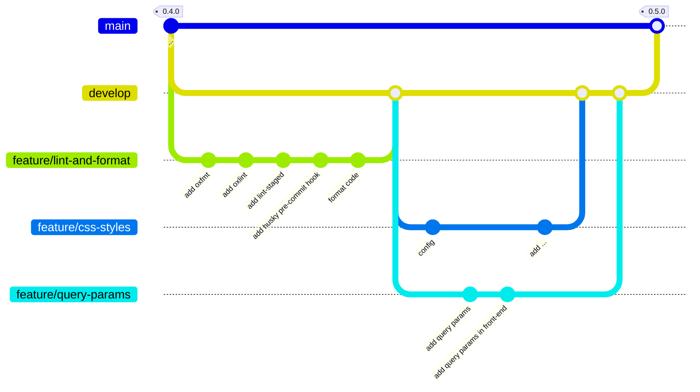

# TMDB Discovery App - 0.5.0

<p class="hero-kicker">lint - format - style - query params - pull requests</p>

---

# Objectifs
    
## Application

- Application de style CSS pour améliorer l'apparence de l'application.
- Ajout de la gestion des query params pour récupérer les films populaires depuis l'API TMDB.
  - Exposition de paramètres lors de l'appel de l'API TMDB pour récupérer les films populaires (langue, page, ...)
  - Utilisation de query params pour passer les paramètres de l'API TMDB via l'URL (query params) depuis le front-end.
    
## Ingénierie logicielle

- oxfmt, outil de formatage de code pour maintenir un style de code cohérent
- oxlint, outil de linting pour le code JavaScript/TypeScript
- pull request, mécanisme de contribution sur GitHub pour proposer des modifications à un projet

<!--

Exemple de notes

-->
---



---

Se positionner sur la branche develop pour démarrer une nouvelle feature `lint-and-format`.

```bash
git switch develop
git switch -c feature/lint-and-format
```

---

# linting avec oxlint

**oxlint** est un outil de linting pour le code JavaScript/TypeScript qui permet de détecter les erreurs de style, les problèmes potentiels et les violations des bonnes pratiques. 

Il permet d'améliorer la qualité du code et de maintenir une cohérence dans le projet.

Installer oxlint :

```bash
npm install -D oxlint
```

Ajouter le script de linting dans le fichier `package.json`:

```json
{
  "scripts": {
    ...
    "lint": "oxlint -c oxlint.config.ts .",
    "lint:fix": "oxlint -c oxlint.config.ts --fix .",
    ...
  }
}
```

---

# linting avec oxlint (suite)

Créer un fichier de configuration `oxlint.config.ts` à la racine du projet avec le contenu suivant:

```typescript
import { defineConfig } from "oxlint";

export default defineConfig({
  plugins: ["typescript", "unicorn", "oxc", "react"],
  categories: {
    correctness: "error",
  },
  rules: {},
  env: {
    builtin: true,
  },
});

```

Cela configure oxlint pour analyser les fichiers TypeScript et React, en utilisant les règles recommandées pour chaque technologie. unicorn et oxc sont des plugins qui ajoutent des règles supplémentaires pour améliorer la qualité du code.

---

# linting avec oxlint (suite)

Lancer le linting du code avec oxlint pour vérifier que le code respecte les règles définies dans le fichier de configuration `oxlint.config.ts`.

```bash
npm run lint
```

Résultat du linting avec oxlint:

```bash
@alexandre-girard-maif ➜ /workspaces/themoviedb-discovery-app-demo-2026-2027 (feature/lint-and-format) $ npm run lint

> themoviedb-discovery-app-demo-2026-2027@1.0.0 lint
> oxlint -c oxlint.config.ts .


  × eslint(no-unused-vars): Catch parameter 'error' is caught but never used.
    ╭─[src/back-end/index.ts:44:12]
 43 │ 
 44 │   } catch (error) {
    ·            ──┬──
    ·              ╰── 'error' is declared here
 45 │     res.status(500).json({ error: 'Failed to fetch popular movies' });
    ╰────
  help: Consider handling this error.

Found 0 warnings and 1 error.
Finished in 49ms on 11 files with 115 rules using 2 threads.
```

---

# linting avec oxlint (suite)

On peut corriger l'erreur de linting en supprimant le paramètre `error` de la clause `catch` dans le fichier `src/back-end/index.ts` à la ligne 44:

```typescript
  } catch {
    res.status(500).json({ error: 'Failed to fetch popular movies' });
  }
```

ou en traitant mieux par exemple en loggant l'erreur dans la console pour faciliter le débogage .

```typescript
  } catch (error) {
    console.error('Error fetching popular movies:', error);
    res.status(500).json({ error: 'Failed to fetch popular movies' });
  }
```

Cette deuxième approche est préférable car elle permet de logguer l'erreur dans la console pour faciliter le débogage.

---

# formatage du code avec oxfmt

**oxfmt** est un outil de formatage de code qui permet de maintenir un style de code cohérent dans le projet. Il peut être utilisé en complément d'oxlint pour formater automatiquement le code selon les règles définies.

Installer oxfmt :

```bash
npm install -D oxfmt
```

Créer un fichier de configuration `oxfmt.config.ts` à la racine du projet avec le contenu suivant:

```typescript
import { defineConfig } from 'oxfmt';

export default defineConfig({
  semi: true,
  singleQuote: true,
  trailingComma: 'all',
  printWidth: 80,
  tabWidth: 2,
});
```

---

# formatage du code avec oxfmt (suite)

Ajouter le script de formatage dans le fichier `package.json`:

```json
{
  "scripts": {
    ...
    "fmt": "oxfmt",
    "fmt:check": "oxfmt --check",
    ...
  }
}
```

Pour vérifier que le code respecte les règles définies dans le fichier de configuration `oxfmt.config.ts`.

```bash
npm run fmt:check
```

On peut également lancer le formatage du code avec oxfmt pour corriger automatiquement les erreurs de formatage:

```bash
npm run fmt
```

----

# Contrôle avec lint-staged

**lint-staged** est un outil qui permet d'exécuter des scripts de linting uniquement sur les fichiers modifiés dans un commit. Cela permet de s'assurer que le code ajouté ou modifié respecte les règles de linting définies dans le projet et de ne pas reformater l'ensemble du code existant, ce qui pourrait introduire des modifications inutiles et rendre l'historique des commits plus difficile à suivre.

Ajouter le package `lint-staged` pour exécuter eslint sur les fichiers modifiés avant chaque commit:

```bash
npm install -D lint-staged
```

Configurer lint-staged dans le fichier `package.json` pour exécuter eslint et prettier sur les fichiers TypeScript et React modifiés:

```json
  ...
  "lint-staged": {
    "*": [
      "npm run fmt",
      "npm run lint:fix"
    ]
  }
  ...
```

----

# Contrôle avec lint-staged (suite)

Afin de s'assurer que lint-staged est exécuté avant chaque commit, nous allons ajouter un hook git `pre-commit` qui va exécuter lint-staged. 

Nous avons déjà installé `husky` dans le projet pour gérer les hooks git. Il suffit donc de créer le hook `pre-commit` dans le dossier `.husky` avec le contenu suivant:

```bash
echo "npx lint-staged" > .husky/pre-commit
```

Si des fichiers ne respectent pas les règles de linting, le commit sera annulé et il faudra corriger les erreurs avant de pouvoir commiter à nouveau. Lorsque cela est possible, les modifications seront automatiquement corrigées par prettier et eslint.

Avec cette configuration le code existant n'est pas modifié, seul le code ajouté ou modifié dans le commit est analysé et corrigé si nécessaire. Cette approche permet de maintenir un code propre et cohérent dans le projet sans avoir à reformater l'ensemble du code existant, qui pourrait introduire des modifications inutiles et rendre l'historique des commits plus difficile à suivre.

---

# Formatage initial du code

Nous allons tout de même lancer une première fois pour formater l'ensemble du code existant et corriger les erreurs de linting. Cela permettra de partir sur une base propre pour les prochaines modifications.

```bash
npm run fmt
npm run lint:fix
```

Nous pouvons constater que de nombreux fichiers ont été modifiés par le formatage.  Cela pourrait rendre l'historique des commits plus difficile à suivre, mais cela permettra de partir sur une base propre pour les prochaines modifications.

---

# merge de la feature `lint-and-format` dans la branche `develop`

```bash
git checkout develop
git merge feature/lint-and-format
```

Nous avons maintenant une base de code propre et cohérente pour continuer le développement de l'application sur la branche `develop`. Nous ne mergerons pas encore la branche `develop` dans la branche `main` car il n'y a pas encore de nouvelle fonctionnalité implémentée. 

---

# feature - css styles

Se positionner sur la branche develop pour démarrer une nouvelle feature `css-styles`.

```bash
git switch develop
git switch -c feature/css-styles
```

L'objectif de cette feature est d'ajouter une feuille de style CSS pour améliorer l'apparence de l'application. et d'améliorer la sémantique du code HTML en utilisant des balises HTML5 appropriées. (header, main, article ...)

---

# feature - css styles (suite)

Afin d'avoir une configuration TypeScript adaptée pour la partie front-end, nous allons créer un fichier `tsconfig.frontend.json` à la racine du projet.

Nous allons au préalable modifier le fichier `tsconfig.json` pour ajouter de la configuration pour la partie front-end.
  
```json 
{
  "files": [],
  "references": [{ "path": "./tsconfig.backend.json" }, { "path": "./tsconfig.frontend.json" }]
}
```

---

# feature - css styles (suite)

et créer un fichier `tsconfig.frontend.json` pour la partie front-end avec le contenu suivant:

```json
{
  "compilerOptions": {
    "target": "ES2023",
    "lib": ["ES2023", "DOM", "DOM.Iterable"],
    "module": "ESNext",
    "moduleResolution": "bundler",
    "jsx": "react-jsx",
    "types": ["vite/client"],
    "strict": true,
    "noEmit": true,
    "allowImportingTsExtensions": true,
    "skipLibCheck": true,
    "noUncheckedSideEffectImports": true
  },
  "include": ["src/front-end/**/*.ts", "src/front-end/**/*.tsx"]
}
```

---

# feature - css styles (suite) - web sémantique

La sémantique du code HTML est importante pour l'accessibilité et le référencement. Nous allons donc modifier le code HTML de la page d'accueil pour utiliser des balises HTML5 appropriées.

Quelques exemples de balises HTML5 sémantiques que nous utiliserons dans notre application:
- main: pour le contenu principal de la page
- nav: pour la navigation
- header: pour l'en-tête de la page
- footer: pour le pied de page
- section: pour les sections de contenu
- article: pour les articles de contenu
- aside: pour les contenus secondaires

Référence: https://web.dev/learn/html/semantic-html?hl=fr

---

# feature - css styles (suite) - web sémantique

Modifier le code HTML de la page d'accueil pour utiliser des balises HTML5 appropriées. Le code suivant est un extrait du fichier `src/front-end/App.tsx`:
```typescript
...
    <main>
      <header>
        <h1>Films populaires</h1>
        <h2>
          Films tendances en France, d'après les données de <b>The Movie Database</b>
        </h2>
      </header>
      <section>
      {movies ? (
        <ul>
          {movies.map((movie) => (
            <li key={movie.id}>
              <article>
                <MovieItem movie={movie} />
              </article>
            </li>
          ))}
        </ul>
      ) : (
        <p>Loading...</p>
      )}
      </section>
    </main>
...
```

<!--

L'entête de la page d'accueil est maintenant sémantique et contient un titre principal (h1) et un sous-titre (h2). Le contenu principal de la page est maintenant contenu dans une balise main, et les films populaires sont contenus dans une balise section.

ul et li sont utilisés pour lister les films populaires, et chaque film est contenu dans une balise article. Cela permet de mieux structurer le contenu de la page et d'améliorer l'accessibilité pour les utilisateurs utilisant des lecteurs d'écran.

-->

---

# feature - css styles (suite) - contenu de movieItem

Nous allons maintenant modifier le contenu du composant `MovieItem` pour afficher uniquement l'affiche du film, le titre du film, l'année de sortie et la note du film. 

Ressources: https://developer.themoviedb.org/reference/configuration-details

---

# feature - css styles (suite) - contenu de movieItem

```typescript
...
export default function MovieItem({ movie }: MovieItemProps) {
  const releaseYear = movie.release_date.slice(0, 4);
  const posterUrl = movie.poster_path ? `https://image.tmdb.org/t/p/w185${movie.poster_path}` : null;
  const rating = movie.vote_average.toFixed(1);

  return (
    <div>
      {posterUrl ? (
        
      ) : (
        <div />
      )}
      <div>
        <h2>{movie.title}</h2>
        <p>
          {releaseYear} · Rating {rating}
        </p>
      </div>
    </div>
  );
}
...
```

<!--

**releaseYear:** nous extrayons l'année de sortie du film à partir de la date de sortie complète (format YYYY-MM-DD) en utilisant la méthode `slice(0, 4)` pour ne conserver que les 4 premiers caractères de la chaîne de caractères.

**poster:** tmdb fournit différents formats d'affiches de films, nous avons choisi le format w185 pour avoir une affiche de taille moyenne. Le format w185 correspond à une largeur de 185 pixels et une hauteur proportionnelle à l'image originale suffisant pour avoir une bonne qualité d'image tout en limitant la taille du fichier.

**rating:** la note du film est arrondie à une décimale pour avoir une meilleure lisibilité. 

-->

---

# feature - css styles (suite) - css

Nous allons maintenant ajouter les styles CSS pour améliorer l'apparence de l'application.

Lien vers la feuille de style globale: <a href="./assets/global.css" target="_blank" rel="noopener noreferrer">assets/global.css</a> à copier dans `src/front-end/global.css` et importer la feuille de style dans le fichier `src/front-end/main.tsx`.

```typescript
import { StrictMode } from "react";
import { createRoot } from "react-dom/client";
import App from "./App.tsx";
import "./global.css";

createRoot(document.getElementById("root")!).render(
  <StrictMode>
    <App />
  </StrictMode>,
);
```

---

# feature - css styles (suite) - css

Lien vers la feuille de style: <a href="./assets/app.css" target="_blank" rel="noopener noreferrer">assets/app.css</a> à copier dans `src/front-end/app.css` et importer la feuille de style dans le fichier `src/front-end/App.tsx`.

Et modifier le code HTML de la page d'accueil pour utiliser les classes CSS définies dans la feuille de style `app.css`. Le code suivant est un extrait du fichier `src/front-end/App.tsx`:

---


```typescript
...
import "./app.css";
...
<main className="app-shell">
      <header className="app-header">
        <h1>Films populaires</h1>
        <h2>
          Films tendances en France, d'après les données de <b>The Movie Database</b>
        </h2>
      </header>
      <section>
        {movies ? (
          <ul className="movie-grid">
            {movies.map((movie) => (
              <li key={movie.id}>
                <article>
                  <MovieItem movie={movie} />
                </article>
              </li>
            ))}
          </ul>
        ) : (
          <p className="status-message">Loading...</p>
        )}
      </section>
    </main>
...
```

---

# feature - css styles (suite) - css

Modifier le code HTML du composant `MovieItem` pour utiliser les classes CSS définies dans la feuille de style `app.css`. Le code suivant est un extrait du fichier `src/front-end/components/MovieItem.tsx`:

---

```typescript
import type { Movie } from "../../back-end/schemas/MoviesTypes";

type MovieItemProps = {
  movie: Movie;
};

export default function MovieItem({ movie }: MovieItemProps) {
  const releaseYear = movie.release_date.slice(0, 4);
  const posterUrl = movie.poster_path ? `https://image.tmdb.org/t/p/w185${movie.poster_path}` : null;
  const rating = movie.vote_average.toFixed(1);

  return (
    <div className="movie-card">
      {posterUrl ?  : <div />}
      <div className="movie-card__content">
        <h2>{movie.title}</h2>
        <p>
          {releaseYear} · Rating {rating}
        </p>
      </div>
    </div>
  );
}
```

Pousser les modifications de la branche `feature/css-styles` sur le dépôt distant.

----

# pull request

Une **pull request** est un mécanisme de contribution sur GitHub qui permet de proposer des modifications à un projet. Elle permet aux contributeurs de soumettre leurs changements pour examen et discussion avant qu'ils ne soient fusionnés dans une branche du projet. 

Les pull requests sont souvent utilisées pour collaborer sur des projets open source, mais elles peuvent également être utilisées dans des projets privés pour faciliter la collaboration entre les membres d'une équipe.

Elle présente même un intétrêt pour un projet personnel, car elle permet de relire son code avant de le fusionner dans la branche cible du projet. Cela permet de détecter des erreurs ou des problèmes potentiels avant qu'ils ne soient intégrés dans le code principal.

Nous verrons plus tard que l'on peut utiliser la pull request pour ajouter des contrôles (tests unitaires, tests d'intégration, linting, ...) avant de fusionner les modifications dans la branche cible du projet.

La **pull request** est une fonctionnalité de GitHub mais elle est également disponible sur d'autres plateformes de gestion de code source comme GitLab, Bitbucket, etc, sous des noms différents (merge request sur GitLab par exemple).

---

# feature - css styles - pull request

Créer une pull request qui permettra de fusionner les modifications dans la branche `develop`. Ne valider pas la pull request pour le moment.

---

# feature - query params

Se positionner sur la branche develop pour démarrer une nouvelle feature `query-params`.

```bash
git switch develop
git switch -c feature/query-params
```

L'objectif de cette feature est de permettre à l'utilisateur de passer des paramètres à l'API TMDB pour récupérer les films populaires. Ces paramètres seront passés via l'URL (query params) depuis le front-end.

Les query params sont des paramètres qui sont ajoutés à l'URL d'une requête HTTP pour transmettre des informations supplémentaires au serveur. Ils sont généralement utilisés pour filtrer, trier ou paginer les résultats d'une requête.

Nous allons avoir une approche progressive pour implémenter cette feature. Nous allons d'abord ajouter les query params dans le back-end, vérifier que l'API TMDB fonctionne correctement avec ces paramètres, puis nous allons ajouter les query params dans le front-end pour permettre à l'utilisateur de les modifier.

----

# feature - query params - back-end

Les query params sont déjà gérés par l'API TMDB, il suffit donc de les transmettre depuis notre back-end vers l'API TMDB. Nous allons donc modifier la route `/api/movies/popular` pour accepter les query params `language` et `page`.

Nous allons dans un premier temps ajouter des constantes pour les query params dans le fichier `src/back-end/constants.ts`:

```typescript
// Langue par défaut pour les requêtes à l'API TMDB
export const DEFAULT_LANGUAGE = 'fr-FR';

// Page par défaut pour les requêtes à l'API TMDB
export const DEFAULT_PAGE = '1';

// Région par défaut pour les requêtes à l'API TMDB
export const DEFAULT_REGION = 'FR';
```

Nous aurons ainsi un comportement par défaut pour les requêtes à l'API TMDB si l'utilisateur ne fournit pas de query params.

----

# feature - query params - back-end (suite)

Extrait des modifications apportées à la route `/api/movies/popular` dans le fichier `src/back-end/index.ts` pour gérer les query params `language`, `page` et `region`:

```typescript
...
      // Create a URLSearchParams object to build the query string for the TMDB API request
      const queryParams = new URLSearchParams();

      // Extract query parameters from the request and append them to the query string
      const { language, page, region } = _req.query;

      queryParams.append('language', (language as string) || DEFAULT_LANGUAGE);
      queryParams.append('page', (page as string) || DEFAULT_PAGE);
      queryParams.append('region', (region as string) || DEFAULT_REGION);

      const response = await fetch(
        `https://api.themoviedb.org/3/movie/popular?${queryParams.toString()}`,
        {
          headers: {
            Authorization: `Bearer ${tmdbAccessToken}`,
            'Content-Type': 'application/json;charset=utf-8',
          },
        },
      );
...
```

----

# feature - query params - back-end (suite)

Tester la route `/api/movies/popular` avec les query params `language`, `page` et `region` pour vérifier que l'API TMDB fonctionne correctement avec ces paramètres.

Pour ajouter les query params à la requête, il suffit de les ajouter à l'URL de la requête. Par exemple, pour récupérer les films populaires en anglais (en-US) et à la page 2, il suffit d'ajouter `?language=en-US&page=2` à l'URL de la requête.

```bash
curl -X GET "http://localhost:3000/api/movies/popular?language=en-US&page=2" -H "accept: application/json"
```

Une fois que la route est testée et fonctionne correctement, commiter les modifications.

----

# feature - query params - front-end

Nous allons dans un premier temps uniquement gérer le fait de passer les query params `language`, `page` et `region` depuis le front-end vers le back-end en passant par l'URL de la requête. Nous verrons plus tard comment ajouter des contrôles pour permettre à l'utilisateur de modifier ces paramètres depuis l'interface utilisateur.

----

# feature - query params - front-end (suite)

Extrait des modifications apportées au fichier `src/front-end/App.tsx` pour gérer les query params `language`, `page` et `region`:

```typescript
export default function App() {
  ...

  // read parameters from the URL query string
  const queryParams = new URLSearchParams(window.location.search);
  const language = queryParams.get('language') || DEFAULT_LANGUAGE;
  const page = queryParams.get('page') || DEFAULT_PAGE;
  const region = queryParams.get('region') || DEFAULT_REGION;

  ...

  // useEffect hook to fetch data from an API when the component mounts
  useEffect(() => {
    // fetch data from an API /api/movies/popular
    fetch(
      `/api/movies/popular?language=${language}&page=${page}&region=${region}`,
    )

  ...
```

----

# feature - query params - front-end (suite)

Comme pour le back-end, nous allons tester que la page d'accueil du front-end fonctionne correctement avec les query params `language`, `page` et `region`. Pour cela, il suffit de modifier l'URL de la page d'accueil pour ajouter les query params.

Par exemple, pour récupérer les films populaires en anglais (en-US) et à la page 2, il suffit d'ajouter `?language=en-US&page=2` à l'URL de la page d'accueil.

Dans votre navigateur, vous pouvez tester l'URL suivante pour vérifier que les query params sont bien pris en compte par le front-end et le back-end:

```bash
http://127.0.0.1:5173/?language=en-US&page=2
```

Notre application est maintenant capable de gérer les query params `language`, `page` et `region` pour récupérer les films populaires depuis l'API TMDB.

----

# feature - query params - front-end (suite)


La langue par défaut étant le français (fr-FR), modifier le titre de la page d'accueil pour afficher "Films populaires" au lieu de "Popular Movies".

Nous verrons plus tard comment ajouter des contrôles pour permettre à l'utilisateur de modifier ces paramètres depuis l'interface utilisateur et éventuellement gérer une application multilingue si nous voulons aller plus loin dans le projet.

Pousser les modifications sur la branche `feature/query-params` sur le dépôt distant et créer une pull request qui permettra de fusionner les modifications dans la branche `develop`. Ne valider pas la pull request pour le moment.

----

# pull request

Nous avons maintenant deux pull requests ouvertes sur le dépôt distant, une pour la feature `css-styles` et une pour la feature `query-params`. Nous allons fusionner les deux pull requests dans la branche `develop` pour valider les modifications apportées par les deux features.

Une fois les deux pull requests fusionnées dans la branche `develop`, nous allons créer une nouvelle pull request pour fusionner la branche `develop` dans la branche `main` et ainsi valider les modifications apportées par les deux features dans la version 0.5.0 de l'application.