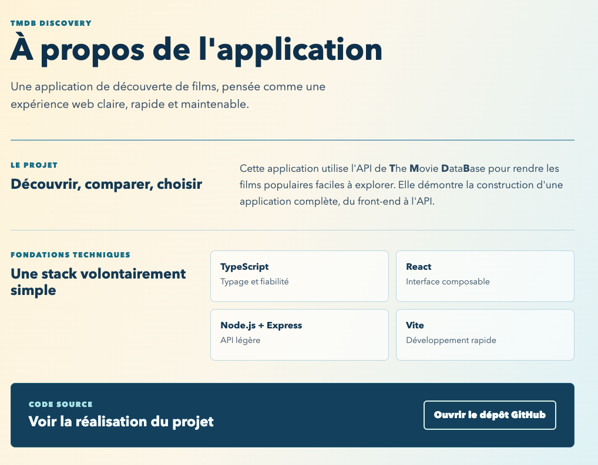
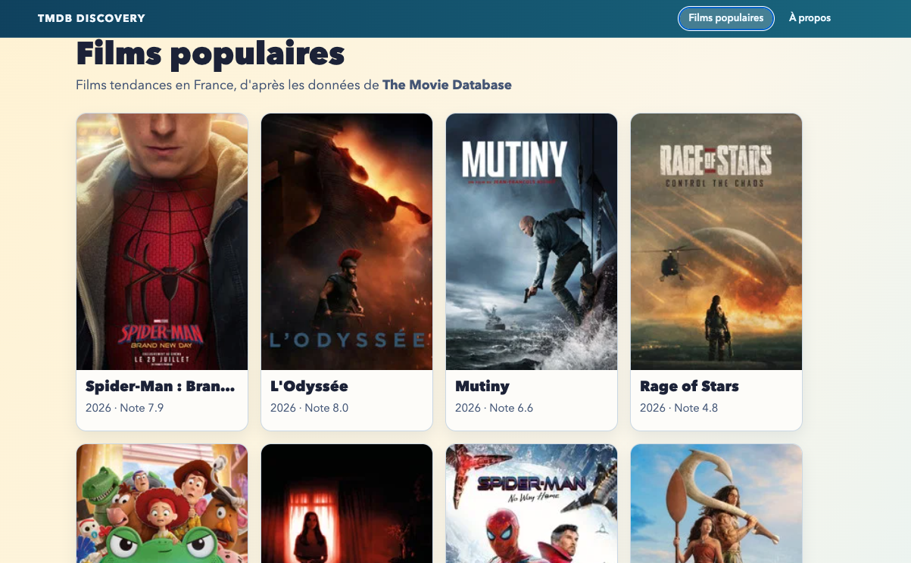
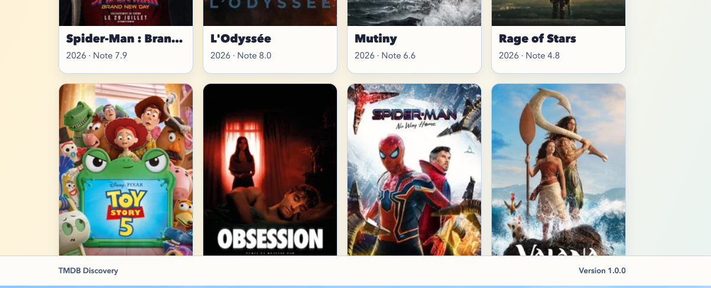
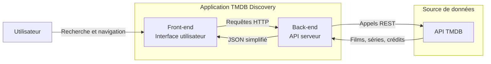
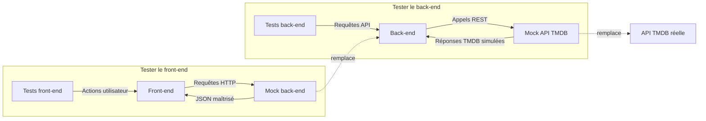

# TMDB Discovery App - 1.0.0

<p class="hero-kicker">navigation - test e2e - test unitaire front-end</p>

---

# Objectifs

## Application

- Composant **NavBar** pour le front-end pour naviguer entre les pages de l'application
- **About page** pour le front-end pour présenter l'application
- **Footer** pour le front-end

## Ingénierie logicielle

- tests logiciels pour le front-end : unitaires, intégration et E2E
- stratégie de test : pyramide, régressions et bonnes pratiques

<!--

-->

---

# front-end - About page

- Objectif : présenter l’application et son objectif.
- Étape 1 : créer la page accessible via l’URL `/about`.
- Étape 2 : rédiger un contenu clair sur le rôle de l’application.
- Étape 3 : appliquer la feuille de style <a href="./assets/AboutPage.css" target="_blank" rel="noopener noreferrer">AboutPage.css</a>.
- Résultat attendu : une page À propos cohérente avec le reste de l’application, voir capture d’écran ci-dessous.
---

# front-end - About page



---

# front-end - NavBar

- Objectif : créer un composant **NavBar** pour naviguer entre les pages de l’application.
- Étape 1 : créer le composant **NavBar**.
- Étape 2 : ajouter les liens vers les pages de l’application.
- Étape 3 : appliquer la feuille de style <a href="./assets/NavBar.css" target="_blank" rel="noopener noreferrer">NavBar.css</a>.
- Résultat attendu : un composant **NavBar** fonctionnel et cohérent avec le reste de l’application, voir capture d’écran ci-dessous.
---

# front-end - NavBar



---

# front-end - Footer

- Objectif : créer un composant **Footer** pour l’application.
- Étape 1 : créer le composant **Footer**.
- Étape 2 : ajouter les informations de copyright et les liens vers les réseaux sociaux.
- Étape 3 : appliquer la feuille de style <a href="./assets/Footer.css" target="_blank" rel="noopener noreferrer">Footer.css</a>.
- Résultat attendu : un composant **Footer** fonctionnel et cohérent avec le reste de l’application, voir capture d’écran ci-dessous.
---

# front-end - Footer



---

# front-end - les différents types de tests

- Objectif : comprendre les niveaux de tests logiciels.
- Définition : chaque type de test vérifie l’application à une échelle différente.
- Pourquoi c’est utile : choisir le test le plus efficace pour chaque risque.
- Exemple rapide : tester une fonction, une API, puis un parcours utilisateur.

---

# Pourquoi tester ?

- Objectif : sécuriser l’évolution de l’application.
- Règle 1 : vérifier que l’application fonctionne comme prévu.
- Règle 2 : détecter rapidement les régressions après une modification.
- Règle 3 : valider les règles métier importantes.
- Anti-pattern à éviter : viser 100 % de couverture sans réfléchir à la pertinence des tests.

---

# dépendance TMDB API - mock

- Objectif : tester le front-end sans dépendre de l’API TMDB.
- Définition : un mock simule un composant, une API ou une base de données.
- Pourquoi c’est utile : isoler le code testé des données changeantes, de la latence et des indisponibilités.
- Exemple rapide : remplacer l’API TMDB par des réponses attendues et maîtrisées.


---

# dépendance TMDB API - mock (suite)


- Objectif : tester chaque partie de l’application avec une dépendance isolée.
- Définition : le front-end et le back-end sont considérés comme deux applications distinctes.
- Pourquoi c’est utile : limiter les causes possibles quand un test échoue.
- Exemple rapide : tester le front-end avec un back-end mocké, puis le back-end avec l’API TMDB mockée.

---

# dépendance TMDB API - mock (suite)

## Architecture de l’application



## Architecture de l’application - mock



---

# Tests unitaires

- Objectif : vérifier une petite unité de code isolée.
- Définition : tester une fonction, une méthode, une classe ou un composant seul.
- Pourquoi c’est utile : obtenir un retour rapide et facile à diagnostiquer.
- Exemple rapide : contrôler le résultat de **getReleaseYear**.

~~~text
getReleaseYear('02-12-2023')
        ↓
       2023

getReleaseYear('wrong format' or null)
        ↓
       unknown
~~~

---

# Tests unitaires - points clés

- Règle 1 : exécuter ces tests souvent, localement et en CI.
- Règle 2 : multiplier les scénarios simples et ciblés.
- Règle 3 : isoler le code testé des API, bases de données et interfaces.
- Anti-pattern à éviter : croire qu’un test unitaire valide toute l’application.

---

# Tests d’intégration

- Objectif : vérifier que plusieurs composants fonctionnent ensemble.
- Définition : tester les interactions entre application, service, base de données ou API.
- Pourquoi c’est utile : détecter les erreurs de contrat et de communication.
- Exemple rapide : vérifier qu’un service écrit correctement dans une vraie base.

~~~text
Front-end → Back-end → Base de données / API externe
~~~

---

# Tests d’intégration - points clés

- Règle 1 : tester les échanges réels entre composants.
- Règle 2 : garder les scénarios centrés sur les contrats importants.
- Règle 3 : prévoir une configuration de test stable et reproductible.
- Anti-pattern à éviter : transformer chaque test d’intégration en parcours complet.

---

# Tests End-to-End

- Objectif : valider un parcours utilisateur complet.
- Définition : tester l’application de bout en bout comme un utilisateur réel.
- Pourquoi c’est utile : donner confiance sur les parcours critiques.
- Exemple rapide : un utilisateur se connecte et accède à son compte.

~~~text
Utilisateur → Accès à la page d'accueil → Navigation → Sélection d'un film → Détails du film
~~~

---

# Tests End-to-End - points clés

- Règle 1 : réserver les E2E aux parcours vraiment importants.
- Règle 2 : utiliser des outils comme **Playwright**.
- Règle 3 : accepter un coût d’exécution et de maintenance plus élevé.
- Anti-pattern à éviter : remplacer tous les tests unitaires par des tests E2E.

---

# Autres types de tests

- Test fonctionnel : vérifie qu’une fonctionnalité respecte les règles attendues.
- Test de non régression : vérifie qu’une modification n’a rien cassé.
- Test de performance : mesure le comportement sous charge.
- Test de sécurité : cherche des vulnérabilités ou comportements dangereux.
- Test de contrat : vérifie qu’un service respecte le format attendu par ses consommateurs.

---

# Exemples de tests spécialisés

- Fonctionnel : appliquer la livraison gratuite dès 50 € d’achat.
- Régression : relancer les tests automatiquement dans la CI/CD.
- Performance : tenir 100 utilisateurs simultanés ou 10 000 requêtes par minute.
- Sécurité : détecter une injection SQL ou un contrôle d’accès incorrect.
- Contrat : repérer un changement de format dans une réponse d’API.

---

# La pyramide des tests

- Objectif : équilibrer confiance, vitesse et coût de maintenance.
- Définition : beaucoup de tests unitaires, moins d’intégration, peu de E2E.
- Pourquoi c’est utile : obtenir un feedback rapide sans perdre les parcours critiques.
- Exemple rapide : tester les règles métier en unitaire et l’achat complet en E2E.

~~~text
                   /\                   
                  /  \
                 /    \
                / E2E  \
               /--------\
              / Intégr.  \
             /------------\
            /  Unitaires   \
           /________________\
~~~

---

# Pyramide inversée

- Objectif : reconnaître une stratégie de test coûteuse.
- Définition : beaucoup de tests E2E, peu de tests unitaires et d’intégration.
- Pourquoi c’est risqué : les retours deviennent lents, fragiles et difficiles à diagnostiquer.
- Exemple rapide : un test “finaliser la commande” échoue sans indiquer la cause précise.

~~~text
              _____________
             /     E2E     \
             \-------------/
              \  Intégr.  /
               \---------/
                \ Unit. /
                 \_____/
~~~

---

# Choisir le bon niveau de test

- Objectif : obtenir le meilleur niveau de confiance au coût le plus faible.
- Règle 1 : tester une règle métier complexe avec un test unitaire.
- Règle 2 : tester une interaction entre composants avec un test d’intégration.
- Règle 3 : tester un parcours utilisateur critique avec un test E2E.
- Anti-pattern à éviter : choisir un type de test par habitude plutôt que par risque.

---

# Bonnes pratiques de test

- Règle 1 : tester le comportement plutôt que l’implémentation interne.
- Règle 2 : rendre chaque test indépendant des autres.
- Règle 3 : rendre les tests déterministes dans les mêmes conditions.
- Anti-pattern à éviter : faire dépendre un test de l’heure réelle, du hasard ou d’un ordre d’exécution.

---

# Cas limites et maintenance

- Règle 1 : tester aussi les erreurs, pas seulement le happy path.
- Règle 2 : garder une suite de tests rapide pour l’exécuter souvent.
- Règle 3 : privilégier des tests utiles plutôt que nombreux.
- Anti-pattern à éviter : maintenir 100 tests qui vérifient tous la même chose.

---

# Exemple de stratégie e-commerce

- Objectif : répartir les tests selon leur granularité.
- Unitaires : prix, promotions, TVA, validation et règles métier.
- Intégration : API avec base de données, paiement et services internes.
- E2E : connexion, achat et paiement sur les parcours critiques.
- Résultat attendu : beaucoup de tests rapides, quelques intégrations, peu de E2E.

---

# À retenir

- Définition unitaire : vérifie les briques de code.
- Définition intégration : vérifie que les briques fonctionnent ensemble.
- Définition E2E : vérifie l’ensemble comme attendu par l’utilisateur.
- Pourquoi c’est utile : combiner plusieurs niveaux de tests selon le risque.
- Exemple rapide : une bonne pyramide limite les tests lents, fragiles et coûteux.

---

# front-end - e2e - configuration

Installer Playwright pour les tests E2E :

```bash
npm install @playwright/test -D
```

resource : <a href="https://playwright.dev/docs/intro" target="_blank" rel="noopener noreferrer">Playwright documentation</a>

Ajouter le fichier config `playwright.config.ts` à la racine du projet TODO : ajouter le contenu du fichier config

Ajouter les scripts de test E2E dans le fichier `package.json` :

```json
{
  "scripts": {
    ...
    "test:e2e": "playwright test",
    "test:e2e:ui": "playwright test --ui",
    "test:e2e:codegen": "playwright codegen localhost:5173",
    ...
  }
}
```

<!--

**playwright*** est un framework de test E2E moderne pour les applications web. Il permet d’automatiser les interactions avec le navigateur et de vérifier le comportement de l’application comme un utilisateur réel.

Il permet de créer des tests qui seront exécutés dans différents navigateurs (Chromium, Firefox, WebKit) et offre des fonctionnalités avancées telles que la capture d’écran, l’enregistrement vidéo et le débogage interactif.

-->

---

# front-end - e2e - about page

- Objectif : vérifier que la page À propos est accessible et contient le contenu attendu.

`e2e/about.spec.ts`

```typescript
import { expect, test } from "@playwright/test";
import packageJson from "../package.json" with { type: "json" };

test("affiche la page about", async ({ page }) => {
  await page.goto("/about");

  await expect(page).toHaveTitle("themoviedb-discovery-app");
  await expect(page.getByRole("heading", { name: "À propos" })).toBeVisible();
  await expect(page.getByRole("link", { name: "À propos" })).toBeVisible();
  await expect(page.getByRole("contentinfo")).toContainText(
    new RegExp(`TMDB Discovery\\s*Version ${packageJson.version}`),
  );
});
```

---

`.gitignore`

```
node_modules/
.env
coverage

# Playwright
/test-results/
/playwright-report/
/blob-report/
/playwright/.cache/
/playwright/.auth/
```

npm run test:e2e

<!--

Le test E2E ci-dessus utilise Playwright pour vérifier que la page À propos de l'application est correctement affichée. Il navigue vers l'URL `/about`, vérifie le titre de la page, la présence du titre principal et du lien "À propos", ainsi que le contenu du pied de page qui doit inclure la version de l'application.

-->

---

# front-end - e2e - films page - détail

utiliser `test:e2e:codegen` et l'exemple de test généré pour créer un test E2E qui vérifie que la navigation vers la page de détail d'un film fonctionne correctement. Le test doit inclure les étapes suivantes :
1. Accéder à la page liste des films.
2. Cliquer sur un film spécifique pour accéder à sa page de détail.
3. Vérifier que la page de détail s'affiche correctement
4. Retourner à la page liste des films et vérifier que la navigation fonctionne correctement.

---

# front-end - e2e - films page - détail

Problème rencontré le contenu de la liste des films est lié à l'API TMDB des films populaires. Hors les films populaires changent régulièrement, ce qui rend le test E2E instable. Pour résoudre ce problème, il est recommandé de mocker la réponse de l'API pour les films populaires afin d'avoir un contenu stable et prévisible pour le test.

Playwright permet de mocker les réponses HTTP en interceptant les requêtes et en fournissant des réponses personnalisées. 

<!--

Faire une démo du mock.

-->
---