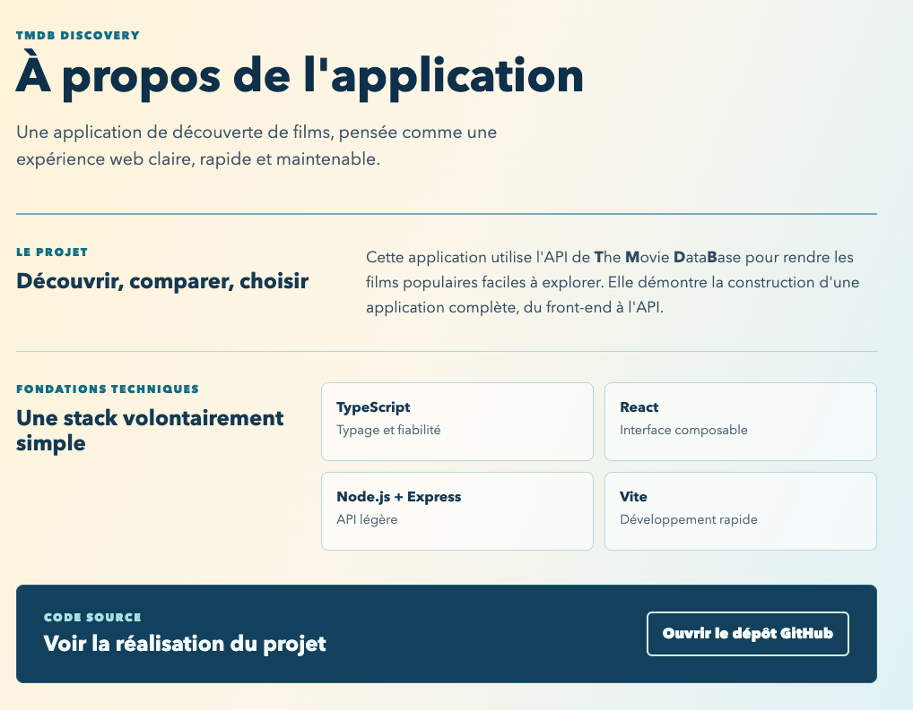
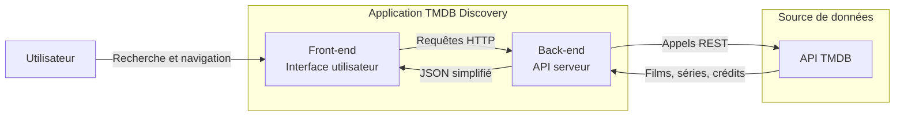
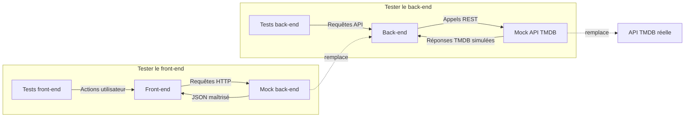

# TMDB Discovery App - 1.0.0

<p class="hero-kicker">navigation - test e2e - test unitaire front-end</p>

---

# Objectifs

## Application

- Composant **NavBar** pour le front-end pour naviguer entre les pages de l'application
- **About page** pour le front-end pour présenter l'application
- **Footer** pour le front-end

## Ingénierie logicielle

- tests logiciels pour le front-end : unitaires, intégration et E2E
- stratégie de test : pyramide, régressions et bonnes pratiques

<!--

-->

---

# front-end - About page

- Objectif : présenter l’application et son objectif.
- Étape 1 : créer la page accessible via l’URL `/about`.
- Étape 2 : rédiger un contenu clair sur le rôle de l’application.
- Étape 3 : appliquer la feuille de style <a href="./assets/AboutPage.css" target="_blank" rel="noopener noreferrer">AboutPage.css</a>.
- Résultat attendu : une page À propos cohérente avec le reste de l’application, voir capture d’écran ci-dessous.
---

# front-end - About page



---

# front-end - NavBar

- Objectif : créer un composant **NavBar** pour naviguer entre les pages de l’application.
- Étape 1 : créer le composant **NavBar**.
- Étape 2 : ajouter les liens vers les pages de l’application.
- Étape 3 : appliquer la feuille de style <a href="./assets/NavBar.css" target="_blank" rel="noopener noreferrer">NavBar.css</a>.
- Résultat attendu : un composant **NavBar** fonctionnel et cohérent avec le reste de l’application, voir capture d’écran ci-dessous.
---

# front-end - NavBar


---

# front-end - Footer

- Objectif : créer un composant **Footer** pour l’application.
- Étape 1 : créer le composant **Footer**.
- Étape 2 : ajouter les informations de copyright et les liens vers les réseaux sociaux.
- Étape 3 : appliquer la feuille de style <a href="./assets/Footer.css" target="_blank" rel="noopener noreferrer">Footer.css</a>.
- Résultat attendu : un composant **Footer** fonctionnel et cohérent avec le reste de l’application, voir capture d’écran ci-dessous.

---

# front-end - Footer (suite)

Afin d'afficher le numéro de version dans le footer, modifiez le fichier de configuration `vite.config.ts` pour y ajouter une variable d'environnement contenant la version de l'application. 

```ts
// vite.config.ts
...
import packageJson from './package.json' with { type: 'json' };
...

export default defineConfig({
  ...
  define: {
    __APP_VERSION__: JSON.stringify(packageJson.version),
  },
  ...
});
```
---

# front-end - Footer


---

# back-end - Tests unitaires

- Objectif : écrire des tests unitaires pour le back-end afin de garantir le bon fonctionnement des différentes fonctionnalités.
- Approche : identifier les fonctions critiques et écrire des tests unitaires pour chacune d’elles, cela ne garantit pas une couverture complète mais permet de se concentrer sur les parties les plus importantes.
- Résultat attendu : une suite de tests unitaires complète et fiable pour le back-end.

<!--
Notes:
- Il est parfois difficile d'avoir une couverture complète des tests unitaires, surtout lorsque le code évolue rapidement. Il est donc important de se concentrer sur les parties critiques et à risque élevé de l'application.
- Pour notre application nous allons tout de même viser une couverture à 100 % même si ce qui est important est de tester les cas pertinents et critiques.
-->

---

# back-end - Tests unitaires (suite)

- Objectif : pour notre application, garantir une couverture complète des tests unitaires.

Afin de vérifier que notre couverture à 100 % est pertinente et efficace, nous allons configurer notre application pour être en erreur si l'on n'atteint pas cette couverture.

```ts
// vite.config.ts
export default defineConfig({
  ...
  test: {
    include: ['src/back-end/**/*.test.ts'],
    coverage: {
      thresholds: {
        statements: 100,
        branches: 100,
        functions: 100,
        lines: 100,
      },
    },
  },
  ...
});
```

<!--
Notes:
  - Pour notre application, nous allons viser une couverture à 100 % des tests unitaires afin de garantir que toutes les fonctions critiques sont correctement testées et que toute régression est rapidement détectée. Cependant, il est important de noter que viser une couverture à 100 % ne doit pas se faire au détriment de la pertinence des tests. Il faut privilégier les tests des cas critiques et à risque élevé.

-->

---

# Test unitaires - Bonnes pratiques

- Ecrire le test unitaire au plus proche du code source. Par exemple, pour une fonction définie dans `utils.tsx`, le test correspondant doit être dans `utils.test.tsx`.
- Le test unitaire doit être indépendant des autres tests et ne doit pas dépendre de l'état global de l'application ou de l'ordre d'exécution des tests.
- Il est recommandé de suivre la structure Arrange-Act-Assert (AAA) pour organiser les tests unitaires de manière claire et cohérente.
- Il est également conseillé de nommer les tests de manière descriptive pour indiquer clairement ce qu'ils vérifient **describe** et **it** blocs afin de faciliter la lecture et la maintenance des tests.
- Avec un objectif de couverture de test à 100 %, le test doit couvrir 100% du fichier source correspondant, même s'il peut potentiellement couvrir d'autres fichiers ou fonctionnalités.
- Tester le comportement plutôt que l’implémentation interne.
- Rendre les tests déterministes dans les mêmes conditions.


<!--
Notes:

- Faire la démonstation en écrivant les tests unitaires pour utils.tsx., health-api.tsx puis movies-api.tsx.
  - montrer l'usage de copilot pour aider, générer des tests unitaires rapidement et efficacement.
  - expliquer que les tests générés automatiquement doivent être revus et adaptés pour s'assurer qu'ils couvrent les cas pertinents et critiques.

-->
---

# Tests unitaires - mock

- Objectif : tester les composants isolément en simulant leurs dépendances.
- Définition : un mock remplace une dépendance réelle par une version contrôlée.
- Pourquoi c’est utile : s’assurer que les tests ne dépendent pas de l’état ou du comportement des dépendances externes.
- Dans notre application, nous allons utiliser des mocks pour isoler les appels aux API externes et tester les composants de manière indépendante.

---

# dépendance TMDB API - mock (suite)

## Architecture de l’application


```mermaid
flowchart LR
    U[Utilisateur]

    subgraph APP[Application TMDB Discovery]
        F[Front-end
Interface utilisateur]
        B[Back-end
API serveur]
    end

    subgraph EXT[Source de données]
        T[API TMDB]
    end

    U -->|Recherche et navigation| F
    F -->|Requêtes HTTP| B
    B -->|Appels REST| T
    T -->|Films, séries, crédits| B
    B -->|JSON simplifié| F
```

## Architecture de l’application - mock


```mermaid
flowchart LR
    subgraph FRONT[Tester le front-end]
        TF[Tests front-end]
        F[Front-end]
        MB[Mock back-end]

        TF -->|Actions utilisateur| F
        F -->|Requêtes HTTP| MB
        MB -->|JSON maîtrisé| F
    end

    subgraph BACK[Tester le back-end]
        TB[Tests back-end]
        B[Back-end]
        MT[Mock API TMDB]

        TB -->|Requêtes API| B
        B -->|Appels REST| MT
        MT -->|Réponses TMDB simulées| B
    end

    MB -. remplace .-> B
    MT -. remplace .-> TMDB[API TMDB réelle]
```

---

# Les différents types de tests

- Objectif : comprendre les niveaux de tests logiciels.
- Définition : chaque type de test vérifie l’application à une échelle différente.
- Pourquoi c’est utile : choisir le test le plus efficace pour chaque risque.
- Exemple rapide : tester une fonction, une API, puis un parcours utilisateur.

---

# Tests unitaires

- Objectif : vérifier une petite unité de code isolée.
- Définition : tester une fonction, une méthode, une classe ou un composant seul.
- Pourquoi c’est utile : obtenir un retour rapide et facile à diagnostiquer.
- Couverture de code : viser à tester toutes les branches et cas possibles d’une unité.

---

# Tests unitaires - points clés

- Règle 1 : exécuter ces tests souvent, localement et en CI.
- Règle 2 : multiplier les scénarios simples et ciblés.
- Règle 3 : isoler le code testé des API, bases de données et interfaces.

---

# Tests d’intégration

- Objectif : vérifier que plusieurs composants fonctionnent ensemble.
- Définition : tester les interactions entre application, service, base de données ou API.
- Pourquoi c’est utile : détecter les erreurs de contrat et de communication.
- Exemple rapide : vérifier qu’un service écrit correctement dans une vraie base.

~~~text
Front-end → Back-end → Base de données / API externe
~~~

---

# Tests d’intégration - points clés

- Règle 1 : tester les échanges réels entre composants.
- Règle 2 : garder les scénarios centrés sur les contrats importants.
- Règle 3 : prévoir une configuration de test stable et reproductible.

---

# Tests End-to-End

- Objectif : valider un parcours utilisateur complet.
- Définition : tester l’application de bout en bout comme un utilisateur réel.
- Pourquoi c’est utile : donner confiance sur les parcours critiques.
- Exemple rapide : un utilisateur se connecte et accède à son compte.

~~~text
Utilisateur → Accès à la page d'accueil → Navigation → Sélection d'un film → Détails du film
~~~

---

# Tests End-to-End - points clés

- Règle 1 : réserver les E2E aux parcours vraiment importants.
- Règle 2 : utiliser des outils comme **Playwright**.
- Règle 3 : accepter un coût d’exécution et de maintenance plus élevé.
- Anti-pattern à éviter : remplacer tous les tests unitaires par des tests E2E.

---

# Autres types de tests

- Test fonctionnel : vérifie qu’une fonctionnalité respecte les règles attendues.
- Test de non régression : vérifie qu’une modification n’a rien cassé.
- Test de performance : mesure le comportement sous charge.
- Test de sécurité : cherche des vulnérabilités ou comportements dangereux.
- Test de contrat : vérifie qu’un service respecte le format attendu par ses consommateurs.

---

# La pyramide des tests

- Objectif : équilibrer confiance, vitesse et coût de maintenance.
- Définition : beaucoup de tests unitaires, moins d’intégration, peu de E2E.
- Pourquoi c’est utile : obtenir un feedback rapide sans perdre les parcours critiques.
- Exemple rapide : tester les règles métier en unitaire et l’achat complet en E2E.

~~~text
                   /\                   
                  /  \
                 /    \
                / E2E  \
               /--------\
              / Intégr.  \
             /------------\
            /  Unitaires   \
           /________________\
~~~

---

# Pyramide inversée

- Objectif : reconnaître une stratégie de test coûteuse.
- Définition : beaucoup de tests E2E, peu de tests unitaires et d’intégration.
- Pourquoi c’est risqué : les retours deviennent lents, fragiles et difficiles à diagnostiquer.

~~~text
              _____________
             /     E2E     \
             \-------------/
              \  Intégr.  /
               \---------/
                \ Unit. /
                 \_____/
~~~

---

# Choisir le bon niveau de test

- Objectif : obtenir le meilleur niveau de confiance au coût le plus faible.
- Règle 1 : tester une règle métier complexe avec un test unitaire.
- Règle 2 : tester une interaction entre composants avec un test d’intégration.
- Règle 3 : tester un parcours utilisateur critique avec un test E2E.

